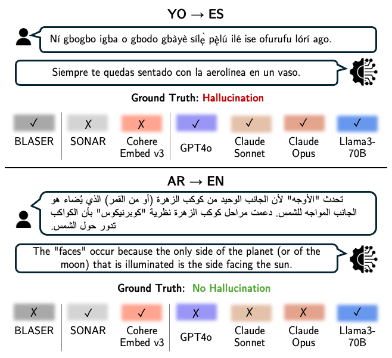
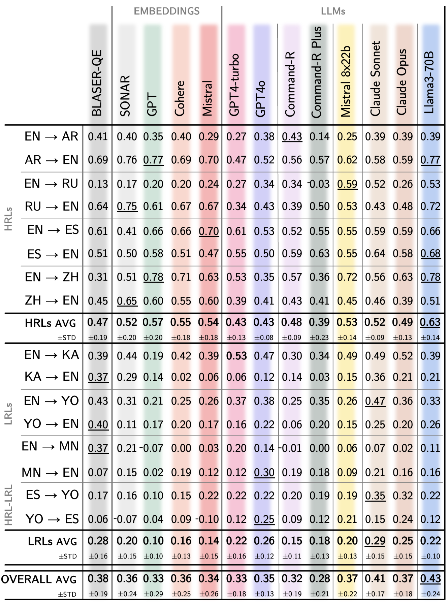
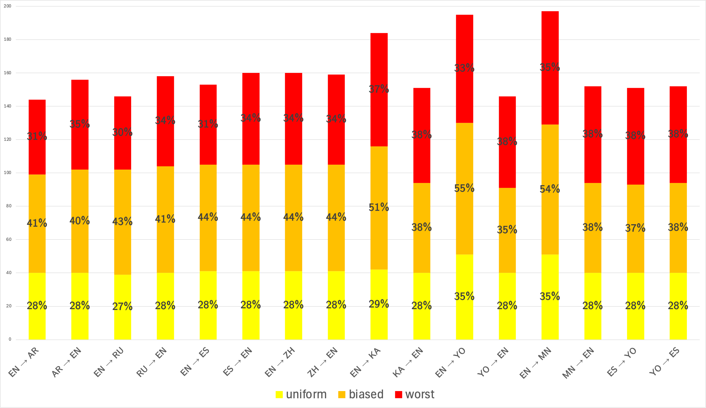
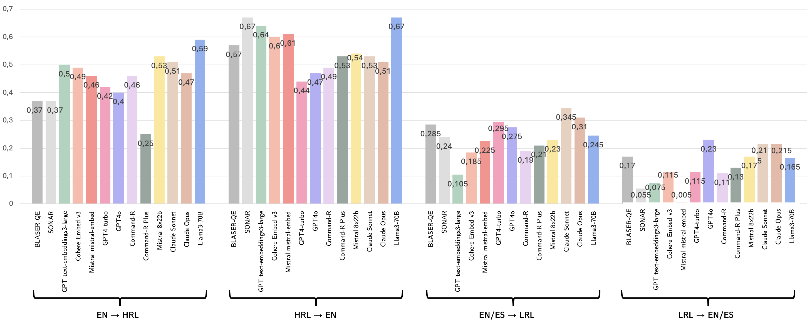

# 利用大型语言模型检测低资源与高资源语言的机器翻译幻觉

发布时间：2024年07月23日

`LLM应用` `机器翻译` `语言处理`

> Machine Translation Hallucination Detection for Low and High Resource Languages using Large Language Models

# 摘要

> 最新的大规模多语言机器翻译系统虽大幅提升了翻译精度，但仍存在生成幻觉的问题，严重损害用户信任。在机器翻译中检测幻觉是一大难题，尤其现有方法在高资源语言表现优异，对低资源语言则力有不逮。本文通过大型语言模型和多语言嵌入的语义相似性，评估了幻觉检测方法。研究涉及16种语言，涵盖高、低资源语言及多样文字。结果显示，模型选择至关重要。在高资源语言中，Llama3-70B平均领先先前最佳水平0.16 MCC。低资源语言中，Claude Sonnet则平均领先其他LLMs 0.03 MCC。研究揭示，尽管LLMs未专门训练于机器翻译，其性能仍可匹敌甚至超越传统模型，但在低资源语言上的优势相对较小。

> Recent advancements in massively multilingual machine translation systems have significantly enhanced translation accuracy; however, even the best performing systems still generate hallucinations, severely impacting user trust. Detecting hallucinations in Machine Translation (MT) remains a critical challenge, particularly since existing methods excel with High-Resource Languages (HRLs) but exhibit substantial limitations when applied to Low-Resource Languages (LRLs). This paper evaluates hallucination detection approaches using Large Language Models (LLMs) and semantic similarity within massively multilingual embeddings. Our study spans 16 language directions, covering HRLs, LRLs, with diverse scripts. We find that the choice of model is essential for performance. On average, for HRLs, Llama3-70B outperforms the previous state of the art by as much as 0.16 MCC (Matthews Correlation Coefficient). However, for LRLs we observe that Claude Sonnet outperforms other LLMs on average by 0.03 MCC. The key takeaway from our study is that LLMs can achieve performance comparable or even better than previously proposed models, despite not being explicitly trained for any machine translation task. However, their advantage is less significant for LRLs.

[Arxiv](https://arxiv.org/abs/2407.16470)