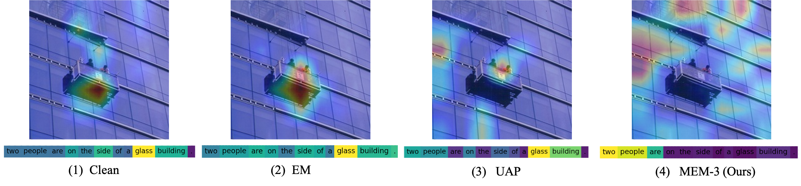
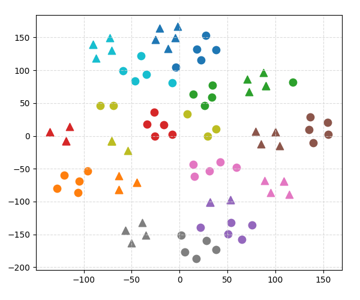

# 多模态不可学习示例：抵御多模态对比学习的保护数据策略

发布时间：2024年07月23日

`LLM应用` `数据隐私` `机器学习`

> Multimodal Unlearnable Examples: Protecting Data against Multimodal Contrastive Learning

# 摘要

> 多模态对比学习 (MCL) 在零-shot 分类中取得了显著进展，但依赖于互联网上的图像-标题对学习也带来了隐私风险。最近的研究提出通过微小扰动生成不可学习示例以保护数据，但这些方法主要针对单模态分类，而在多模态场景中尚未充分探索。本文中，我们提出了一种新颖的多步骤误差最小化 (MEM) 方法，通过优化图像噪声和文本触发器，有效构建多模态数据中的保护捷径。实验表明，MEM 能显著降低模型性能，且具有高度可转移性。相关代码已公开在 GitHub 上。

> Multimodal contrastive learning (MCL) has shown remarkable advances in zero-shot classification by learning from millions of image-caption pairs crawled from the Internet. However, this reliance poses privacy risks, as hackers may unauthorizedly exploit image-text data for model training, potentially including personal and privacy-sensitive information. Recent works propose generating unlearnable examples by adding imperceptible perturbations to training images to build shortcuts for protection. However, they are designed for unimodal classification, which remains largely unexplored in MCL. We first explore this context by evaluating the performance of existing methods on image-caption pairs, and they do not generalize effectively to multimodal data and exhibit limited impact to build shortcuts due to the lack of labels and the dispersion of pairs in MCL. In this paper, we propose Multi-step Error Minimization (MEM), a novel optimization process for generating multimodal unlearnable examples. It extends the Error-Minimization (EM) framework to optimize both image noise and an additional text trigger, thereby enlarging the optimized space and effectively misleading the model to learn the shortcut between the noise features and the text trigger. Specifically, we adopt projected gradient descent to solve the noise minimization problem and use HotFlip to approximate the gradient and replace words to find the optimal text trigger. Extensive experiments demonstrate the effectiveness of MEM, with post-protection retrieval results nearly half of random guessing, and its high transferability across different models. Our code is available on the https://github.com/thinwayliu/Multimodal-Unlearnable-Examples

[Arxiv](https://arxiv.org/abs/2407.16307)