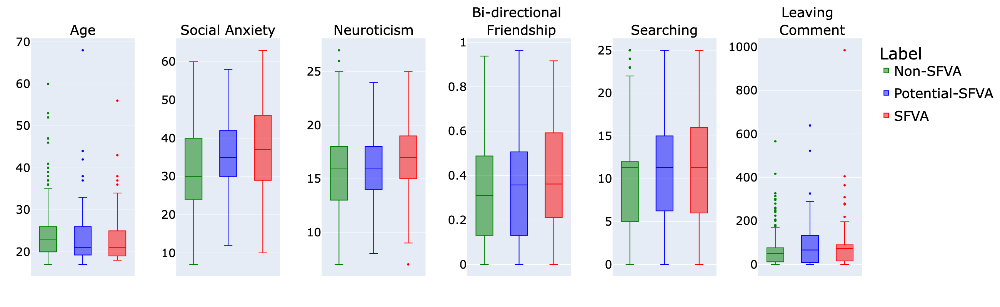
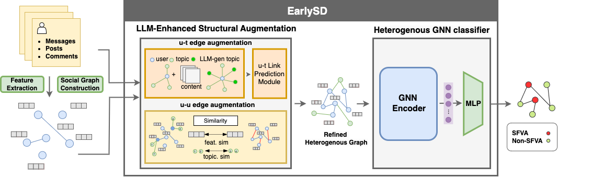

# 基于在线社交网络数据的短视频成瘾早期识别

发布时间：2024年07月23日

`LLM应用` `社交网络` `心理健康`

> Online Social Network Data-Driven Early Detection on Short-Form Video Addiction

# 摘要

> 短形式视频（SFV）近年来风靡全球，成为各大社交平台上的热门娱乐方式。然而，研究表明，短视频成瘾不仅影响身心健康，如注意力下降和学习动力减弱，还与现实生活中的心理支持缺失、家庭学业压力及社交焦虑等问题相关。目前，SFVA的检测往往滞后于负面后果的出现。为此，我们计划构建基于社交网络行为的短视频成瘾数据集，并设计早期检测框架EarlySD。此前的在线社交媒体心理健康研究多聚焦于抑郁和自杀倾向的检测。我们的研究首次提出针对SFVA的早期检测框架，利用大型语言模型（LLMs）解决数据稀疏和缺失问题，并将社交行为数据分模态处理，构建异构社交网络结构以精准检测SFVA。通过自建数据集的定量分析和广泛实验，我们验证了EarlySD方法在短视频成瘾检测中的有效性。

> Short-form video (SFV) has become a globally popular form of entertainment in recent years, appearing on major social media platforms. However, current research indicate that short video addiction can lead to numerous negative effects on both physical and psychological health, such as decreased attention span and reduced motivation to learn. Additionally, Short-form Video Addiction (SFVA) has been linked to other issues such as a lack of psychological support in real life, family or academic pressure, and social anxiety. Currently, the detection of SFVA typically occurs only after users experience negative consequences. Therefore, we aim to construct a short video addiction dataset based on social network behavior and design an early detection framework for SFVA. Previous mental health detection research on online social media has mostly focused on detecting depression and suicidal tendency. In this study, we propose the first early detection framework for SFVA EarlySD. We first introduce large language models (LLMs) to address the common issues of sparsity and missing data in graph datasets. Meanwhile, we categorize social network behavior data into different modalities and design a heterogeneous social network structure as the primary basis for detecting SFVA. We conduct a series of quantitative analysis on short video addicts using our self-constructed dataset, and perform extensive experiments to validate the effectiveness of our method EarlySD, using social data and heterogeneous social graphs in the detection of short video addiction.

[Arxiv](https://arxiv.org/abs/2407.18277)