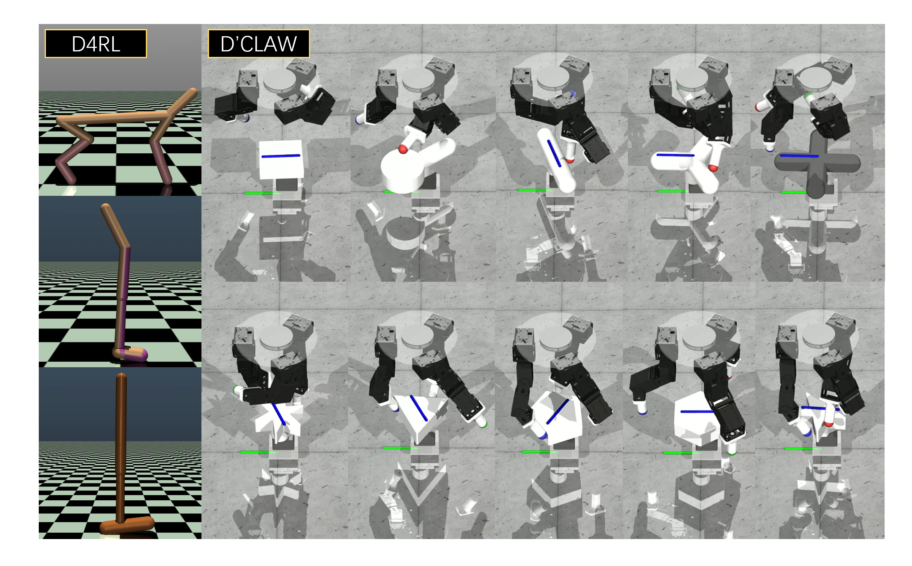

# 通过 Decision-RWKV 方法，我们为机器人操作提供了一种终身学习的循环序列建模优化方案。

发布时间：2024年07月23日

`LLM应用` `机器人学`

> Optimizing Robotic Manipulation with Decision-RWKV: A Recurrent Sequence Modeling Approach for Lifelong Learning

# 摘要

> Transformer架构模型在多个领域如自然语言处理、计算机视觉和机器人学中广泛应用，其中ChatGPT等大型语言模型极大地提升了机器对人类语言的理解能力，并展现了卓越的记忆与再现技能。然而，传统机器学习算法面临的灾难性遗忘问题，限制了机器人在复杂任务中的表现。本文深入探讨了RWKV框架，该框架以高效序列建模著称，并分析了其与决策Transformer及经验回放技术的结合。我们特别关注了这一结合在序列决策和机器人终身学习中的性能提升潜力。为此，我们提出了DRWKV模型，并在多个实验平台上进行了详尽测试，结果显示该模型在处理复杂任务时表现出色。所有相关代码和实验细节已在GitHub上公开，供学术界参考。

> Models based on the Transformer architecture have seen widespread application across fields such as natural language processing, computer vision, and robotics, with large language models like ChatGPT revolutionizing machine understanding of human language and demonstrating impressive memory and reproduction capabilities. Traditional machine learning algorithms struggle with catastrophic forgetting, which is detrimental to the diverse and generalized abilities required for robotic deployment. This paper investigates the Receptance Weighted Key Value (RWKV) framework, known for its advanced capabilities in efficient and effective sequence modeling, and its integration with the decision transformer and experience replay architectures. It focuses on potential performance enhancements in sequence decision-making and lifelong robotic learning tasks. We introduce the Decision-RWKV (DRWKV) model and conduct extensive experiments using the D4RL database within the OpenAI Gym environment and on the D'Claw platform to assess the DRWKV model's performance in single-task tests and lifelong learning scenarios, showcasing its ability to handle multiple subtasks efficiently. The code for all algorithms, training, and image rendering in this study is open-sourced at https://github.com/ancorasir/DecisionRWKV.

[Arxiv](https://arxiv.org/abs/2407.16306)