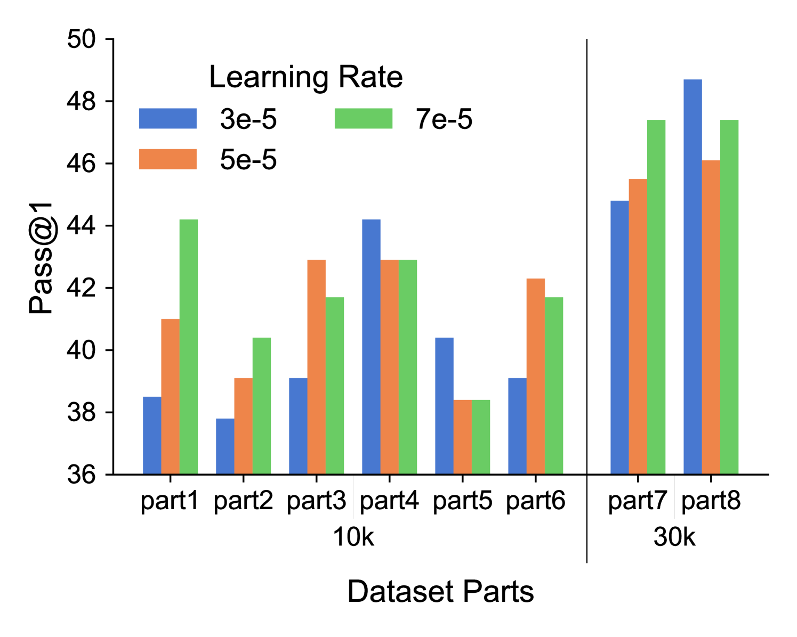

# OriGen：借助代码间的增强与自我反思，革新RTL代码生成技术

发布时间：2024年07月23日

`LLM应用` `半导体` `软件开发`

> OriGen:Enhancing RTL Code Generation with Code-to-Code Augmentation and Self-Reflection

# 摘要

> 最新研究表明，大型语言模型（LLMs）在RTL代码生成领域潜力巨大，如GPT-4和Claude3-Opus等商业模型已取得显著进展。然而，这些商业模型常引发隐私和安全顾虑。相比之下，开源LLMs虽解决了这些问题，但因缺乏高质量开源RTL数据集，性能不及商业模型。为此，我们推出OriGen，一个全开源框架，具备自我反思和数据集增强功能，旨在生成高质量RTL代码。我们创新性地采用知识蒸馏进行代码增强，提升数据集质量。OriGen还能基于编译器反馈自我修正语法错误。得益于精心构建的全面数据集，OriGen在RTL代码生成上大幅领先其他开源方案，在VerilogEval-Human基准测试中提升9.8%。同时，在自我反思能力评估中，OriGen超越GPT-4达18.1%，展现出卓越的自我纠错能力。

> Recent studies have illuminated that Large Language Models (LLMs) exhibit substantial potential in the realm of RTL (Register Transfer Level) code generation, with notable advancements evidenced by commercial models such as GPT-4 and Claude3-Opus. Despite their proficiency, these commercial LLMs often raise concerns regarding privacy and security. Conversely, open-source LLMs, which offer solutions to these concerns, have inferior performance in RTL code generation tasks to commercial models due to the lack of highquality open-source RTL datasets. To address this issue, we introduce OriGen, a fully open-source framework featuring self-reflection capabilities and a dataset augmentation methodology for generating high-quality, large-scale RTL code. We propose a novel code-to-code augmentation methodology that leverages knowledge distillation to enhance the quality of the open-source RTL code datasets. Additionally, OriGen is capable of correcting syntactic errors by leveraging a self-reflection process based on feedback from the compiler. The self-reflection ability of the model is facilitated by a carefully constructed dataset, which comprises a comprehensive collection of samples. Experimental results demonstrate that OriGen remarkably outperforms other open-source alternatives in RTL code generation, surpassing the previous best-performing LLM by 9.8% on the VerilogEval-Human benchmark. Furthermore, OriGen exhibits superior capabilities in self-reflection and error rectification, surpassing GPT-4 by 18.1% on the benchmark designed to evaluate the capability of self-reflection.

[Arxiv](https://arxiv.org/abs/2407.16237)