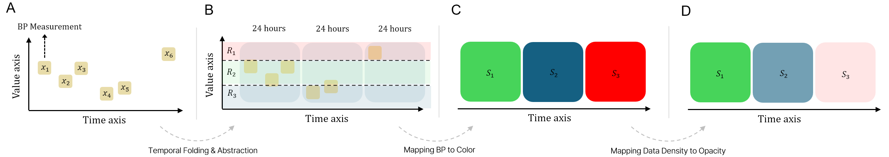
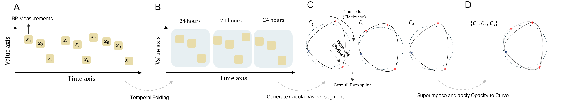
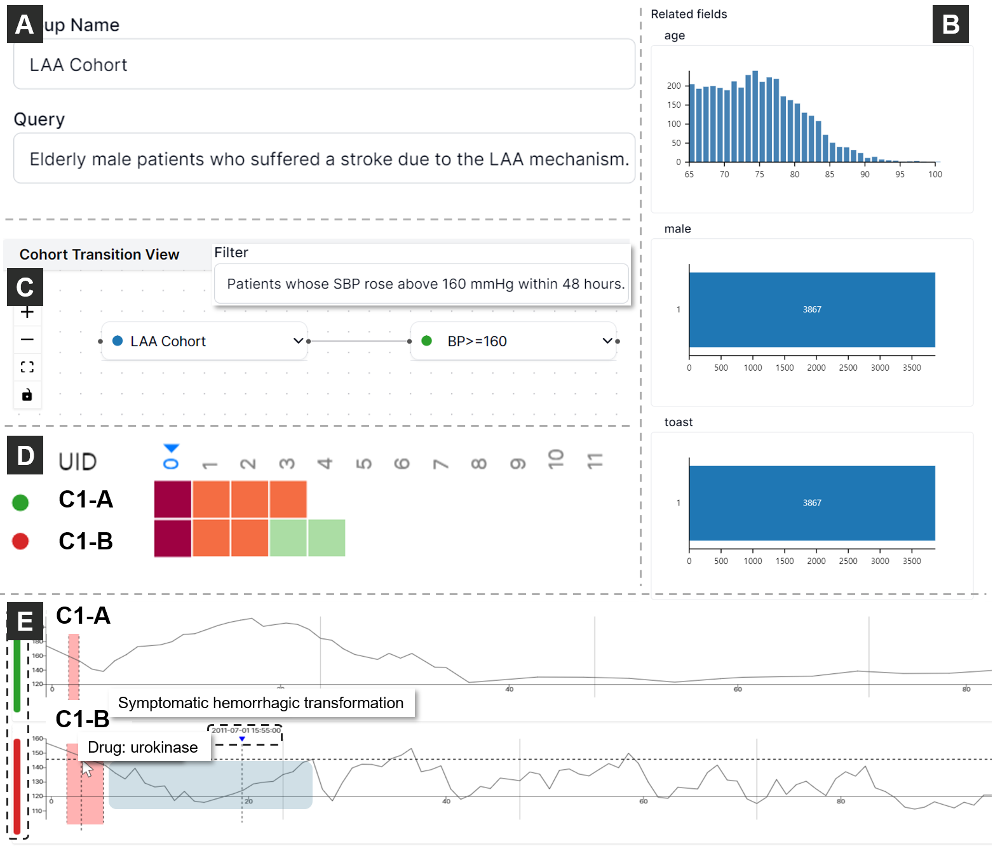
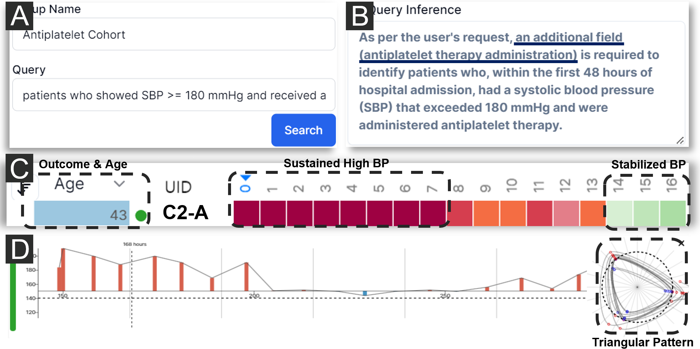

# PhenoFlow：一款由人类与 LLM 共同驱动的视觉分析工具，专为探索庞大且复杂的中风数据集而设计。

发布时间：2024年07月23日

`LLM应用` `人工智能`

> PhenoFlow: A Human-LLM Driven Visual Analytics System for Exploring Large and Complex Stroke Datasets

# 摘要

> 急性中风的治疗需迅速而精准，以确保患者最佳恢复。然而，与急性中风相关的临床数据，尤其是血压测量，其复杂性和不规则性为有效分析和决策带来了挑战。在与资深神经科医生的长期合作中，我们研发了PhenoFlow系统，该系统巧妙结合人类专家与大型语言模型（LLM），共同处理急性缺血性中风患者的庞杂数据。PhenoFlow创新性地将LLM作为数据处理助手，而神经科医生则通过直观可视化与自然语言交互，对分析结果进行深入探索与监督，从而减轻认知负担，专注于决策制定。为保障患者隐私，PhenoFlow仅利用元数据进行分析，确保结果的可重复性与可解释性。系统独特的“切片与包装”设计，通过时间折叠技术，辅以线性条形图，有效揭示了不规则血压数据中的潜在模式。案例研究显示，PhenoFlow能支持大规模临床数据的迭代分析，助力神经科医生做出更为明智的决策。我们的研究成果展示了LLM在应对急性缺血性中风患者临床决策挑战中的巨大潜力。

> Acute stroke demands prompt diagnosis and treatment to achieve optimal patient outcomes. However, the intricate and irregular nature of clinical data associated with acute stroke, particularly blood pressure (BP) measurements, presents substantial obstacles to effective visual analytics and decision-making. Through a year-long collaboration with experienced neurologists, we developed PhenoFlow, a visual analytics system that leverages the collaboration between human and Large Language Models (LLMs) to analyze the extensive and complex data of acute ischemic stroke patients. PhenoFlow pioneers an innovative workflow, where the LLM serves as a data wrangler while neurologists explore and supervise the output using visualizations and natural language interactions. This approach enables neurologists to focus more on decision-making with reduced cognitive load. To protect sensitive patient information, PhenoFlow only utilizes metadata to make inferences and synthesize executable codes, without accessing raw patient data. This ensures that the results are both reproducible and interpretable while maintaining patient privacy. The system incorporates a slice-and-wrap design that employs temporal folding to create an overlaid circular visualization. Combined with a linear bar graph, this design aids in exploring meaningful patterns within irregularly measured BP data. Through case studies, PhenoFlow has demonstrated its capability to support iterative analysis of extensive clinical datasets, reducing cognitive load and enabling neurologists to make well-informed decisions. Grounded in long-term collaboration with domain experts, our research demonstrates the potential of utilizing LLMs to tackle current challenges in data-driven clinical decision-making for acute ischemic stroke patients.

[Arxiv](https://arxiv.org/abs/2407.16329)