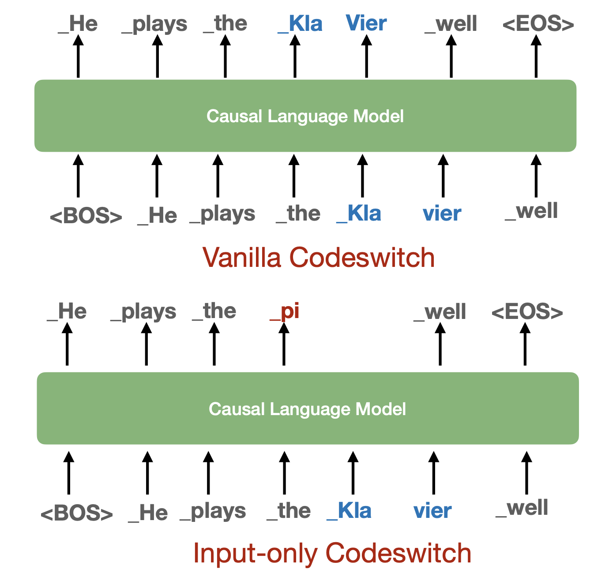

# PreAlign：通过早期确立多语言对齐，助力跨语言迁移能力的提升。

发布时间：2024年07月23日

`LLM理论` `人工智能` `语言处理`

> PreAlign: Boosting Cross-Lingual Transfer by Early Establishment of Multilingual Alignment

# 摘要

> 尽管大型语言模型主要以英语进行预训练，但它们仍展现出一定的多语言能力。然而，这些模型在自发多语言对齐方面表现较弱，影响了跨语言的迁移和知识共享。为解决这一问题，先前的研究尝试在预训练过程中或之后注入多语言对齐信息。本文提出的PreAlign框架，通过在预训练前建立多语言对齐，初始化模型以生成对齐词的相似表示，并利用代码切换策略在预训练中保持对齐。实验结果显示，PreAlign在语言建模、零-shot跨语言迁移及知识应用方面，均显著超越了传统的多语言联合训练方法。进一步的实际应用实验也证实了PreAlign在不同规模模型中的有效性。

> Large language models demonstrate reasonable multilingual abilities, despite predominantly English-centric pretraining. However, the spontaneous multilingual alignment in these models is shown to be weak, leading to unsatisfactory cross-lingual transfer and knowledge sharing. Previous works attempt to address this issue by explicitly injecting multilingual alignment information during or after pretraining. Thus for the early stage in pretraining, the alignment is weak for sharing information or knowledge across languages. In this paper, we propose PreAlign, a framework that establishes multilingual alignment prior to language model pretraining. PreAlign injects multilingual alignment by initializing the model to generate similar representations of aligned words and preserves this alignment using a code-switching strategy during pretraining. Extensive experiments in a synthetic English to English-Clone setting demonstrate that PreAlign significantly outperforms standard multilingual joint training in language modeling, zero-shot cross-lingual transfer, and cross-lingual knowledge application. Further experiments in real-world scenarios further validate PreAlign's effectiveness across various model sizes.

[Arxiv](https://arxiv.org/abs/2407.16222)