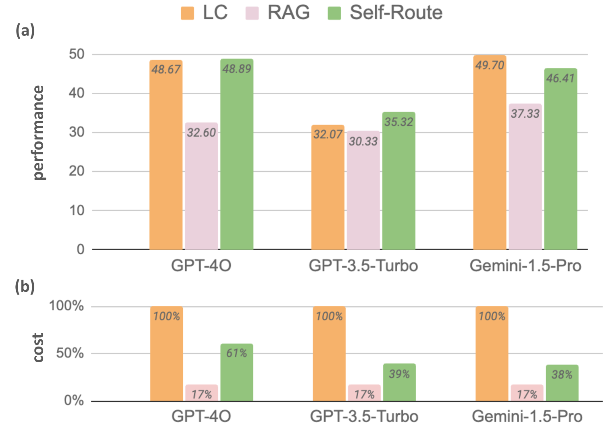
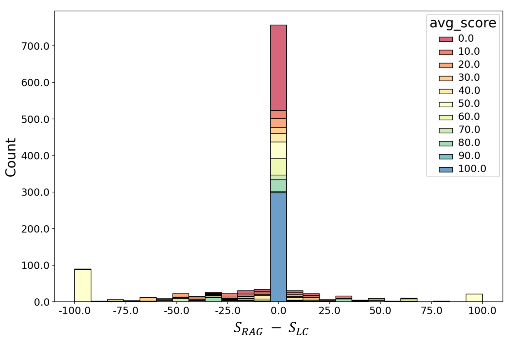
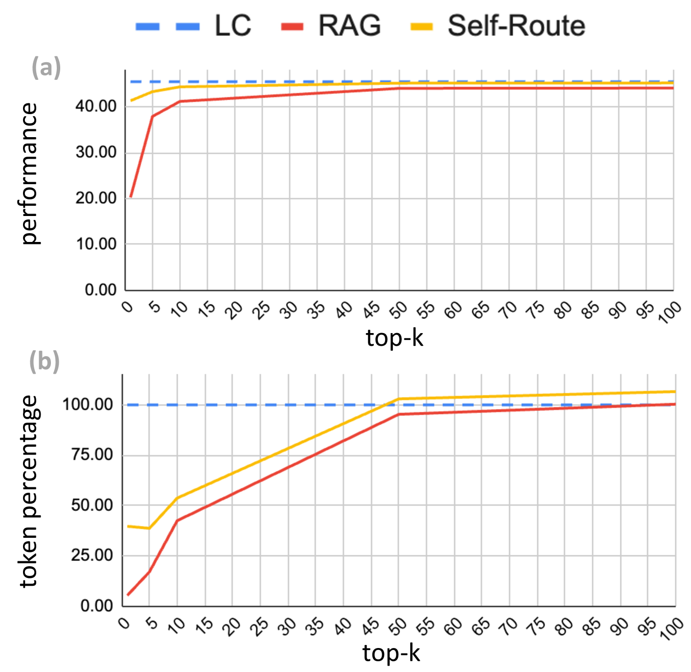
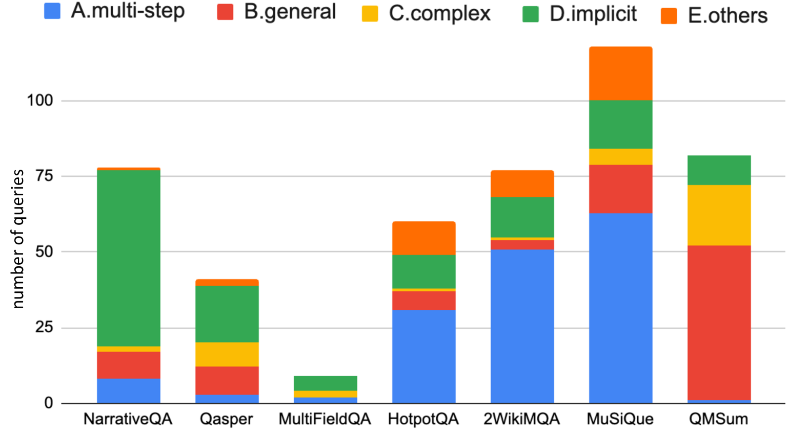

# 检索增强生成还是长上下文LLMs？我们进行了一项全面研究，并提出了一种混合方法。

发布时间：2024年07月23日

`RAG` `人工智能` `大数据`

> Retrieval Augmented Generation or Long-Context LLMs? A Comprehensive Study and Hybrid Approach

# 摘要

> RAG 一直是 LLM 处理冗长上下文的高效工具，但 Gemini-1.5 和 GPT-4 等模型已能直接理解长篇内容。我们对比了 RAG 与 LC LLM，旨在融合两者的优势。通过在多个数据集上测试三种最新 LLM，我们发现资源充足时，LC 性能更胜一筹，但 RAG 的成本优势明显。为此，我们设计了 Self-Route 方法，根据模型自我评估智能选择 RAG 或 LC，既降低成本又保持高效。这一发现为 LLM 在长上下文应用中提供了实用指南。

> Retrieval Augmented Generation (RAG) has been a powerful tool for Large Language Models (LLMs) to efficiently process overly lengthy contexts. However, recent LLMs like Gemini-1.5 and GPT-4 show exceptional capabilities to understand long contexts directly. We conduct a comprehensive comparison between RAG and long-context (LC) LLMs, aiming to leverage the strengths of both. We benchmark RAG and LC across various public datasets using three latest LLMs. Results reveal that when resourced sufficiently, LC consistently outperforms RAG in terms of average performance. However, RAG's significantly lower cost remains a distinct advantage. Based on this observation, we propose Self-Route, a simple yet effective method that routes queries to RAG or LC based on model self-reflection. Self-Route significantly reduces the computation cost while maintaining a comparable performance to LC. Our findings provide a guideline for long-context applications of LLMs using RAG and LC.

[Arxiv](https://arxiv.org/abs/2407.16833)