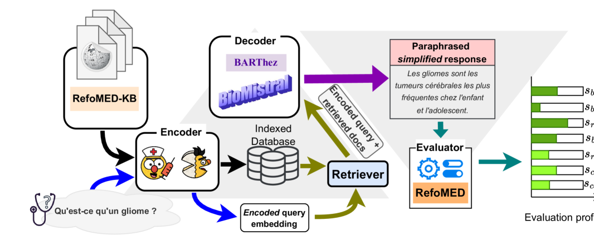
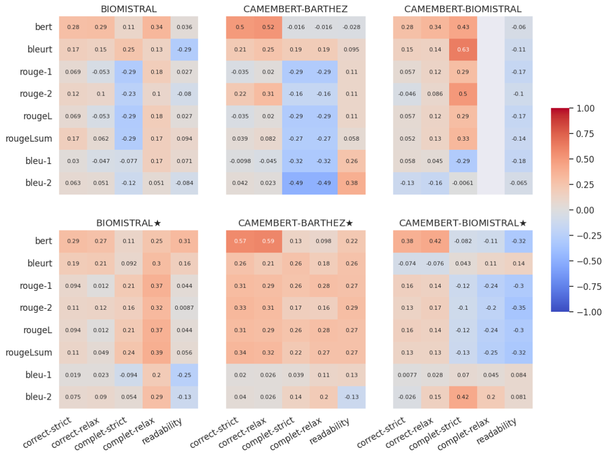

# 通过检索、生成、评估流程，本研究探索了小型语言模型在医学释义生成中的应用。

发布时间：2024年07月23日

`LLM应用` `人工智能`

> Retrieve, Generate, Evaluate: A Case Study for Medical Paraphrases Generation with Small Language Models

# 摘要

> 随着 LLM 对公众的普及，其在医疗建议中的应用变得难以监控。LLM 在语言生成方面存在两大难题：一是易产生幻觉，需基于科学事实；二是模型庞大，对计算资源要求极高。为此，我们推出了 pRAGe 流程，利用 SLM 进行医疗释义的增强生成与评估。我们探讨了 SLM 在法语医疗释义生成中的效能及外部知识库的影响。

> Recent surge in the accessibility of large language models (LLMs) to the general population can lead to untrackable use of such models for medical-related recommendations. Language generation via LLMs models has two key problems: firstly, they are prone to hallucination and therefore, for any medical purpose they require scientific and factual grounding; secondly, LLMs pose tremendous challenge to computational resources due to their gigantic model size. In this work, we introduce pRAGe, a pipeline for Retrieval Augmented Generation and evaluation of medical paraphrases generation using Small Language Models (SLM). We study the effectiveness of SLMs and the impact of external knowledge base for medical paraphrase generation in French.

[Arxiv](https://arxiv.org/abs/2407.16565)