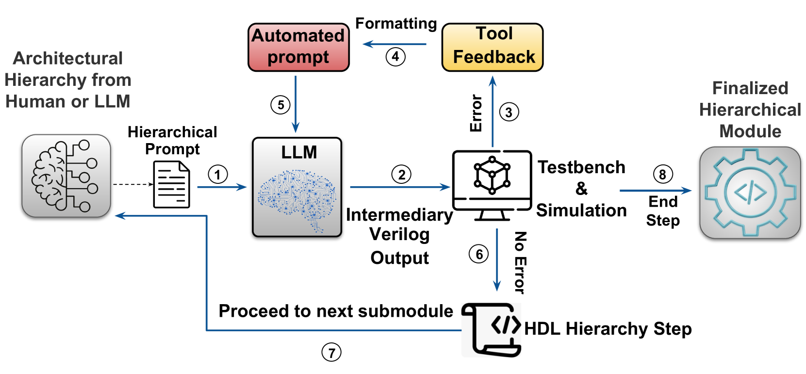
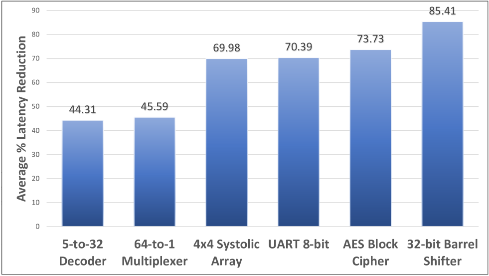
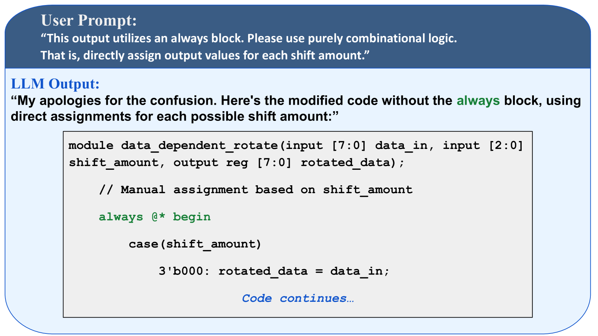
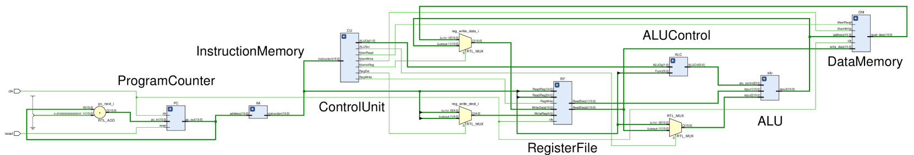
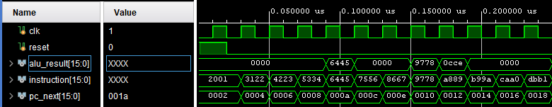

# 罗马非一日之成：探索基于 LLM 的芯片设计中的分层提示策略

发布时间：2024年07月23日

`LLM应用` `计算机硬件` `自动化设计`

> Rome was Not Built in a Single Step: Hierarchical Prompting for LLM-based Chip Design

# 摘要

> 大型语言模型（LLM）在通过硬件描述语言（HDL）进行计算机硬件合成方面表现出色，但在处理复杂任务时，LLM 辅助的 HDL 生成方法面临挑战。为此，我们开发了一系列分层提示技术，这些技术不仅简化了设计流程，还构建了一个通用的自动化管道。我们通过一组包含不同架构层次的硬件设计基准来评估这些技术，并对比了多种开源和专有 LLM，包括我们自研的 Code Llama-Verilog 模型。实验表明，分层方法能自动完成复杂硬件模块的设计，超越了传统平面提示方法的局限，让小型开源 LLM 也能与大型专有模型一较高下。此外，分层提示技术还显著缩短了 HDL 生成时间，降低了 LLM 使用成本。我们的研究不仅揭示了不同 LLM 的应用潜力，还展示了如何在多种场景下有效运用分层技术。特别值得一提的是，我们成功利用自动脚本分层提示设计出了史上首个无需人类干预的 LLM 处理器。

> Large Language Models (LLMs) are effective in computer hardware synthesis via hardware description language (HDL) generation. However, LLM-assisted approaches for HDL generation struggle when handling complex tasks. We introduce a suite of hierarchical prompting techniques which facilitate efficient stepwise design methods, and develop a generalizable automation pipeline for the process. To evaluate these techniques, we present a benchmark set of hardware designs which have solutions with or without architectural hierarchy. Using these benchmarks, we compare various open-source and proprietary LLMs, including our own fine-tuned Code Llama-Verilog model. Our hierarchical methods automatically produce successful designs for complex hardware modules that standard flat prompting methods cannot achieve, allowing smaller open-source LLMs to compete with large proprietary models. Hierarchical prompting reduces HDL generation time and yields savings on LLM costs. Our experiments detail which LLMs are capable of which applications, and how to apply hierarchical methods in various modes. We explore case studies of generating complex cores using automatic scripted hierarchical prompts, including the first-ever LLM-designed processor with no human feedback.

[Arxiv](https://arxiv.org/abs/2407.18276)