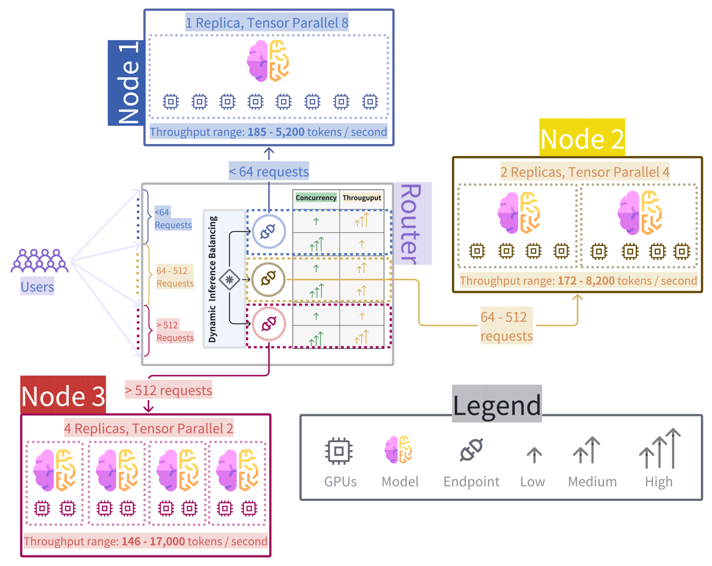

# ScaleLLM：一个通过优化端到端效率，实现资源节约的大型语言模型服务框架

发布时间：2024年07月23日

`LLM应用` `信息技术`

> ScaleLLM: A Resource-Frugal LLM Serving Framework by Optimizing End-to-End Efficiency

# 摘要

> 大型语言模型（LLM）在商业应用中备受青睐，其服务效率直接关系到用户体验。尽管当前研究多聚焦于个别子过程的优化，如本地推理与通信，却缺乏一个能提供整体系统视角的端到端优化框架。本研究深入剖析了LLM服务系统中的关键瓶颈，揭示了全面优化端点需超越LLM推理的复杂挑战。为此，我们推出了ScaleLLM系统，专为高效资源利用而设计。实验数据显示，在64个并发请求下，ScaleLLM不仅速度提升至vLLM的4.3倍，更以1.5倍的高吞吐量领先业界。

> Large language models (LLMs) have surged in popularity and are extensively used in commercial applications, where the efficiency of model serving is crucial for the user experience. Most current research focuses on optimizing individual sub-procedures, e.g. local inference and communication, however, there is no comprehensive framework that provides a holistic system view for optimizing LLM serving in an end-to-end manner. In this work, we conduct a detailed analysis to identify major bottlenecks that impact end-to-end latency in LLM serving systems. Our analysis reveals that a comprehensive LLM serving endpoint must address a series of efficiency bottlenecks that extend beyond LLM inference. We then propose ScaleLLM, an optimized system for resource-efficient LLM serving. Our extensive experiments reveal that with 64 concurrent requests, ScaleLLM achieves a 4.3x speed up over vLLM and outperforms state-of-the-arts with 1.5x higher throughput.

[Arxiv](https://arxiv.org/abs/2408.00008)