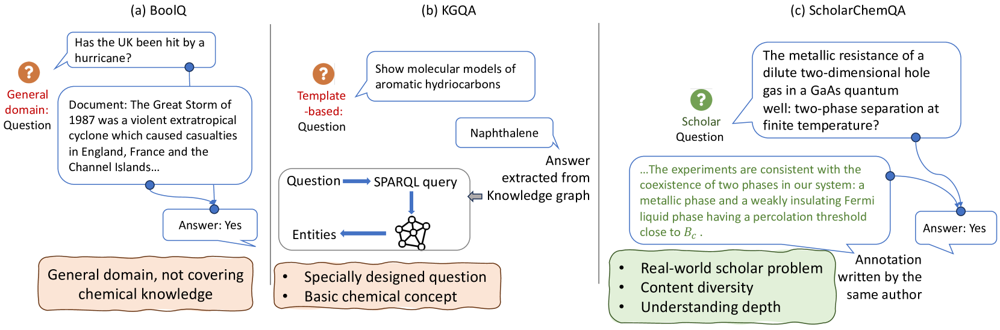
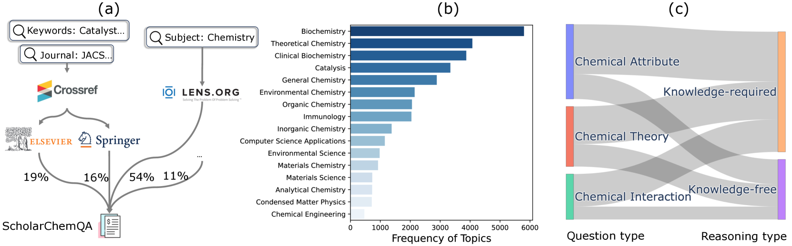
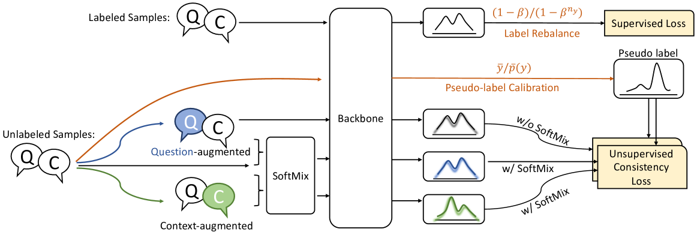
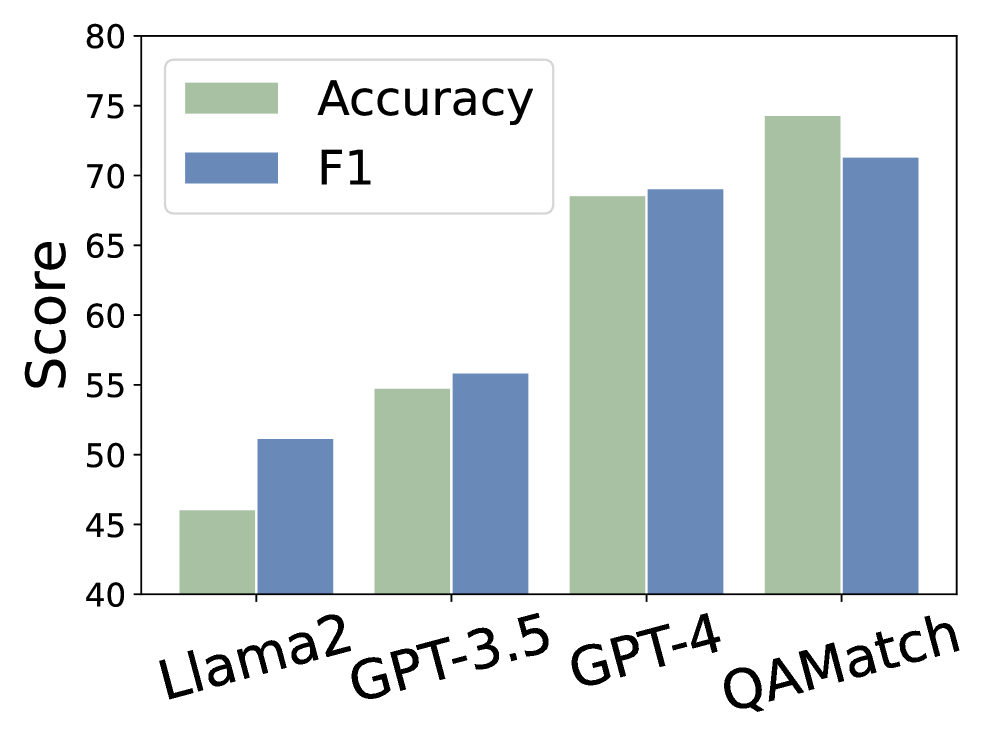
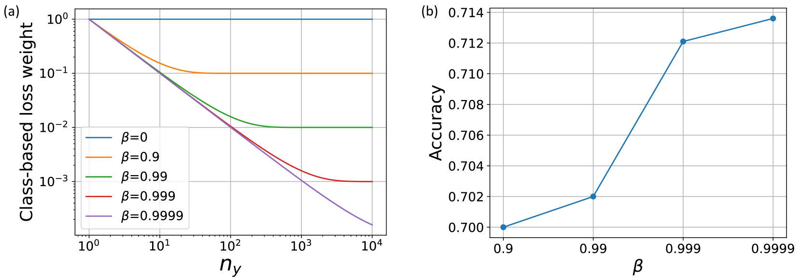
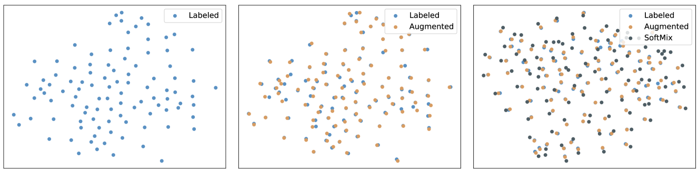
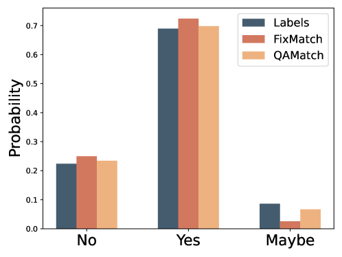
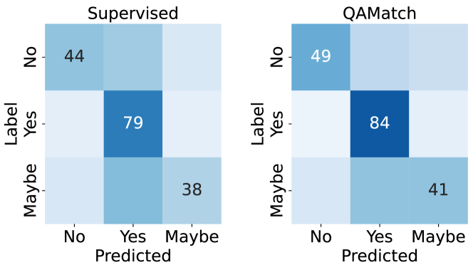
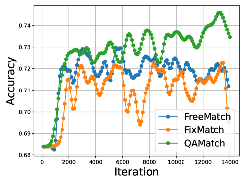

# ScholarChemQA：展现语言模型在化学研究问答领域的强大能力

发布时间：2024年07月23日

`LLM应用`

> ScholarChemQA: Unveiling the Power of Language Models in Chemical Research Question Answering

# 摘要

> 问答（QA）是评估语言模型推理和知识深度的有效手段。尽管通用领域和生物医学领域的QA数据集丰富，但学术化学领域却鲜有探索。化学QA在教育和研究中至关重要，它能将复杂的化学信息转化为易于理解的形式。为此，我们推出了ScholarChemQA，一个源自化学论文的大型QA数据集，它揭示了现实世界中的典型挑战，如数据分布不均和大量未标记数据。针对此，我们设计了QAMatch模型，专门用于利用我们收集的数据高效解答化学问题。我们首先通过逆类别频率调整实例损失权重，解决了标签分布不均的问题，确保少数类别不被多数类别淹没。随后，我们利用未标记数据丰富学习过程，通过SoftMix操作生成多样化的增强数据，并确保其预测与伪标签一致。为保证伪标签质量，我们提出了一种校准方法，使单个样本的伪标签估计与真实分布紧密对齐。实验结果显示，QAMatch在ScholarChemQA及四个基准数据集上均显著超越了同类基线和大型语言模型（LLMs）。我们期待这一基准和模型能推动化学QA领域的进一步研究。

> Question Answering (QA) effectively evaluates language models' reasoning and knowledge depth. While QA datasets are plentiful in areas like general domain and biomedicine, academic chemistry is less explored. Chemical QA plays a crucial role in both education and research by effectively translating complex chemical information into readily understandable format. Addressing this gap, we introduce ScholarChemQA, a large-scale QA dataset constructed from chemical papers. This dataset reflects typical real-world challenges, including an imbalanced data distribution and a substantial amount of unlabeled data that can be potentially useful. Correspondingly, we introduce a QAMatch model, specifically designed to effectively answer chemical questions by fully leveraging our collected data. We first address the issue of imbalanced label distribution by re-weighting the instance-wise loss based on the inverse frequency of each class, ensuring minority classes are not dominated by majority ones during optimization. Next, we utilize the unlabeled data to enrich the learning process, generating a variety of augmentations based on a SoftMix operation and ensuring their predictions align with the same target, i.e., pseudo-labels. To ensure the quality of the pseudo-labels, we propose a calibration procedure aimed at closely aligning the pseudo-label estimates of individual samples with a desired ground truth distribution. Experiments show that our QAMatch significantly outperforms the recent similar-scale baselines and Large Language Models (LLMs) not only on our ScholarChemQA dataset but also on four benchmark datasets. We hope our benchmark and model can facilitate and promote more research on chemical QA.

[Arxiv](https://arxiv.org/abs/2407.16931)