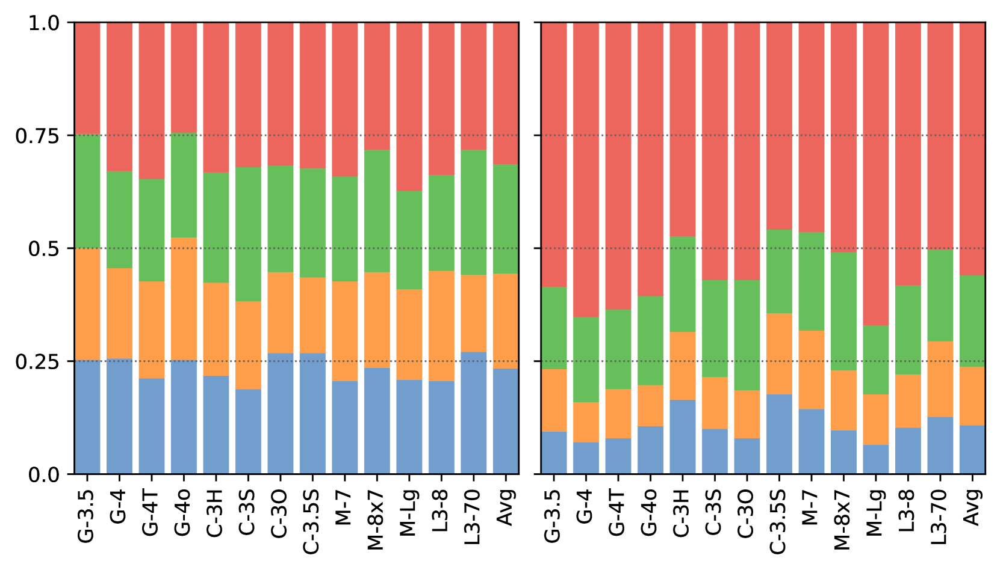
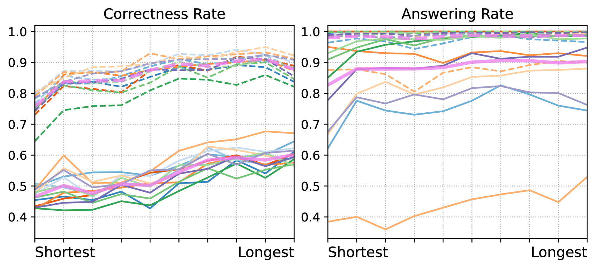
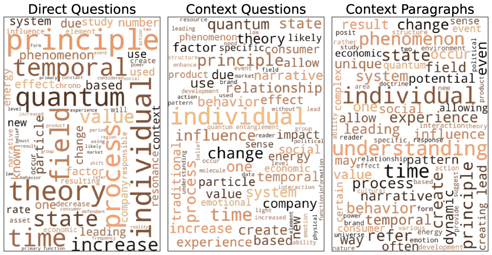
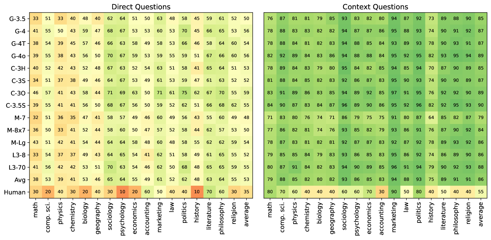
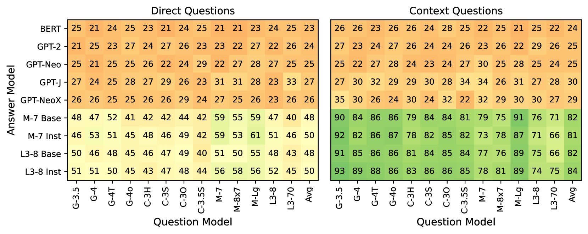

# 共同幻想：大型语言模型幻觉如出一辙

发布时间：2024年07月23日

`LLM理论` `人工智能` `计算机科学`

> Shared Imagination: LLMs Hallucinate Alike

# 摘要

> 尽管大型语言模型 (LLM) 的训练方法相似，但我们通过虚构问答 (IQA) 探索了模型间的相似性。在 IQA 中，一个模型创造虚构问题，另一个模型解答。令人惊讶的是，所有模型都能成功解答这些虚构问题，揭示了一个“共享想象空间”。我们深入研究了这一现象，并探讨了其对模型同质性、幻觉和计算创造力的影响。

> Despite the recent proliferation of large language models (LLMs), their training recipes -- model architecture, pre-training data and optimization algorithm -- are often very similar. This naturally raises the question of the similarity among the resulting models. In this paper, we propose a novel setting, imaginary question answering (IQA), to better understand model similarity. In IQA, we ask one model to generate purely imaginary questions (e.g., on completely made-up concepts in physics) and prompt another model to answer. Surprisingly, despite the total fictionality of these questions, all models can answer each other's questions with remarkable success, suggesting a "shared imagination space" in which these models operate during such hallucinations. We conduct a series of investigations into this phenomenon and discuss implications on model homogeneity, hallucination, and computational creativity.

[Arxiv](https://arxiv.org/abs/2407.16604)