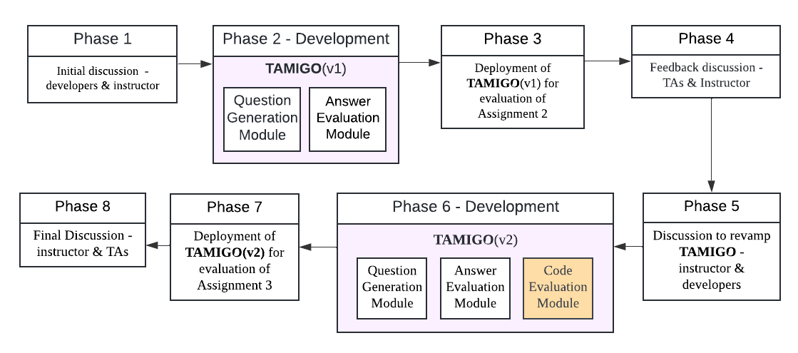

# TAMIGO 项目旨在通过 LLM 辅助的 viva 和代码评估，提升高级计算课程中助教的教学效能。

发布时间：2024年07月23日

`LLM应用` `软件开发`

> TAMIGO: Empowering Teaching Assistants using LLM-assisted viva and code assessment in an Advanced Computing Class

# 摘要

> 大型语言模型（LLMs）在教育领域的应用为学生、教师和助教带来了革命性的变化。本文探讨了LLMs在印度大学分布式系统高级课程中辅助助教（TAs）进行口试和代码评估的实际应用。我们开发了TAMIGO系统，利用LLM帮助TAs评估编程作业。  在口试环节，TAs通过TAMIGO生成问题并分发给学生，随后利用TAMIGO对学生答案进行反馈。对于代码评估，TAs选取学生提交的代码片段，通过TAMIGO生成相应反馈。TAMIGO生成的反馈为TAs的进一步评估提供了依据。  我们评估了LLM在生成口试问题、模型答案、口试答案反馈以及代码提交反馈方面的质量。结果显示，LLMs在提供充足上下文和背景信息时，能高效生成口试问题。然而，LLM生成的口试答案反馈存在一定波动，偶尔的幻觉现象影响了反馈的准确性。尽管如此，反馈整体连贯、建设性、全面且平衡，并未给TAs带来负担。对于代码提交，LLM生成的反馈同样具有建设性、全面性和平衡性，但在与教师制定的代码评估标准对齐方面仍有提升空间。我们的研究有助于深入理解LLMs在教育环境中的应用优势与局限。

> Large Language Models (LLMs) have significantly transformed the educational landscape, offering new tools for students, instructors, and teaching assistants. This paper investigates the application of LLMs in assisting teaching assistants (TAs) with viva and code assessments in an advanced computing class on distributed systems in an Indian University. We develop TAMIGO, an LLM-based system for TAs to evaluate programming assignments.
  For viva assessment, the TAs generated questions using TAMIGO and circulated these questions to the students for answering. The TAs then used TAMIGO to generate feedback on student answers. For code assessment, the TAs selected specific code blocks from student code submissions and fed it to TAMIGO to generate feedback for these code blocks. The TAMIGO-generated feedback for student answers and code blocks was used by the TAs for further evaluation.
  We evaluate the quality of LLM-generated viva questions, model answers, feedback on viva answers, and feedback on student code submissions. Our results indicate that LLMs are highly effective at generating viva questions when provided with sufficient context and background information. However, the results for LLM-generated feedback on viva answers were mixed; instances of hallucination occasionally reduced the accuracy of feedback. Despite this, the feedback was consistent, constructive, comprehensive, balanced, and did not overwhelm the TAs. Similarly, for code submissions, the LLM-generated feedback was constructive, comprehensive and balanced, though there was room for improvement in aligning the feedback with the instructor-provided rubric for code evaluation. Our findings contribute to understanding the benefits and limitations of integrating LLMs into educational settings.

[Arxiv](https://arxiv.org/abs/2407.16805)