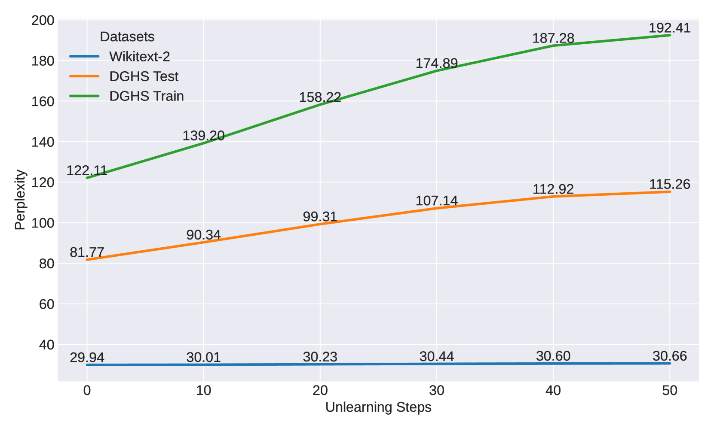

# 探索迁移遗忘：揭示跨领域偏差缓解的实证研究

发布时间：2024年07月23日

`LLM理论` `人工智能` `社会科学`

> Towards Transfer Unlearning: Empirical Evidence of Cross-Domain Bias Mitigation

# 摘要

> 大型语言模型（LLM）往往携带着训练数据中的偏见。尽管传统去偏方法有一定效果，但无法彻底消除这些模型中的偏见和毒性。本文探讨了一种基于遗忘机制的去偏策略，通过优化针对少数群体的仇恨言论，降低偏见内容的生成概率。我们提出的掩码语言模型遗忘技术，能有效剔除文本中的有害成分，使模型学会选择性遗忘，从而摆脱偏见。实验证实，这种方法在减少偏见的同时，并未削弱模型的语言处理能力。更有趣的是，研究发现，针对某一类偏见的去偏处理，可能意外地有助于缓解其他类型的偏见，显示出跨领域去偏的潜在价值。

> Large language models (LLMs) often inherit biases from vast amounts of training corpora. Traditional debiasing methods, while effective to some extent, do not completely eliminate memorized biases and toxicity in LLMs. In this paper, we study an unlearning-based approach to debiasing in LLMs by performing gradient ascent on hate speech against minority groups, i.e., minimizing the likelihood of biased or toxic content. Specifically, we propose a mask language modeling unlearning technique, which unlearns the harmful part of the text. This method enables LLMs to selectively forget and disassociate from biased and harmful content. Experimental results demonstrate the effectiveness of our approach in diminishing bias while maintaining the language modeling abilities. Surprisingly, the results also unveil an unexpected potential for cross-domain transfer unlearning: debiasing in one bias form (e.g. gender) may contribute to mitigating others (e.g. race and religion).

[Arxiv](https://arxiv.org/abs/2407.16951)