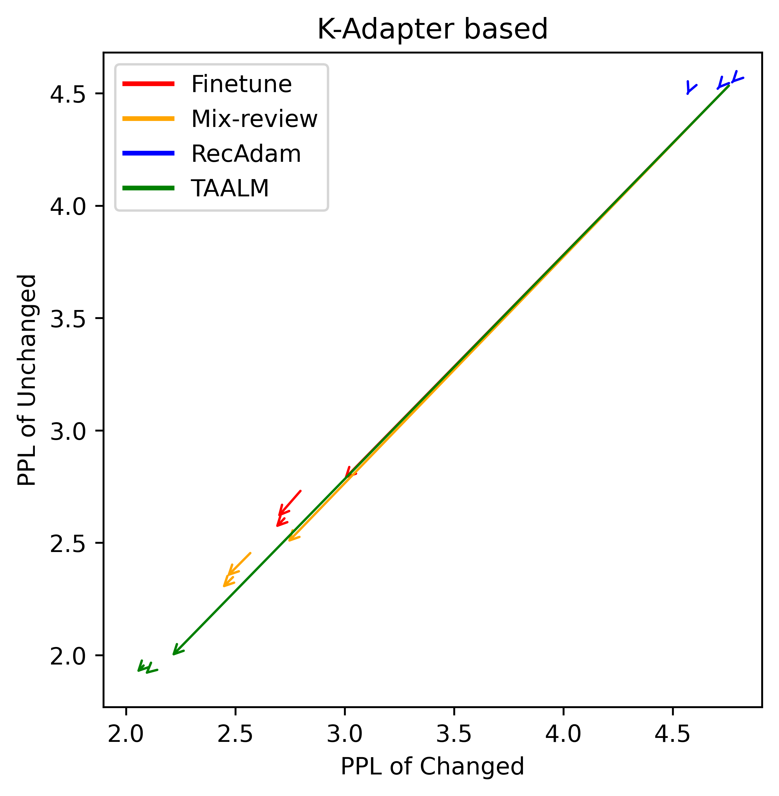

# Train-Attention：探索在持续知识学习过程中，元学习如何决定关注点

发布时间：2024年07月23日

`LLM理论` `人工智能`

> Train-Attention: Meta-Learning Where to Focus in Continual Knowledge Learning

# 摘要

> 在大型语言模型中，持续知识学习面临灾难性遗忘的挑战，传统方法如正则化和架构调整虽有应用，但效率不高，且可能导致不必要的参数更新。为此，我们创新性地提出了 TAALM 方法，通过智能地为标记分配权重，优化学习过程，减少遗忘。同时，鉴于现有基准在展示学习与保留平衡方面的不足，我们引入了 \textsc{LAMA-ckl} 基准。实验表明，TAALM 不仅在性能上超越了现有方法，还能与之前的 CKL 技术协同工作，展现出卓越的兼容性和效率。

> Previous studies on continual knowledge learning (CKL) in large language models (LLMs) have predominantly focused on approaches such as regularization, architectural modifications, and rehearsal techniques to mitigate catastrophic forgetting. However, these methods naively inherit the inefficiencies of standard training procedures, indiscriminately applying uniform weight across all tokens, which can lead to unnecessary parameter updates and increased forgetting. To address these shortcomings, we propose a novel CKL approach termed Train-Attention-Augmented Language Model (TAALM), which enhances learning efficiency by dynamically predicting and applying weights to tokens based on their usefulness. This method employs a meta-learning framework that optimizes token importance predictions, facilitating targeted knowledge updates and minimizing forgetting. Also, we observe that existing benchmarks do not clearly exhibit the trade-off between learning and retaining, therefore we propose a new benchmark, \textsc{LAMA-ckl}, to address this issue. Through experiments conducted on both newly introduced and established CKL benchmarks, TAALM proves the state-of-the-art performance upon the baselines, and also shows synergistic compatibility when integrated with previous CKL approaches.

[Arxiv](https://arxiv.org/abs/2407.16920)