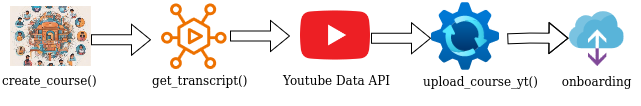
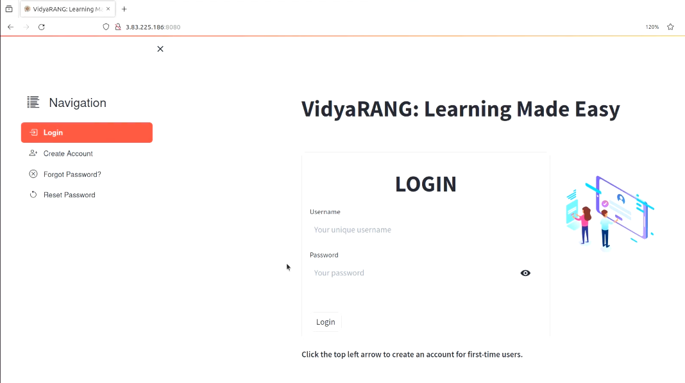
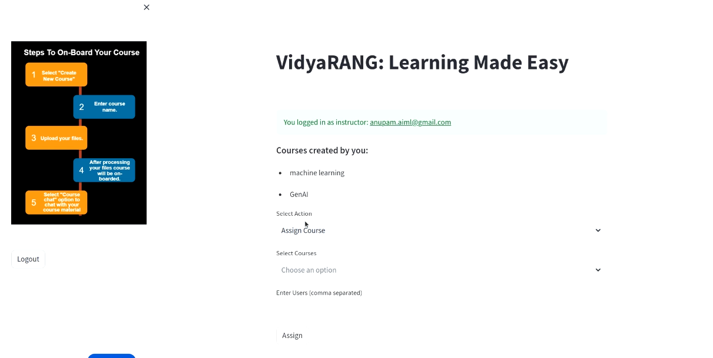

# VidyaRANG：一款由大型语言模型支持的对话学习平台

发布时间：2024年07月23日

`LLM应用

解释：这篇论文摘要描述了一个平台，该平台利用知识增强检索技术来服务跨领域的学习者，并强调了在技术实现中对安全与隐私的重视。尽管提到了大型语言模型（如GPT）的局限性，但论文的主要焦点是应用这些技术来创建一个教育平台，该平台能够提供个性化的学习体验并保护敏感信息。因此，它属于LLM应用的范畴，因为它是在实际应用场景中使用大型语言模型的技术和方法。` `软件工程`

> VidyaRANG: Conversational Learning Based Platform powered by Large Language Model

# 摘要

> 在这个信息爆炸的时代，为学生提供精准的权威解答面临挑战。大型语言模型如GPT无法处理敏感保密信息的问题。此时，知识增强检索技术显得尤为关键。我们设计的平台致力于服务跨领域的学习者，支持视频和书籍学习，并允许互动提问，有效提升学习专注度，同时保障个性化学习体验。教师的角色因此简化，能更高效地培训更多学生。为保护隐私，教师可控制课程访问权限，实现个性化教学。技术层面，我们融合了软件开发、产品管理及云计算知识，前端采用Streamlit和React框架，确保安全与隐私，服务器配备SSL证书，API密钥安全存储，并实现了与移动应用的连接，全面覆盖软件工程核心领域。

> Providing authoritative information tailored to a student's specific doubt is a hurdle in this era where search engines return an overwhelming number of article links. Large Language Models such as GPTs fail to provide answers to questions that were derived from sensitive confidential information. This information which is specific to some organisations is not available to LLMs due to privacy constraints. This is where knowledge-augmented retrieval techniques become particularly useful. The proposed platform is designed to cater to the needs of learners from divergent fields. Today, the most common format of learning is video and books, which our proposed platform allows learners to interact and ask questions. This increases learners' focus time exponentially by restricting access to pertinent content and, at the same time allowing personalized access and freedom to gain in-depth knowledge. Instructor's roles and responsibilities are significantly simplified allowing them to train a larger audience. To preserve privacy, instructors can grant course access to specific individuals, enabling personalized conversation on the provided content. This work includes an extensive spectrum of software development and product management skills, which also circumscribe knowledge of cloud computing for running Large Language Models and maintaining the application. For Frontend development, which is responsible for user interaction and user experience, Streamlit and React framework have been utilized. To improve security and privacy, the server is routed to a domain with an SSL certificate, and all the API key/s are stored securely on an AWS EC2 instance, to enhance user experience, web connectivity to an Android Studio-based mobile app has been established, and in-process to publish the app on play store, thus addressing all major software engineering disciplines

[Arxiv](https://arxiv.org/abs/2407.16209)