# VisMin：探索视觉中的微妙变化

发布时间：2024年07月23日

`LLM应用` `计算机视觉`

> VisMin: Visual Minimal-Change Understanding

# 摘要

> 视觉-语言模型（VLMs）对物体细节、属性和物体间关系的精准理解至关重要。现有评估主要集中在模型区分相似描述的能力上。本文提出新基准VisMin，挑战模型在两图两文中找出正确匹配，每次仅涉及物体、属性、数量或空间关系中的单一变化。我们构建了自动化框架并经人工严格验证。实验显示，VLMs在空间关系和计数上表现不足。为此，我们创建了大规模数据集，微调CLIP和Idefics2，显著提升了细粒度理解和图像-文本对齐。所有资源已公开于\url{https://vismin.net/}。

> Fine-grained understanding of objects, attributes, and relationships between objects is crucial for visual-language models (VLMs). Existing benchmarks primarily focus on evaluating VLMs' capability to distinguish between two very similar \textit{captions} given an image. In this paper, we introduce a new, challenging benchmark termed \textbf{Vis}ual \textbf{Min}imal-Change Understanding (VisMin), which requires models to predict the correct image-caption match given two images and two captions. The image pair and caption pair contain minimal changes, i.e., only one aspect changes at a time from among the following: \textit{object}, \textit{attribute}, \textit{count}, and \textit{spatial relation}. These changes test the models' understanding of objects, attributes (such as color, material, shape), counts, and spatial relationships between objects. We built an automatic framework using large language models and diffusion models, followed by a rigorous 4-step verification process by human annotators. Empirical experiments reveal that current VLMs exhibit notable deficiencies in understanding spatial relationships and counting abilities. We also generate a large-scale training dataset to finetune CLIP and Idefics2, showing significant improvements in fine-grained understanding across benchmarks and in CLIP's general image-text alignment. We release all resources, including the benchmark, training data, and finetuned model checkpoints, at \url{https://vismin.net/}.

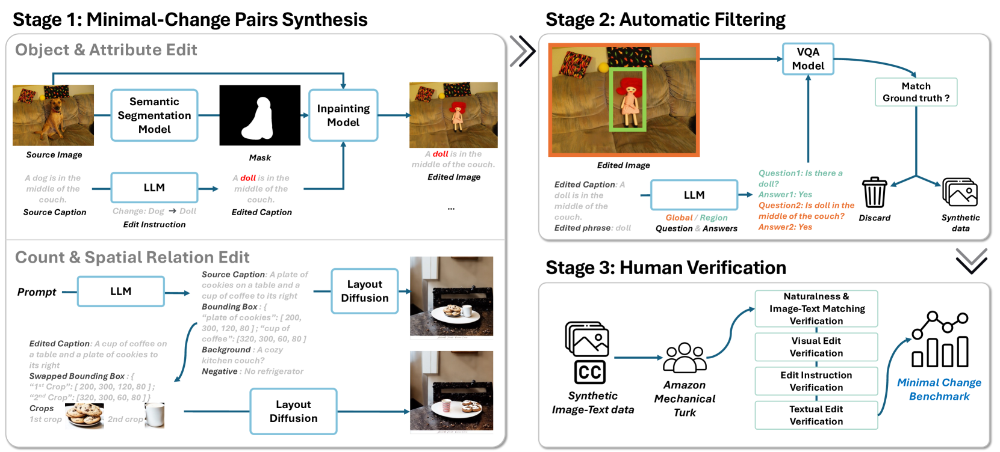

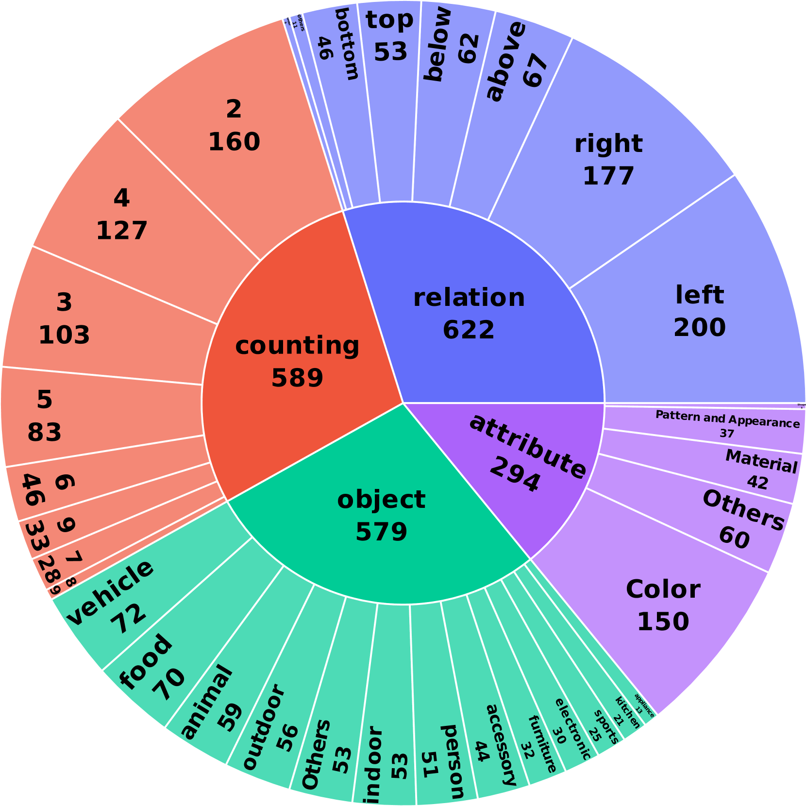

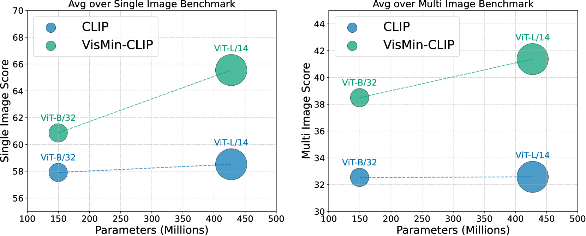

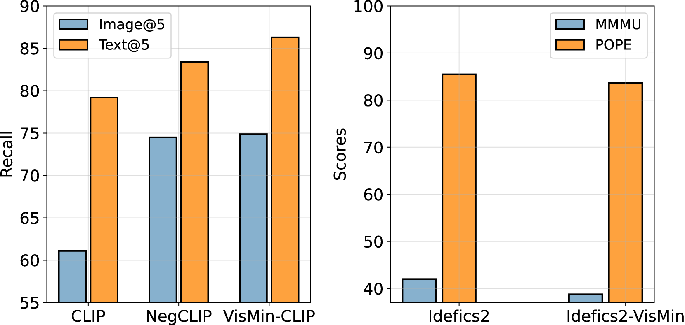

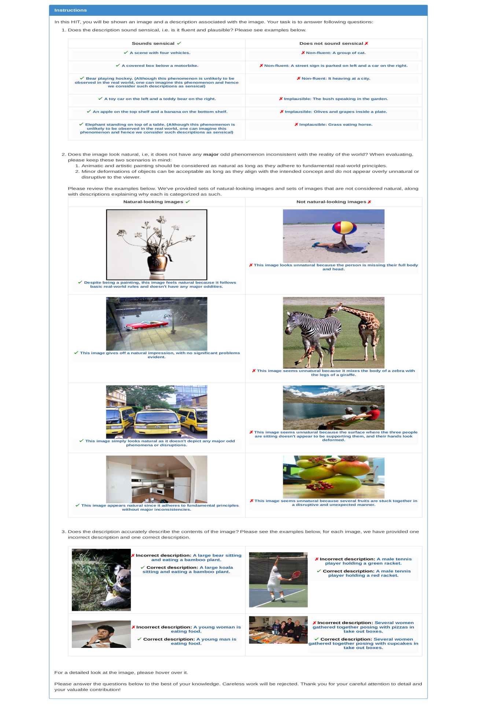

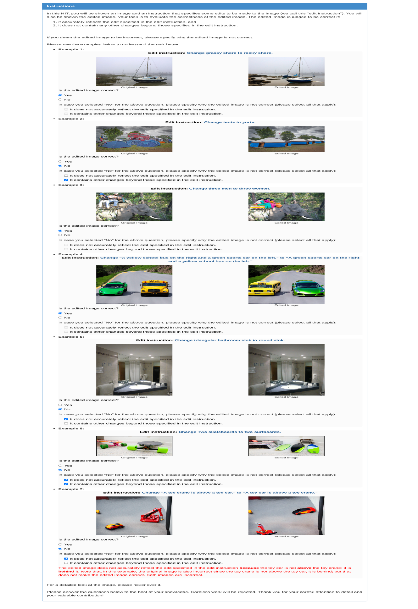

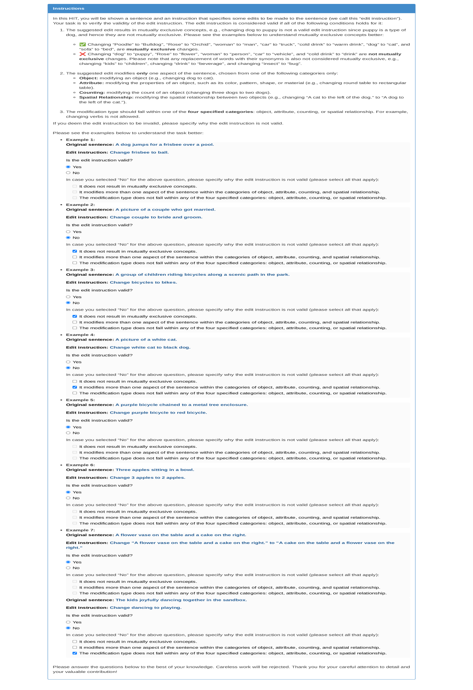

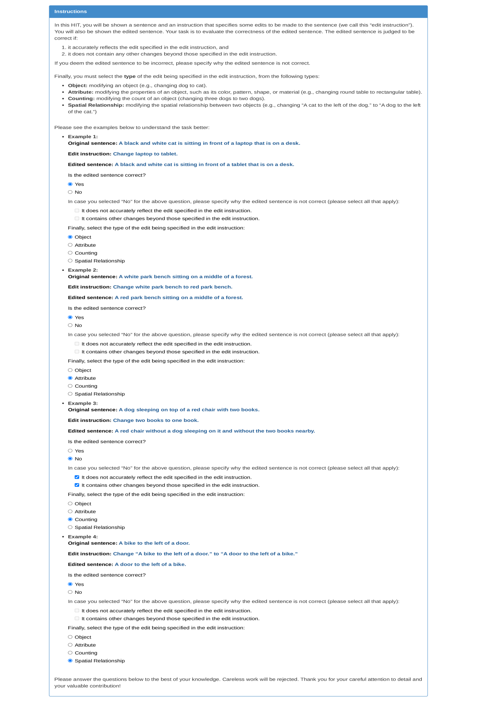

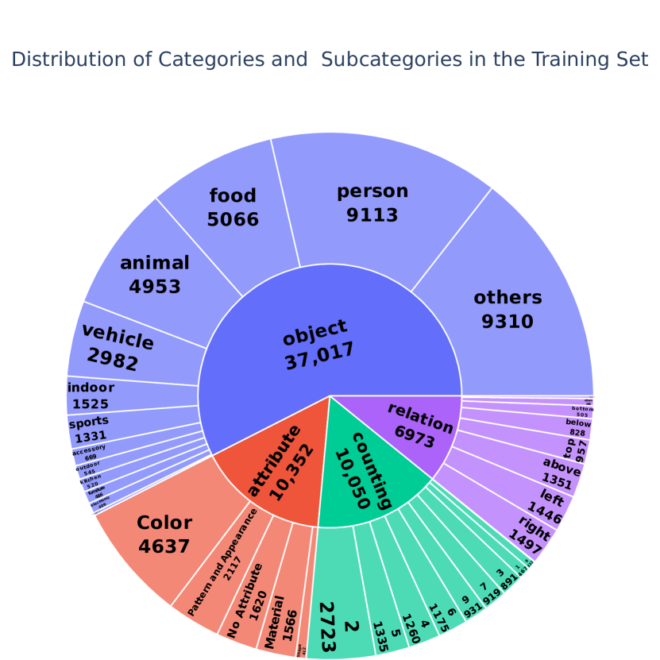

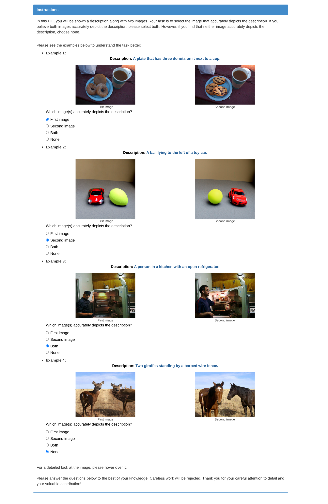

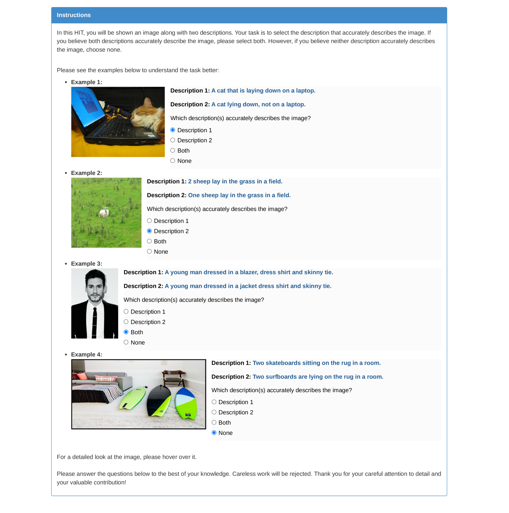

[Arxiv](https://arxiv.org/abs/2407.16772)