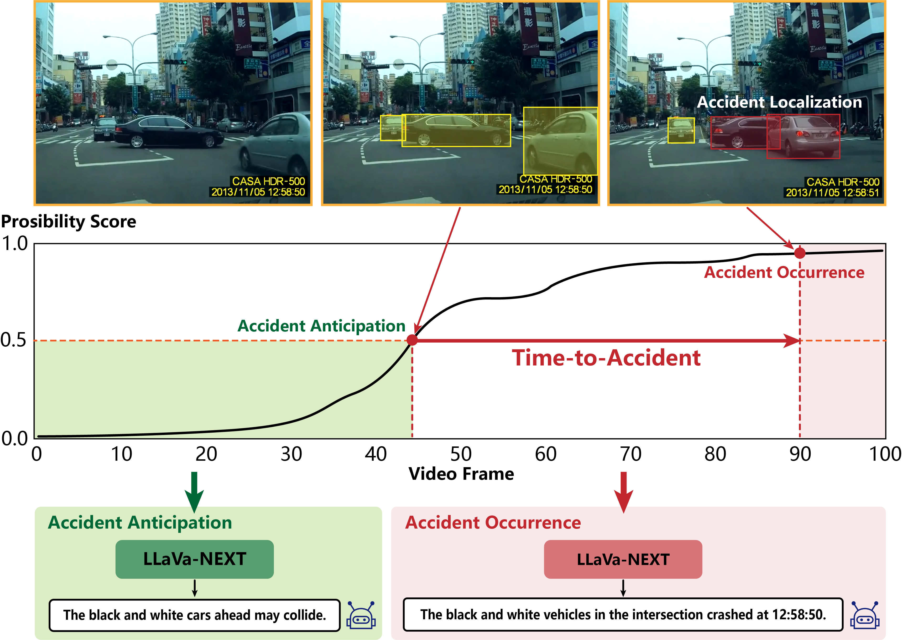
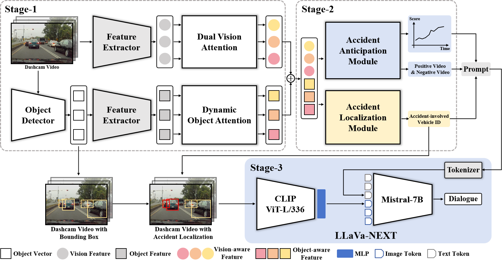
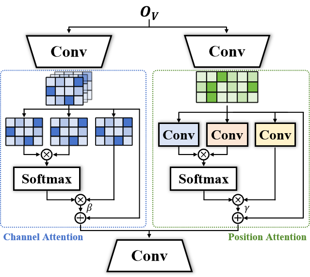
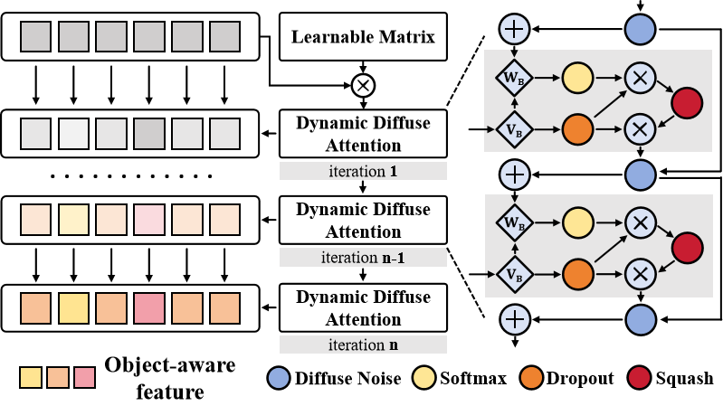
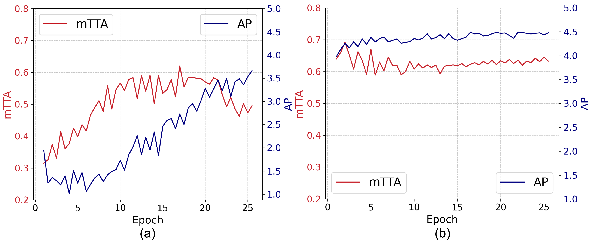

# 何时何地何事？结合大型语言模型，我们提出了一种新颖的事故预测与定位基准。

发布时间：2024年07月23日

`LLM应用` `自动驾驶`

> When, Where, and What? An Novel Benchmark for Accident Anticipation and Localization with Large Language Models

# 摘要

> 随着自动驾驶系统逐渐融入日常生活，准确预测并缓解交通事故的能力变得至关重要。传统模型虽能预测事故发生时间，但在定位事故和识别相关实体方面表现不佳。为此，我们提出了一种集成大型语言模型（LLMs）的新框架，旨在全方位提升预测能力——包括事故的性质、时间和地点。我们创新性地设计了一种基于链的注意力机制，能动态调整以聚焦高风险驾驶元素。此外，通过一个三阶段处理流程，将小模型的输出转化为LLMs所需的多模态详细输入，从而深化对交通动态的理解。实证研究表明，我们的方法在平均精度（AP）和平均时间至事故（mTTA）指标上表现卓越，为事故预测技术树立了新标杆。这不仅提升了自动驾驶安全的技术水平，还优化了人机交互，使得自动驾驶系统提供的预测信息更加直观易用。

> As autonomous driving systems increasingly become part of daily transportation, the ability to accurately anticipate and mitigate potential traffic accidents is paramount. Traditional accident anticipation models primarily utilizing dashcam videos are adept at predicting when an accident may occur but fall short in localizing the incident and identifying involved entities. Addressing this gap, this study introduces a novel framework that integrates Large Language Models (LLMs) to enhance predictive capabilities across multiple dimensions--what, when, and where accidents might occur. We develop an innovative chain-based attention mechanism that dynamically adjusts to prioritize high-risk elements within complex driving scenes. This mechanism is complemented by a three-stage model that processes outputs from smaller models into detailed multimodal inputs for LLMs, thus enabling a more nuanced understanding of traffic dynamics. Empirical validation on the DAD, CCD, and A3D datasets demonstrates superior performance in Average Precision (AP) and Mean Time-To-Accident (mTTA), establishing new benchmarks for accident prediction technology. Our approach not only advances the technological framework for autonomous driving safety but also enhances human-AI interaction, making predictive insights generated by autonomous systems more intuitive and actionable.

[Arxiv](https://arxiv.org/abs/2407.16277)