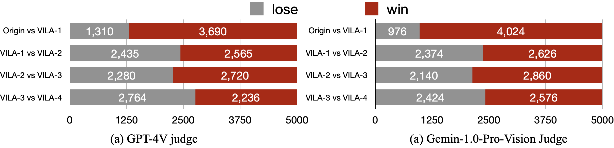
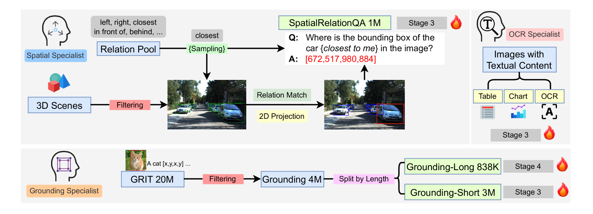
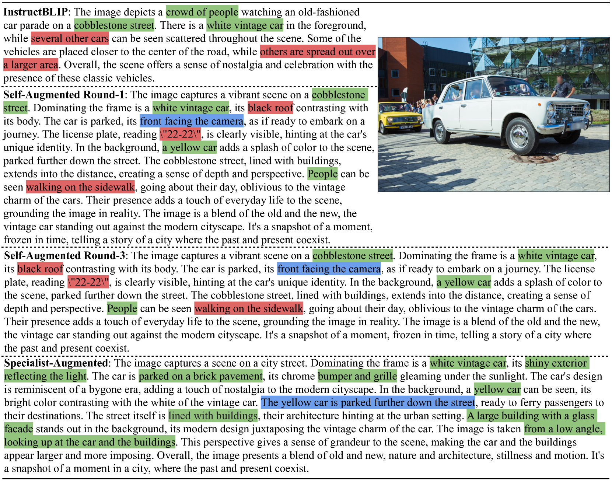

# $VILA^2$：VILA 的增强版

发布时间：2024年07月24日

`LLM应用` `人工智能` `计算机视觉`

> $VILA^2$: VILA Augmented VILA

# 摘要

> 随着大型语言模型的成功，视觉语言模型也迅速发展。然而，数据管理这一环节仍未得到充分关注。面对数据瓶颈，现有方法或是依赖于互联网上质量参差不齐的原始数据，或是受限于商业模型的性能上限。为此，我们提出了一种创新方法，通过自我增强和专家增强两个步骤，迭代提升数据与模型性能。在自我增强阶段，VLM通过重新标注预训练数据来优化质量，并基于此精炼数据集重新训练模型。这一过程可循环进行，直至效果饱和。随后，我们利用特定领域专家VLM，通过针对性的重新标注与训练，将专业知识融入通用VLM。最终，我们推出的$VILA^2$系列VLM，在多项任务上超越了现有技术，并在MMMU排行榜上刷新了开源模型的记录。

> Visual language models (VLMs) have rapidly progressed, driven by the success of large language models (LLMs). While model architectures and training infrastructures advance rapidly, data curation remains under-explored. When data quantity and quality become a bottleneck, existing work either directly crawls more raw data from the Internet that does not have a guarantee of data quality or distills from black-box commercial models (e.g., GPT-4V / Gemini) causing the performance upper bounded by that model. In this work, we introduce a novel approach that includes a self-augment step and a specialist-augment step to iteratively improve data quality and model performance. In the self-augment step, a VLM recaptions its own pretraining data to enhance data quality, and then retrains from scratch using this refined dataset to improve model performance. This process can iterate for several rounds. Once self-augmentation saturates, we employ several specialist VLMs finetuned from the self-augmented VLM with domain-specific expertise, to further infuse specialist knowledge into the generalist VLM through task-oriented recaptioning and retraining. With the combined self-augmented and specialist-augmented training, we introduce $VILA^2$ (VILA-augmented-VILA), a VLM family that consistently improves the accuracy on a wide range of tasks over prior art, and achieves new state-of-the-art results on MMMU leaderboard among open-sourced models.

[Arxiv](https://arxiv.org/abs/2407.17453)