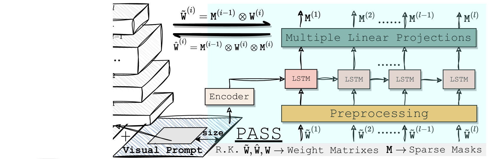
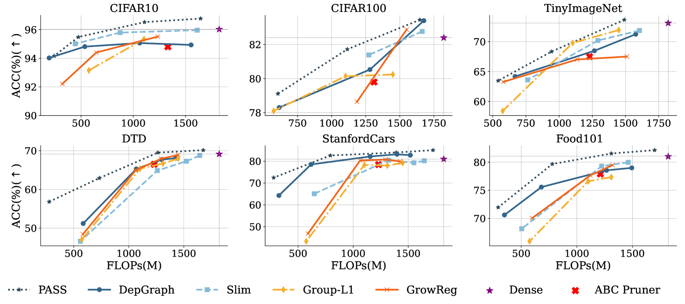
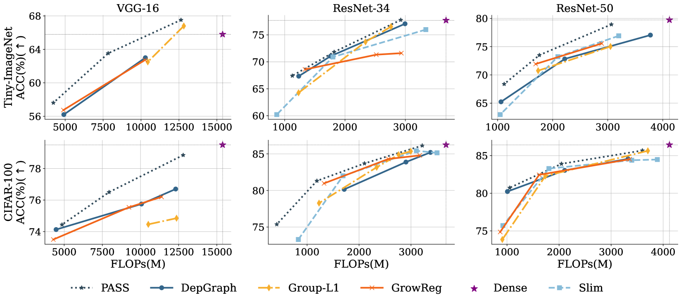
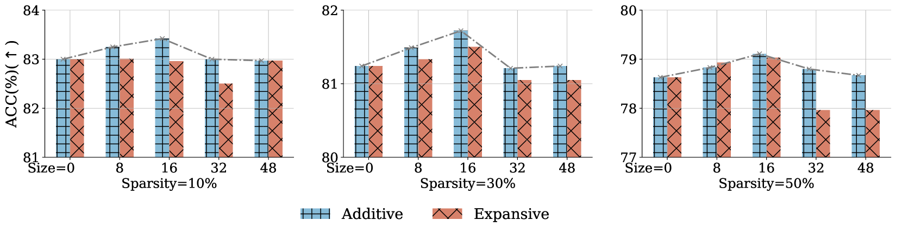
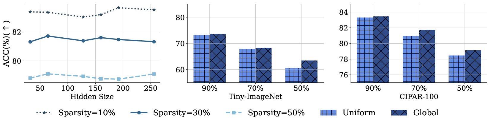

# 视觉提示借助循环超网络，巧妙定位了结构中的稀疏性优势。

发布时间：2024年07月24日

`LLM理论` `计算机视觉` `机器学习`

> (PASS) Visual Prompt Locates Good Structure Sparsity through a Recurrent HyperNetwork

# 摘要

> 尽管大规模神经网络在视觉和语言处理等领域表现出色，但其高性能是以庞大的计算资源为代价的。结构模型剪枝，得益于其加速友好的稀疏模式，成为提升模型效率的重要算法。本文探讨了一个创新思路：通过视觉提示捕捉通道重要性，进而推导出高质量的结构稀疏性。为此，我们设计了\texttt{PASS}框架，这是一个定制的超网络，结合视觉提示和网络权重统计，循环输出逐层通道稀疏性，充分考虑了层间通道的内在依赖。实验结果显示，\texttt{PASS}在多个网络架构和数据集上，不仅在相同计算量下提升了$1\%\sim 3\%$的准确性，还在达到相同性能时实现了$0.35\times$的加速，超越了基线方法。

> Large-scale neural networks have demonstrated remarkable performance in different domains like vision and language processing, although at the cost of massive computation resources. As illustrated by compression literature, structural model pruning is a prominent algorithm to encourage model efficiency, thanks to its acceleration-friendly sparsity patterns. One of the key questions of structural pruning is how to estimate the channel significance. In parallel, work on data-centric AI has shown that prompting-based techniques enable impressive generalization of large language models across diverse downstream tasks. In this paper, we investigate a charming possibility - \textit{leveraging visual prompts to capture the channel importance and derive high-quality structural sparsity}. To this end, we propose a novel algorithmic framework, namely \texttt{PASS}. It is a tailored hyper-network to take both visual prompts and network weight statistics as input, and output layer-wise channel sparsity in a recurrent manner. Such designs consider the intrinsic channel dependency between layers. Comprehensive experiments across multiple network architectures and six datasets demonstrate the superiority of \texttt{PASS} in locating good structural sparsity. For example, at the same FLOPs level, \texttt{PASS} subnetworks achieve $1\%\sim 3\%$ better accuracy on Food101 dataset; or with a similar performance of $80\%$ accuracy, \texttt{PASS} subnetworks obtain $0.35\times$ more speedup than the baselines.

[Arxiv](https://arxiv.org/abs/2407.17412)