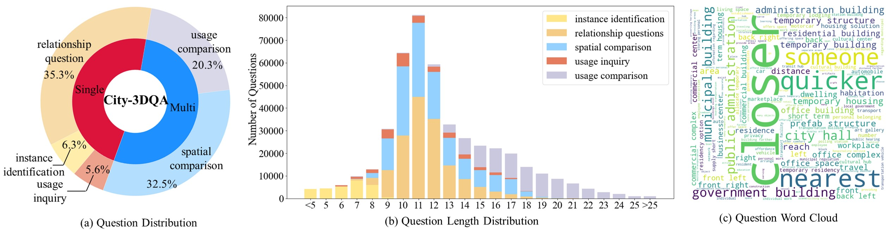

# 三维问答助力城市景观洞察

发布时间：2024年07月24日

`Agent` `城市规划` `人工智能`

> 3D Question Answering for City Scene Understanding

# 摘要

> 3D多模态问答（MQA）在智能代理理解3D环境中的场景方面至关重要。虽然研究多聚焦于室内外任务，但城市级场景理解的研究尚少。由于缺乏城市级的空间语义和人与环境交互信息，理解城市场景颇具挑战。为此，我们从数据集和方法两方面入手，推出了首个包含城市场景语义和交互任务的City-3DQA数据集，并提出了利用场景图增强城市理解的Sg-CityU方法。该方法在City-3DQA数据集上表现卓越，准确率达63.94%和63.76%，超越了室内3D MQA方法和LLMs的零-shot方法，展现出顶尖的鲁健性和泛化能力。

> 3D multimodal question answering (MQA) plays a crucial role in scene understanding by enabling intelligent agents to comprehend their surroundings in 3D environments. While existing research has primarily focused on indoor household tasks and outdoor roadside autonomous driving tasks, there has been limited exploration of city-level scene understanding tasks. Furthermore, existing research faces challenges in understanding city scenes, due to the absence of spatial semantic information and human-environment interaction information at the city level.To address these challenges, we investigate 3D MQA from both dataset and method perspectives. From the dataset perspective, we introduce a novel 3D MQA dataset named City-3DQA for city-level scene understanding, which is the first dataset to incorporate scene semantic and human-environment interactive tasks within the city. From the method perspective, we propose a Scene graph enhanced City-level Understanding method (Sg-CityU), which utilizes the scene graph to introduce the spatial semantic. A new benchmark is reported and our proposed Sg-CityU achieves accuracy of 63.94 % and 63.76 % in different settings of City-3DQA. Compared to indoor 3D MQA methods and zero-shot using advanced large language models (LLMs), Sg-CityU demonstrates state-of-the-art (SOTA) performance in robustness and generalization.

[Arxiv](https://arxiv.org/abs/2407.17398)