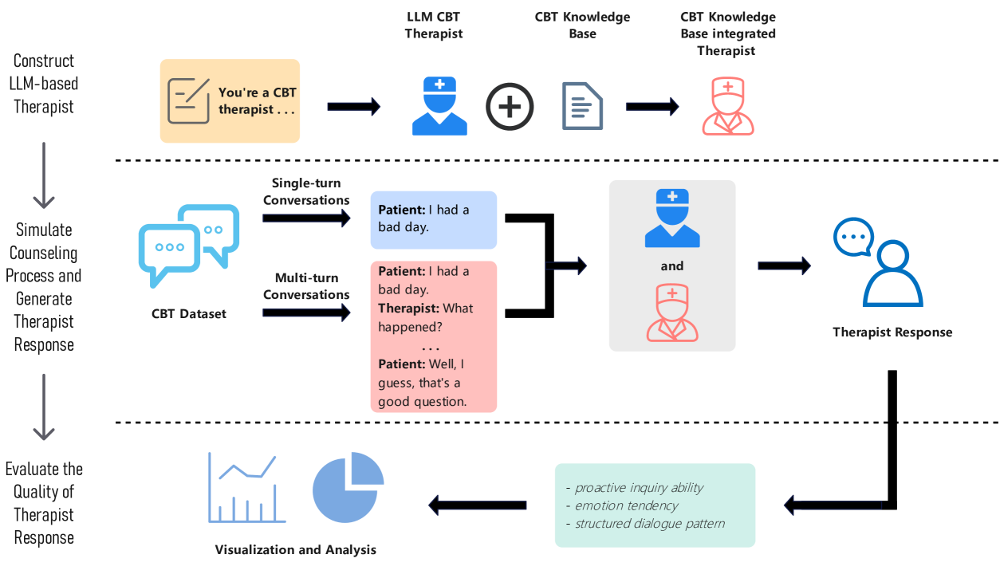

# 大型语言模型能否实施认知行为疗法？

发布时间：2024年07月24日

`LLM应用` `心理健康` `人工智能`

> Are Large Language Models Possible to Conduct Cognitive Behavioral Therapy?

# 摘要

> 在当今社会，心理健康问题愈发显著，心理障碍的多样性、复杂性和普遍性日益增加。认知行为疗法（CBT）作为一种无副作用且临床有效的心理治疗方法，其普及和质量在多数国家仍显不足。近年来，大型语言模型（LLM）在情绪障碍的识别与干预方面展现出潜力，为心理治疗开辟了新途径。然而，LLM是否能真正实施CBT仍存疑。为此，我们从网络视频中收集了真实CBT语料，构建了一个自动评估框架，涵盖生成文本的情感倾向、结构化对话及主动询问能力。我们通过计算情感倾向分数、运用多样评估指标对比模型间的CBT表现，并利用PQA指标评估引导患者的能力。此外，我们还探索了整合CBT知识库对LLM的CBT能力的提升效果。实验结果表明，LLM在心理咨询领域展现出巨大潜力，尤其是在技术手段的辅助下。

> In contemporary society, the issue of psychological health has become increasingly prominent, characterized by the diversification, complexity, and universality of mental disorders. Cognitive Behavioral Therapy (CBT), currently the most influential and clinically effective psychological treatment method with no side effects, has limited coverage and poor quality in most countries. In recent years, researches on the recognition and intervention of emotional disorders using large language models (LLMs) have been validated, providing new possibilities for psychological assistance therapy. However, are LLMs truly possible to conduct cognitive behavioral therapy? Many concerns have been raised by mental health experts regarding the use of LLMs for therapy. Seeking to answer this question, we collected real CBT corpus from online video websites, designed and conducted a targeted automatic evaluation framework involving the evaluation of emotion tendency of generated text, structured dialogue pattern and proactive inquiry ability. For emotion tendency, we calculate the emotion tendency score of the CBT dialogue text generated by each model. For structured dialogue pattern, we use a diverse range of automatic evaluation metrics to compare speaking style, the ability to maintain consistency of topic and the use of technology in CBT between different models . As for inquiring to guide the patient, we utilize PQA (Proactive Questioning Ability) metric. We also evaluated the CBT ability of the LLM after integrating a CBT knowledge base to explore the help of introducing additional knowledge to enhance the model's CBT counseling ability. Four LLM variants with excellent performance on natural language processing are evaluated, and the experimental result shows the great potential of LLMs in psychological counseling realm, especially after combining with other technological means.

[Arxiv](https://arxiv.org/abs/2407.17730)