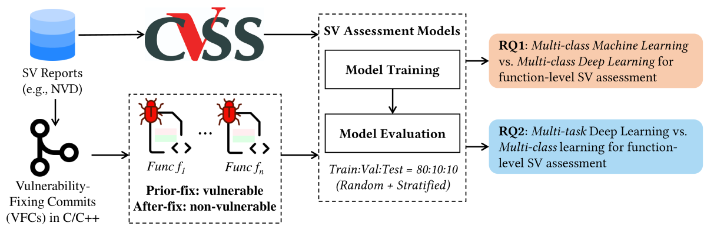
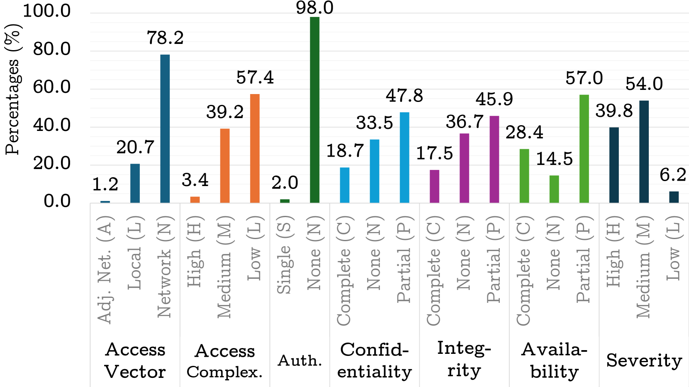
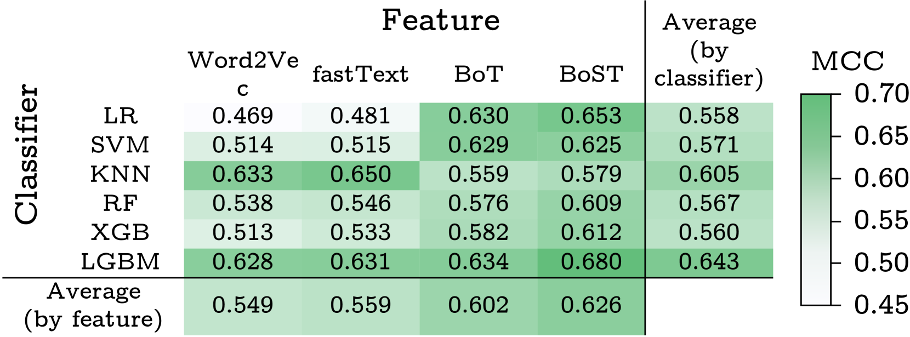
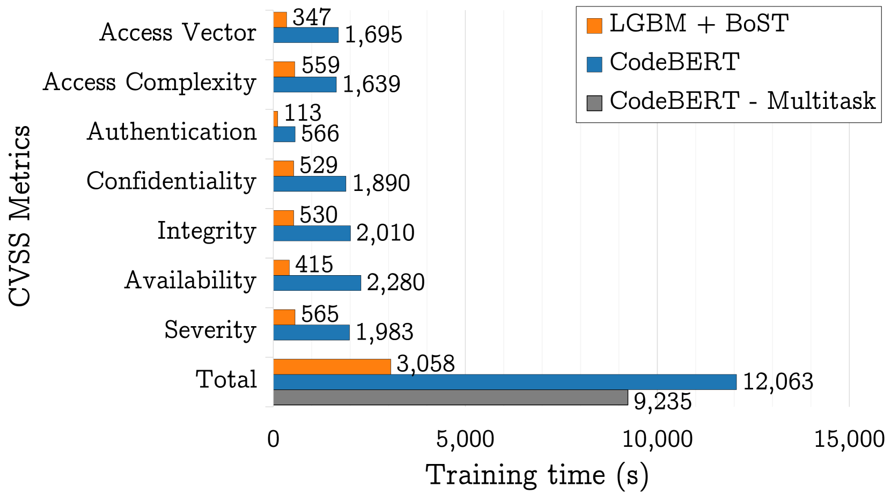

# 自动化代码漏洞评估：我们进展如何？C/C++ 实证研究探析

发布时间：2024年07月24日

`LLM应用` `软件工程` `网络安全`

> Automated Code-centric Software Vulnerability Assessment: How Far Are We? An Empirical Study in C/C++

# 摘要

> 背景：C和C++语言在软件工程中占据重要地位，因其广泛应用。众多研究采用ML和DL技术检测这些语言源码中的软件漏洞（SVs）。然而，这些技术在函数级SV评估中的应用尚待深入探索。随着SV评估对安全缺陷的详细信息提供，其重要性日益凸显。目的：我们首次实证研究ML和DL模型在C/C++函数级SV评估中的性能，这些模型多用于SV检测。方法：基于9,993个易受攻击的C/C++函数，我们评估了六种多类ML模型和五种多类DL模型在函数级SV评估中的性能，依据CVSS。我们进一步探索多任务学习，该学习能在一个模型中同时预测所有SV评估输出，并比较其与原始多类模型的有效性和效率。结果：ML在函数级SV评估中与DL模型性能相当甚至更优，且训练时间大幅减少。多任务学习使DL模型性能显著提升，MCC平均增加8-22%。结论：我们总结了在C/C++中使用数据驱动技术进行函数级SV评估的实践，包括多任务DL的运用，以平衡效率和有效性，为未来研究奠定坚实基础。

> Background: The C and C++ languages hold significant importance in Software Engineering research because of their widespread use in practice. Numerous studies have utilized Machine Learning (ML) and Deep Learning (DL) techniques to detect software vulnerabilities (SVs) in the source code written in these languages. However, the application of these techniques in function-level SV assessment has been largely unexplored. SV assessment is increasingly crucial as it provides detailed information on the exploitability, impacts, and severity of security defects, thereby aiding in their prioritization and remediation. Aims: We conduct the first empirical study to investigate and compare the performance of ML and DL models, many of which have been used for SV detection, for function-level SV assessment in C/C++. Method: Using 9,993 vulnerable C/C++ functions, we evaluated the performance of six multi-class ML models and five multi-class DL models for the SV assessment at the function level based on the Common Vulnerability Scoring System (CVSS). We further explore multi-task learning, which can leverage common vulnerable code to predict all SV assessment outputs simultaneously in a single model, and compare the effectiveness and efficiency of this model type with those of the original multi-class models. Results: We show that ML has matching or even better performance compared to the multi-class DL models for function-level SV assessment with significantly less training time. Employing multi-task learning allows the DL models to perform significantly better, with an average of 8-22% increase in Matthews Correlation Coefficient (MCC). Conclusions: We distill the practices of using data-driven techniques for function-level SV assessment in C/C++, including the use of multi-task DL to balance efficiency and effectiveness. This can establish a strong foundation for future work in this area.

[Arxiv](https://arxiv.org/abs/2407.17053)