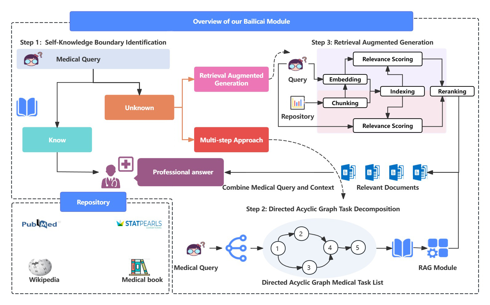
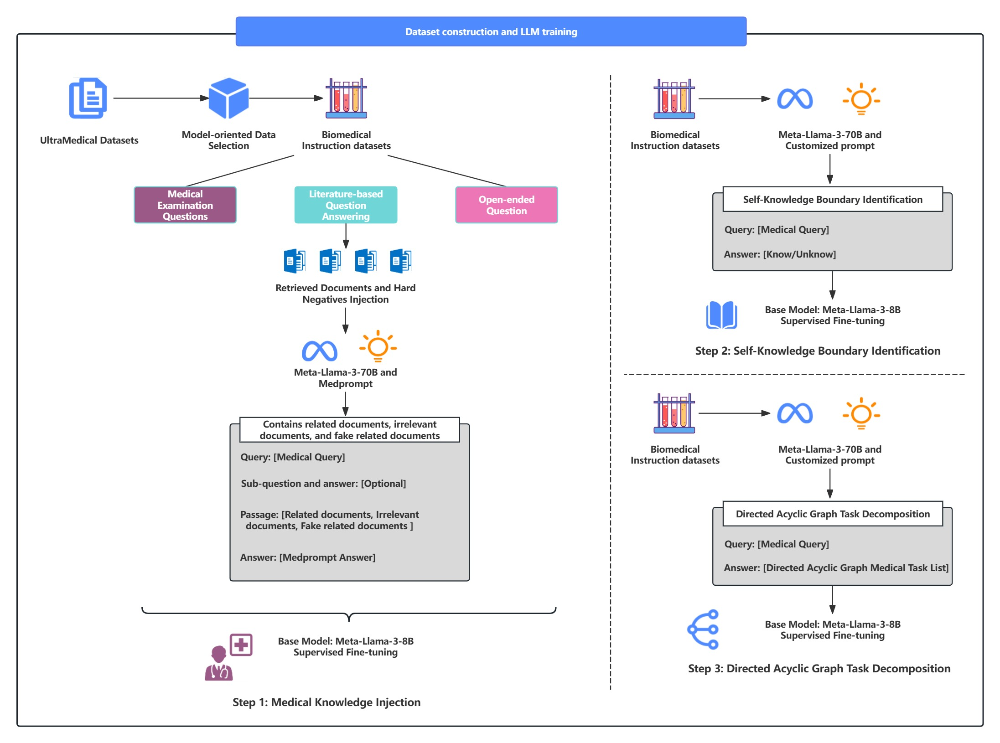
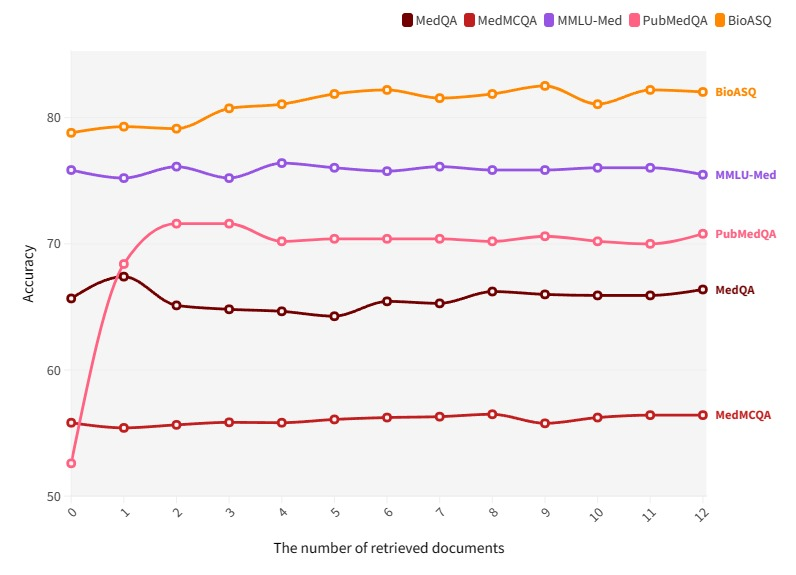

# 百利彩框架：专为医疗领域定制，结合检索与生成技术，提升应用性能。

发布时间：2024年07月24日

`RAG` `人工智能`

> Bailicai: A Domain-Optimized Retrieval-Augmented Generation Framework for Medical Applications

# 摘要

> 大型语言模型（LLM）在自然语言理解领域展现出非凡能力，激发了其在多领域应用的广泛探索。在医疗领域，尽管开源 LLM 经过特定领域微调后表现尚可，但仍远不及 GPT-4 和 GPT-3.5 等专有模型。这些开源模型在特定领域知识的深度与广度上存在不足，且在文本生成时易产生“幻觉”现象。为解决这些问题，研究者引入了检索增强生成（RAG）技术，通过外部知识库的背景信息来强化 LLM，同时保持其内部参数不变。然而，文档噪声对性能的影响不容忽视，且 RAG 在医疗领域的应用尚处起步阶段。本研究推出的 Bailicai 框架，巧妙融合了检索增强生成与专为医疗领域优化的 LLM，通过四个子模块的实施，显著提升了 LLM 在医学领域的性能。实验数据显示，Bailicai 方法在多个医学基准测试中超越了现有医学领域 LLM，并优于 GPT-3.5。此外，该方法有效减少了 LLM 在医学应用中的幻觉现象，并在处理无关或伪相关文档时，显著改善了传统 RAG 技术面临的噪声问题。

> Large Language Models (LLMs) have exhibited remarkable proficiency in natural language understanding, prompting extensive exploration of their potential applications across diverse domains. In the medical domain, open-source LLMs have demonstrated moderate efficacy following domain-specific fine-tuning; however, they remain substantially inferior to proprietary models such as GPT-4 and GPT-3.5. These open-source models encounter limitations in the comprehensiveness of domain-specific knowledge and exhibit a propensity for 'hallucinations' during text generation. To mitigate these issues, researchers have implemented the Retrieval-Augmented Generation (RAG) approach, which augments LLMs with background information from external knowledge bases while preserving the model's internal parameters. However, document noise can adversely affect performance, and the application of RAG in the medical field remains in its nascent stages. This study presents the Bailicai framework: a novel integration of retrieval-augmented generation with large language models optimized for the medical domain. The Bailicai framework augments the performance of LLMs in medicine through the implementation of four sub-modules. Experimental results demonstrate that the Bailicai approach surpasses existing medical domain LLMs across multiple medical benchmarks and exceeds the performance of GPT-3.5. Furthermore, the Bailicai method effectively attenuates the prevalent issue of hallucinations in medical applications of LLMs and ameliorates the noise-related challenges associated with traditional RAG techniques when processing irrelevant or pseudo-relevant documents.

[Arxiv](https://arxiv.org/abs/2407.21055)