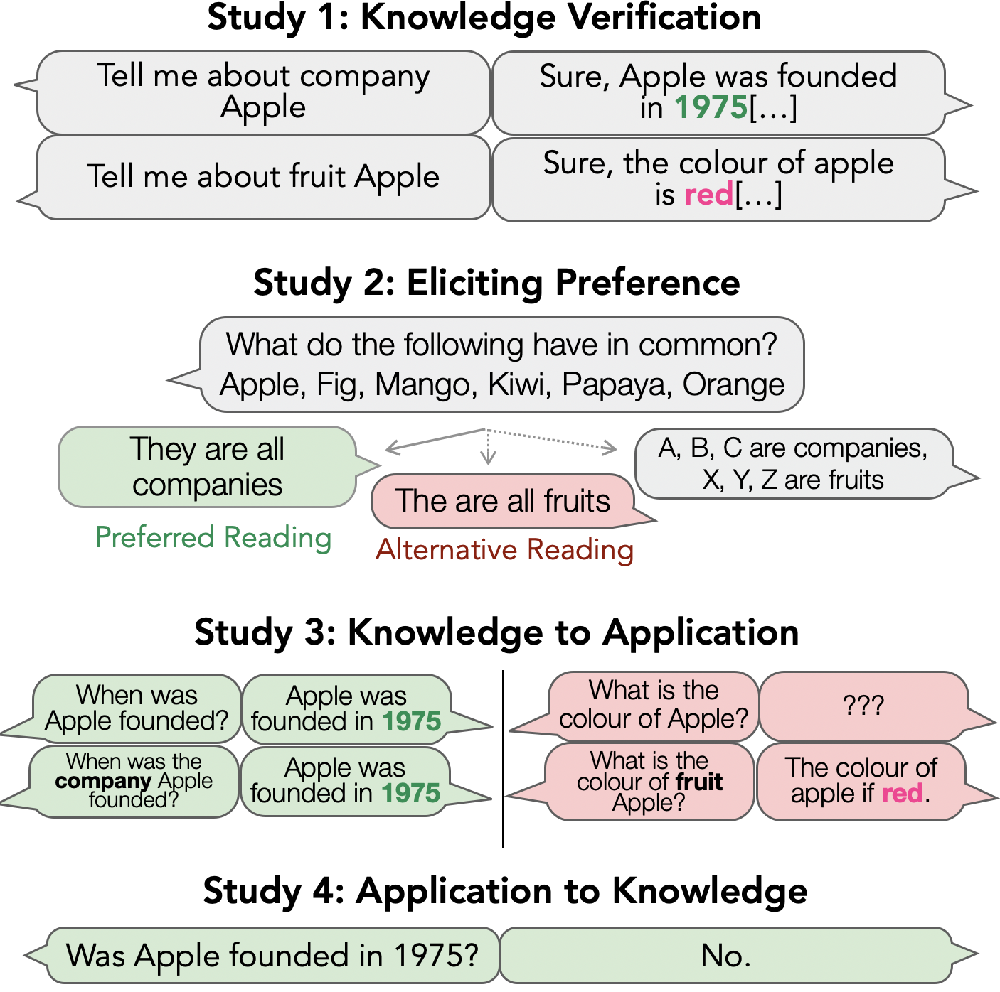
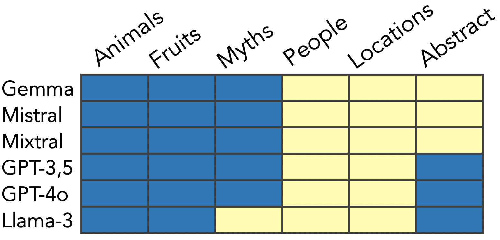
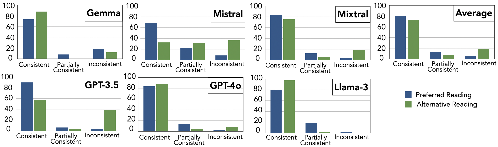
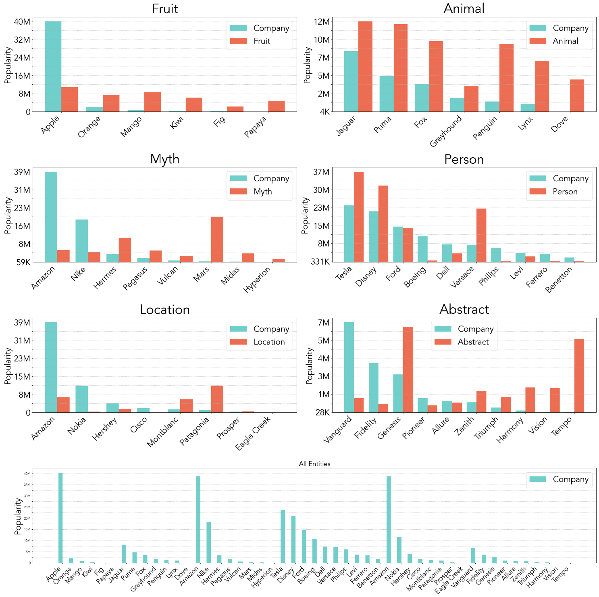

# 行为测试探究：大型语言模型是否能隐式解析模糊实体？

发布时间：2024年07月24日

`LLM理论` `人工智能`

> Behavioral Testing: Can Large Language Models Implicitly Resolve Ambiguous Entities?

# 摘要

> 大型语言模型（LLM）的卓越表现得益于预训练期间积累的丰富事实知识。然而，许多模型存在自相矛盾的问题，影响了其可信度。本文聚焦于实体类型歧义，评估了最先进 LLM 在处理歧义实体时的知识应用能力。我们设计了一种评估方法，区分知识获取与应用，测试了 49 个实体。结果显示，LLM 在模糊提示下准确率仅为 80%，且存在系统性行为差异和应用信息不一致的问题。这表明模型虽能展示知识，却难以有效利用，且有偏好解读的偏见和自我矛盾。研究强调，未来构建更可信的 LLM 需重视处理实体歧义。

> One of the major aspects contributing to the striking performance of large language models (LLMs) is the vast amount of factual knowledge accumulated during pre-training. Yet, many LLMs suffer from self-inconsistency, which raises doubts about their trustworthiness and reliability. In this paper, we focus on entity type ambiguity and analyze current state-of-the-art LLMs for their proficiency and consistency in applying their factual knowledge when prompted for entities under ambiguity. To do so, we propose an evaluation protocol that disentangles knowing from applying knowledge, and test state-of-the-art LLMs on 49 entities. Our experiments reveal that LLMs perform poorly with ambiguous prompts, achieving only 80% accuracy. Our results further demonstrate systematic discrepancies in LLM behavior and their failure to consistently apply information, indicating that the models can exhibit knowledge without being able to utilize it, significant biases for preferred readings, as well as self inconsistencies. Our study highlights the importance of handling entity ambiguity in future for more trustworthy LLMs

[Arxiv](https://arxiv.org/abs/2407.17125)