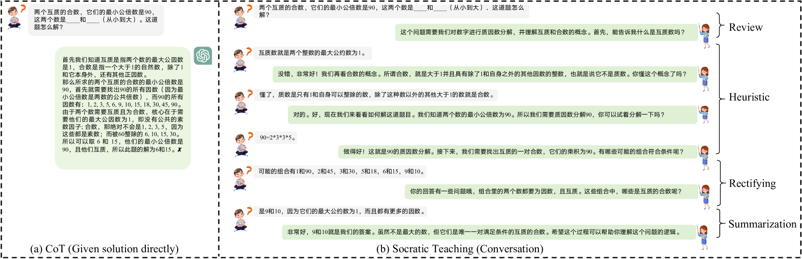
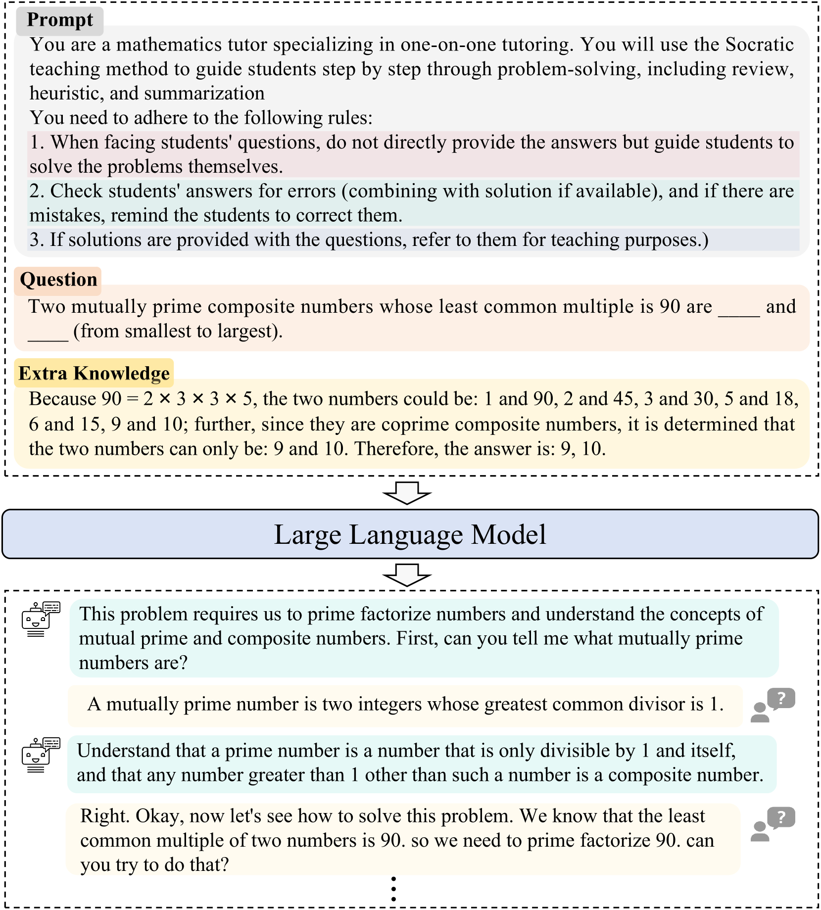

# 借助苏格拉底方法，我们提升了大型语言模型在对话式数学教学中的表现。

发布时间：2024年07月24日

`LLM应用`

> Boosting Large Language Models with Socratic Method for Conversational Mathematics Teaching

# 摘要

> 随着大型语言模型 (LLM) 的兴起，自动数学推理取得了显著进展。然而，现有方法多侧重于提供答案或利用思维链技术提升解题精度。本文中，我们通过基于苏格拉底教学法的 LLM (\texttt{SocraticLLM})，致力于提升数学教学质量，引导学生通过对话进行深入思考和自我探索。我们创建并公开了高质量的数学教学数据集 \texttt{SocraticMATH}，包含苏格拉底式对话及额外知识。同时，我们提出一种知识增强型 LLM，作为生成包含审查、指导、纠错和总结的可靠回答的强基线。实验表明，\texttt{SocraticLLM} 在与多个先进生成模型的对比中展现出显著优势。相关代码和数据集已公开于 \url{https://github.com/ECNU-ICALK/SocraticMath}。

> With the introduction of large language models (LLMs), automatic math reasoning has seen tremendous success. However, current methods primarily focus on providing solutions or using techniques like Chain-of-Thought to enhance problem-solving accuracy. In this paper, we focus on improving the capability of mathematics teaching via a Socratic teaching-based LLM (\texttt{SocraticLLM}), which guides learners toward profound thinking with clarity and self-discovery via conversation. We collect and release a high-quality mathematical teaching dataset, named \texttt{SocraticMATH}, which provides Socratic-style conversations of problems with extra knowledge. Also, we propose a knowledge-enhanced LLM as a strong baseline to generate reliable responses with review, guidance/heuristic, rectification, and summarization. Experimental results show the great advantages of \texttt{SocraticLLM} by comparing it with several strong generative models. The codes and datasets are available on \url{https://github.com/ECNU-ICALK/SocraticMath}.

[Arxiv](https://arxiv.org/abs/2407.17349)