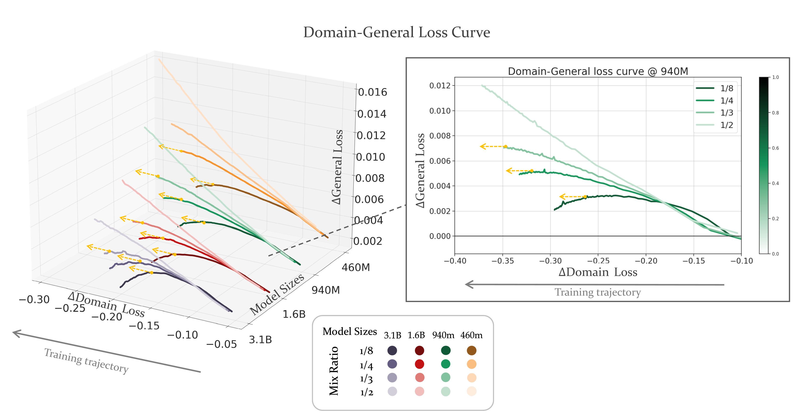

# CMR 缩放法则：预测语言模型持续预训练的关键混合比例

发布时间：2024年07月24日

`LLM理论` `人工智能`

> CMR Scaling Law: Predicting Critical Mixture Ratios for Continual Pre-training of Language Models

# 摘要

> 大型语言模型（LLM）虽在多任务中表现卓越，但在专业领域常因缺乏特定语料而表现欠佳。持续预训练（CPT）通过注入新领域知识并重放通用语料，既增强模型能力又防止遗忘。然而，通用与特定语料的混合比例常凭经验选择，导致训练效率欠佳。我们深入研究CPT下LLM的扩展行为，揭示了损失、混合比例与训练规模间的幂律关系。我们定义了通用与特定能力间的关键平衡点——关键混合比例（CMR），它既能维持模型通用性，又能实现领域转移，最大化资源利用。实验证明，CMR具有可预测性，我们提出的CMR缩放定律已得到验证。这些成果为专业领域LLM训练提供了优化指南，确保性能的同时高效管理资源。

> Large Language Models (LLMs) excel in diverse tasks but often underperform in specialized fields due to limited domain-specific or proprietary corpus. Continual pre-training (CPT) enhances LLM capabilities by imbuing new domain-specific or proprietary knowledge while replaying general corpus to prevent catastrophic forgetting. The data mixture ratio of general corpus and domain-specific corpus, however, has been chosen heuristically, leading to sub-optimal training efficiency in practice. In this context, we attempt to re-visit the scaling behavior of LLMs under the hood of CPT, and discover a power-law relationship between loss, mixture ratio, and training tokens scale. We formalize the trade-off between general and domain-specific capabilities, leading to a well-defined Critical Mixture Ratio (CMR) of general and domain data. By striking the balance, CMR maintains the model's general ability and achieves the desired domain transfer, ensuring the highest utilization of available resources. Therefore, if we value the balance between efficiency and effectiveness, CMR can be consider as the optimal mixture ratio.Through extensive experiments, we ascertain the predictability of CMR, and propose CMR scaling law and have substantiated its generalization. These findings offer practical guidelines for optimizing LLM training in specialized domains, ensuring both general and domain-specific performance while efficiently managing training resources.

[Arxiv](https://arxiv.org/abs/2407.17467)