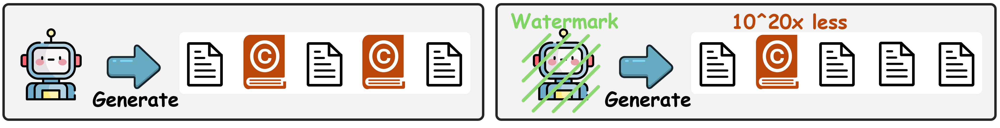
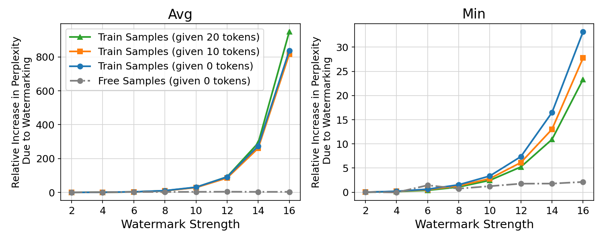
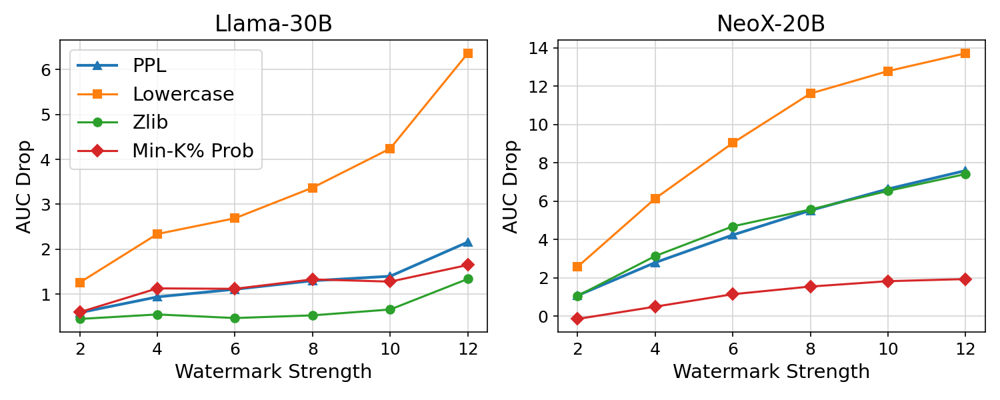
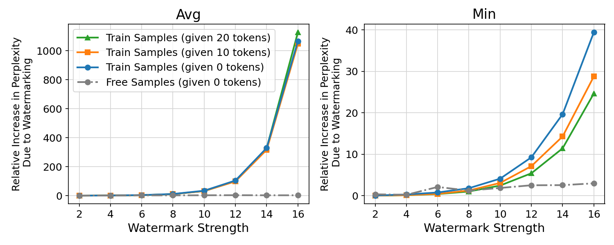
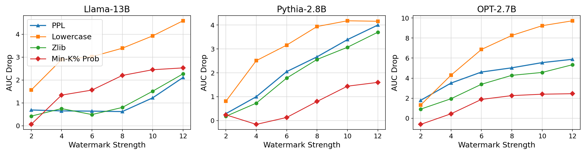
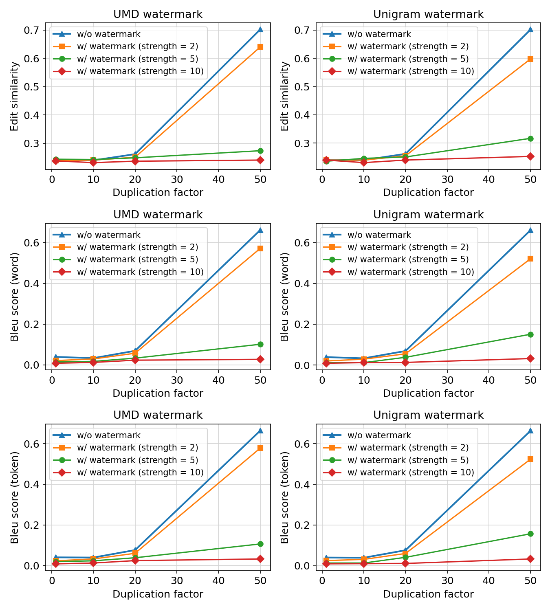

# 我们探讨一个关键问题：在大型语言模型中嵌入水印，是否能有效阻止版权文本的生成，并保护训练数据的隐私？

发布时间：2024年07月24日

`LLM应用` `版权保护`

> Can Watermarking Large Language Models Prevent Copyrighted Text Generation and Hide Training Data?

# 摘要

> 大型语言模型 (LLM) 在生成丰富多样的文本方面表现出色，但无意中产生受版权保护内容的问题引发了担忧。本文首先探讨了在 LLM 中应用水印以防止生成受版权文本的有效性，并通过理论与实证研究证实了其显著效果。同时，我们还分析了水印对成员推理攻击 (MIA) 的影响，这种攻击试图识别样本是否源自预训练数据集，可能用于版权侵权检测。研究发现，水印降低了 MIA 的成功率，增加了检测难度。为此，我们提出了一种适应性技术，以提升水印环境下 MIA 的效能。这些发现凸显了针对 LLM 中关键问题，尤其是涉及法律影响的，开发适应性解决方案的重要性。

> Large Language Models (LLMs) have demonstrated impressive capabilities in generating diverse and contextually rich text. However, concerns regarding copyright infringement arise as LLMs may inadvertently produce copyrighted material. In this paper, we first investigate the effectiveness of watermarking LLMs as a deterrent against the generation of copyrighted texts. Through theoretical analysis and empirical evaluation, we demonstrate that incorporating watermarks into LLMs significantly reduces the likelihood of generating copyrighted content, thereby addressing a critical concern in the deployment of LLMs. Additionally, we explore the impact of watermarking on Membership Inference Attacks (MIAs), which aim to discern whether a sample was part of the pretraining dataset and may be used to detect copyright violations. Surprisingly, we find that watermarking adversely affects the success rate of MIAs, complicating the task of detecting copyrighted text in the pretraining dataset. Finally, we propose an adaptive technique to improve the success rate of a recent MIA under watermarking. Our findings underscore the importance of developing adaptive methods to study critical problems in LLMs with potential legal implications.

[Arxiv](https://arxiv.org/abs/2407.17417)