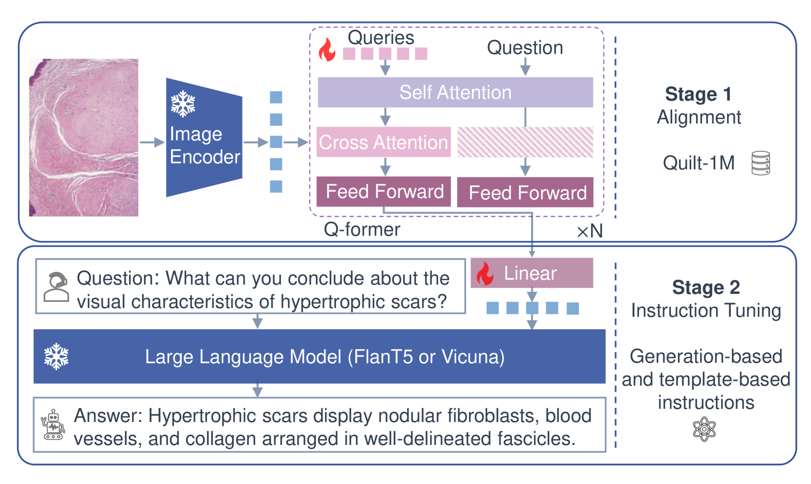
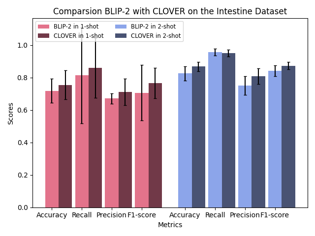
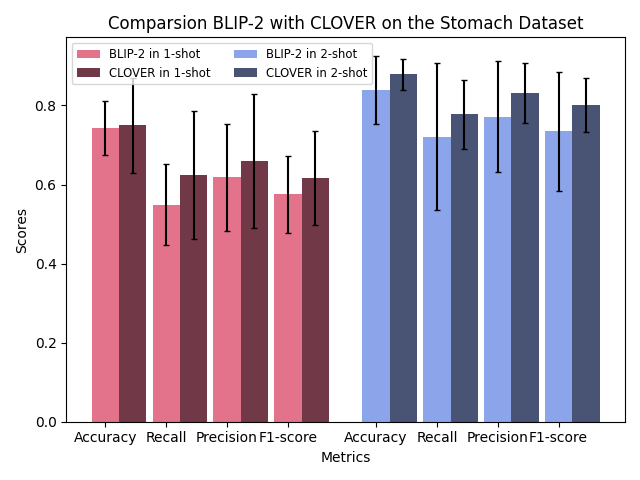
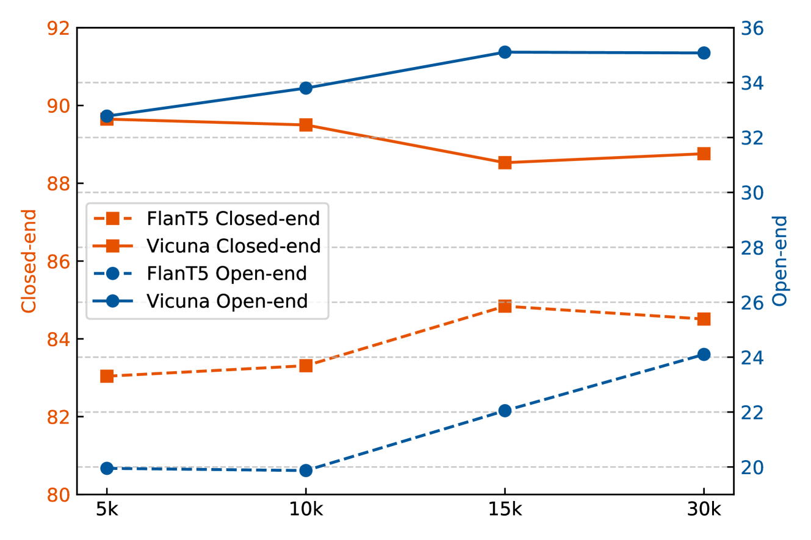
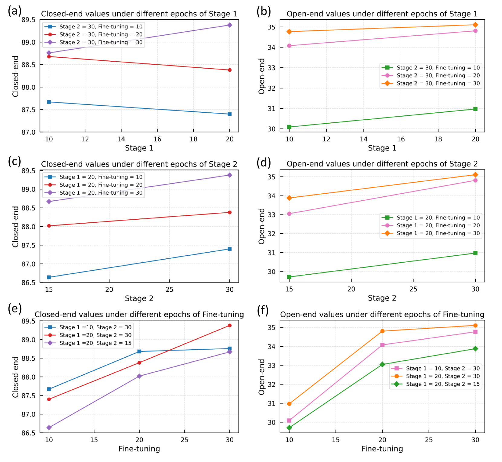

# 高效经济的病理视觉与语言分析指令学习

发布时间：2024年07月24日

`LLM应用` `数字病理学`

> Cost-effective Instruction Learning for Pathology Vision and Language Analysis

# 摘要

> 视觉-语言模型的兴起，为AI与人类的互动对话开辟了新天地。然而，将其应用于临床领域，却面临着数据规模、财务和计算资源的重重挑战。为此，我们推出了CLOVER，一个经济高效的对话病理学指令学习框架。CLOVER通过训练轻量级模块，并结合大型语言模型的指令调优，巧妙避开了高昂的GPT-4，转而在GPT-3.5上精心设计提示，以构建基于生成的指令，充分利用网络病理学知识。此外，我们还精心打造了一套高质量的数字病理学模板指令集，以增强指令的实用性。实验结果表明，CLOVER在病理学视觉问答中，凭借混合形式指令展现出显著优势。其在开放式和封闭式问题的回答上，不仅成本效益高，更超越了使用GPT-4生成指令的强大基线模型。CLOVER通过指令调优，在外部临床数据中展现了出色的少样本学习能力。这些成果预示着CLOVER在推动数字病理学快速对话应用方面的巨大潜力。

> The advent of vision-language models fosters the interactive conversations between AI-enabled models and humans. Yet applying these models into clinics must deal with daunting challenges around large-scale training data, financial, and computational resources. Here we propose a cost-effective instruction learning framework for conversational pathology named as CLOVER. CLOVER only trains a lightweight module and uses instruction tuning while freezing the parameters of the large language model. Instead of using costly GPT-4, we propose well-designed prompts on GPT-3.5 for building generation-based instructions, emphasizing the utility of pathological knowledge derived from the Internet source. To augment the use of instructions, we construct a high-quality set of template-based instructions in the context of digital pathology. From two benchmark datasets, our findings reveal the strength of hybrid-form instructions in the visual question-answer in pathology. Extensive results show the cost-effectiveness of CLOVER in answering both open-ended and closed-ended questions, where CLOVER outperforms strong baselines that possess 37 times more training parameters and use instruction data generated from GPT-4. Through the instruction tuning, CLOVER exhibits robustness of few-shot learning in the external clinical dataset. These findings demonstrate that cost-effective modeling of CLOVER could accelerate the adoption of rapid conversational applications in the landscape of digital pathology.

[Arxiv](https://arxiv.org/abs/2407.17734)