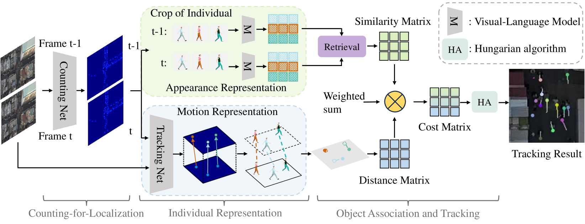
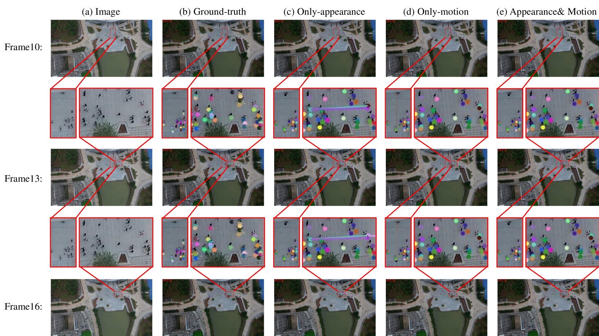
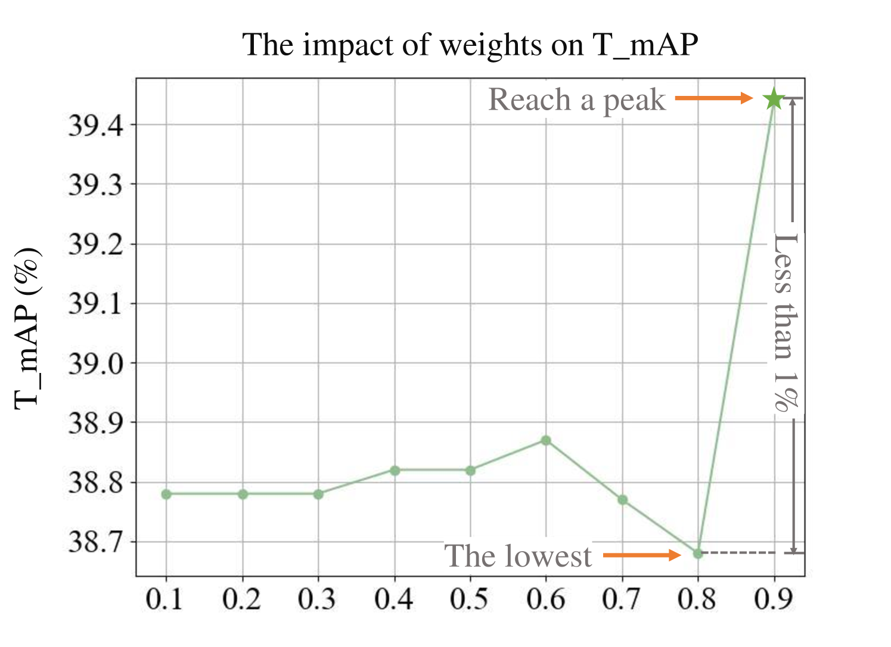

# DenseTrack：利用密度感知运动与外观协同技术，实现无人机群体追踪

发布时间：2024年07月24日

`Agent` `无人机` `安防监控`

> DenseTrack: Drone-based Crowd Tracking via Density-aware Motion-appearance Synergy

# 摘要

> 无人机群体追踪因物体小且密集而面临挑战。为此，我们推出密度感知追踪框架（DenseTrack），它通过人群计数精准定位，融合视觉与运动线索，优化小物体追踪。DenseTrack特别针对跨帧运动问题，提升追踪准确性与可靠性。它以人群密度为锚，结合运动与位置信息，利用匈牙利算法确保帧间个体精准匹配。在DroneCrowd数据集上，我们的方法表现卓越，有效应对无人机视角下的追踪难题。

> Drone-based crowd tracking faces difficulties in accurately identifying and monitoring objects from an aerial perspective, largely due to their small size and close proximity to each other, which complicates both localization and tracking. To address these challenges, we present the Density-aware Tracking (DenseTrack) framework. DenseTrack capitalizes on crowd counting to precisely determine object locations, blending visual and motion cues to improve the tracking of small-scale objects. It specifically addresses the problem of cross-frame motion to enhance tracking accuracy and dependability. DenseTrack employs crowd density estimates as anchors for exact object localization within video frames. These estimates are merged with motion and position information from the tracking network, with motion offsets serving as key tracking cues. Moreover, DenseTrack enhances the ability to distinguish small-scale objects using insights from the visual-language model, integrating appearance with motion cues. The framework utilizes the Hungarian algorithm to ensure the accurate matching of individuals across frames. Demonstrated on DroneCrowd dataset, our approach exhibits superior performance, confirming its effectiveness in scenarios captured by drones.

[Arxiv](https://arxiv.org/abs/2407.17272)