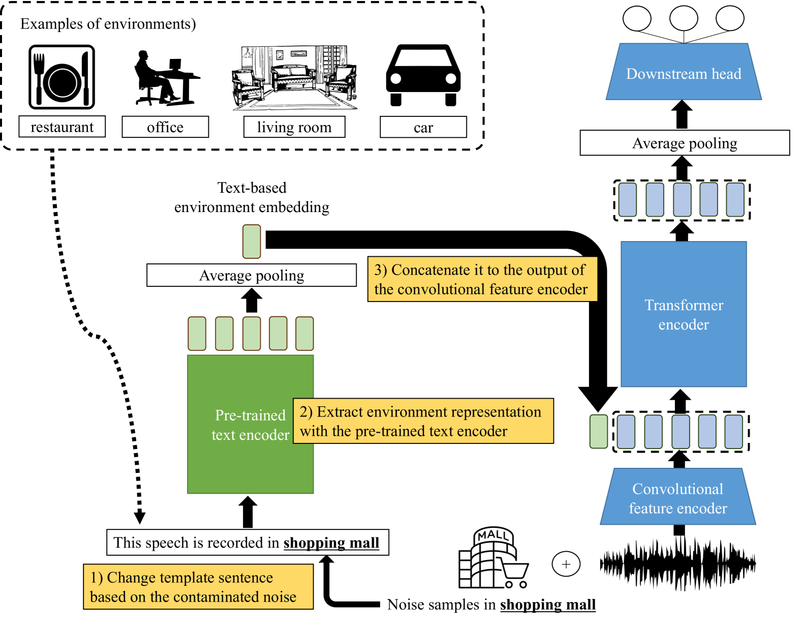
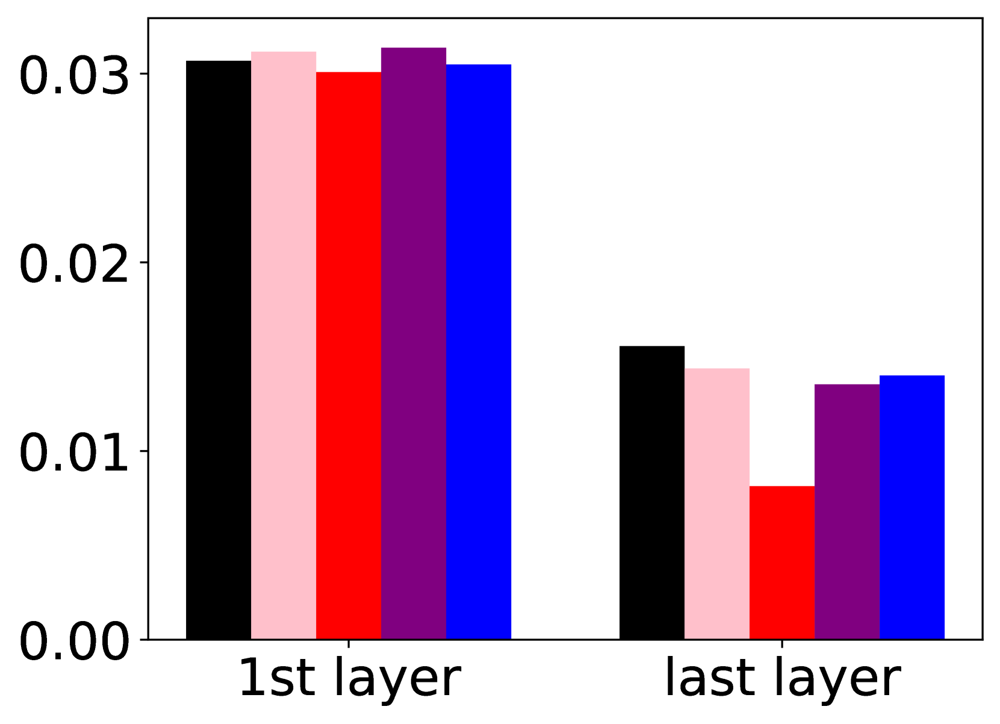
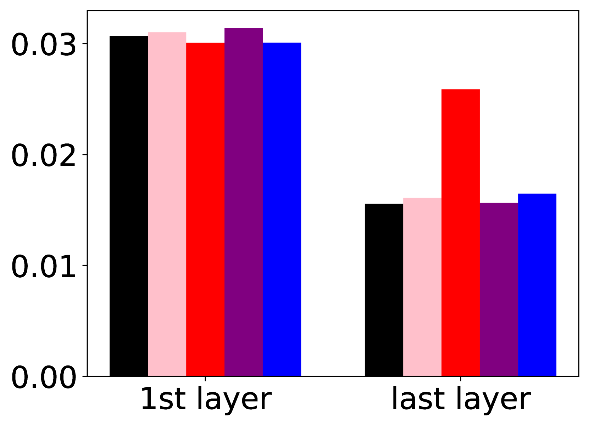
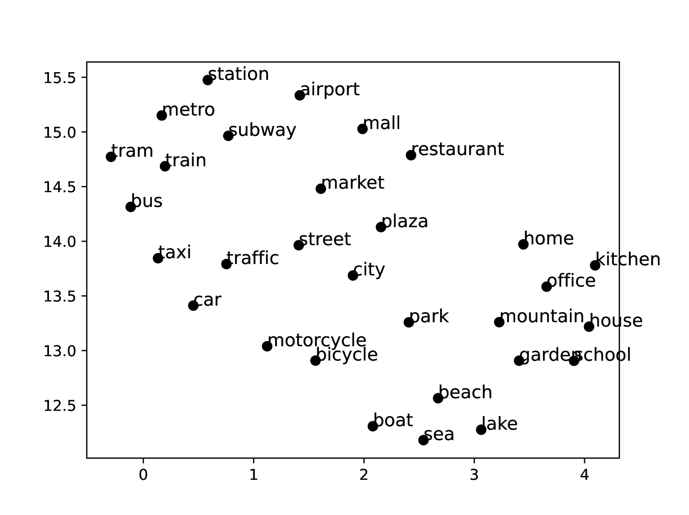
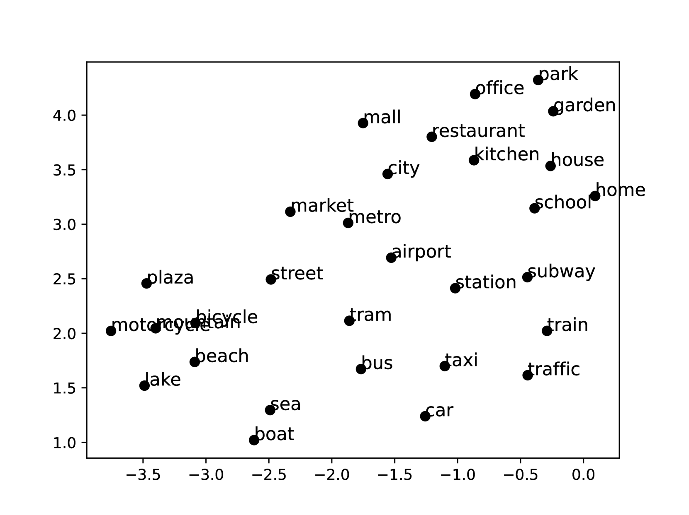

# 通过环境文本描述，提升语音情感识别在噪声环境中的稳定性

发布时间：2024年07月24日

`LLM应用` `语音识别` `情感分析`

> Describe Where You Are: Improving Noise-Robustness for Speech Emotion Recognition with Text Description of the Environment

# 摘要

> 在现实环境中，语音情感识别系统常因噪音干扰而性能下降。本文提出一种创新方法，通过利用测试环境的先验知识，在嘈杂环境中提升SER性能。我们采用文本引导的环境感知训练策略，结合受污染语音样本及其噪音描述训练SER模型。利用预训练文本编码器提取环境嵌入，并将其融入基于transformer的SER模型中。实验结果显示，大型语言模型处理的文本环境描述显著增强了SER系统的噪音抗干扰能力。与传统方法相比，我们的方法在低信噪比条件下表现更优，尤其在-5dB SNR测试中，性能提升显著，分别为唤醒度31.8%、支配度23.5%和愉悦度9.5%。

> Speech emotion recognition (SER) systems often struggle in real-world environments, where ambient noise severely degrades their performance. This paper explores a novel approach that exploits prior knowledge of testing environments to maximize SER performance under noisy conditions. To address this task, we propose a text-guided, environment-aware training where an SER model is trained with contaminated speech samples and their paired noise description. We use a pre-trained text encoder to extract the text-based environment embedding and then fuse it to a transformer-based SER model during training and inference. We demonstrate the effectiveness of our approach through our experiment with the MSP-Podcast corpus and real-world additive noise samples collected from the Freesound repository. Our experiment indicates that the text-based environment descriptions processed by a large language model (LLM) produce representations that improve the noise-robustness of the SER system. In addition, our proposed approach with an LLM yields better performance than our environment-agnostic baselines, especially in low signal-to-noise ratio (SNR) conditions. When testing at -5dB SNR level, our proposed method shows better performance than our best baseline model by 31.8 % (arousal), 23.5% (dominance), and 9.5% (valence).

[Arxiv](https://arxiv.org/abs/2407.17716)