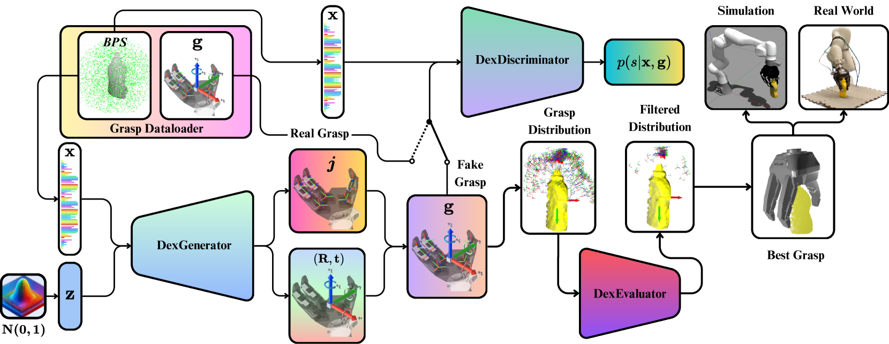
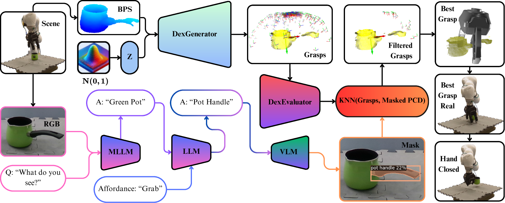
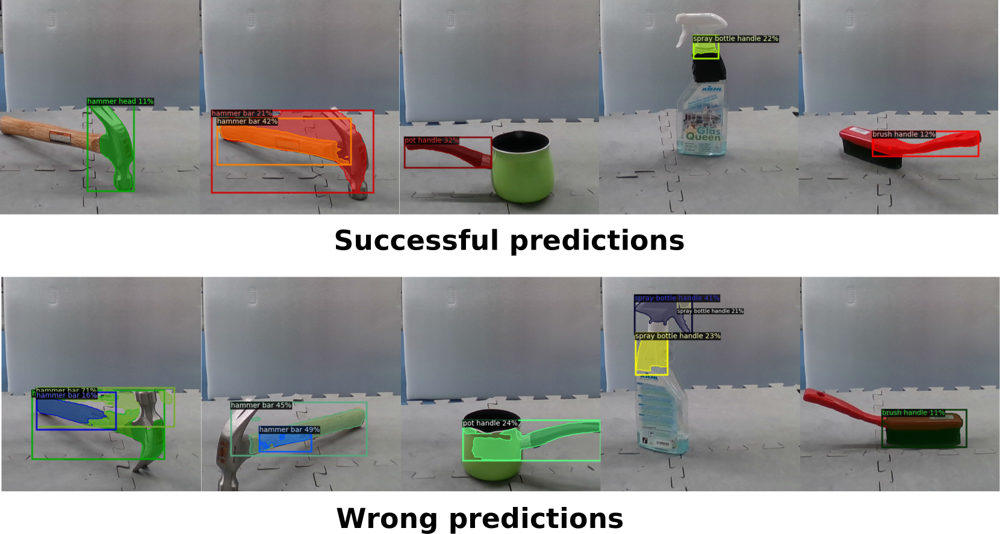

# DexGANGrasp：专为任务导向操作设计的灵巧生成对抗抓取合成技术

发布时间：2024年07月24日

`Agent` `机器人` `人工智能`

> DexGANGrasp: Dexterous Generative Adversarial Grasping Synthesis for Task-Oriented Manipulation

# 摘要

> 我们推出了 DexGanGrasp，这是一种实时单视图灵巧抓取合成技术，通过基于 cGANs 的 DexGenerator 生成抓取动作，并由 DexEvalautor 评估其稳定性。实验证明，该方法在现实世界中的成功率比 FFHNet 基准高出 18.57%。此外，我们将 DexGanGrasp 升级为 DexAfford-Prompt，结合 MLLMs 和 VLMs，实现了开放词汇表的面向任务灵巧抓取，并在实际应用中取得了成功。

> We introduce DexGanGrasp, a dexterous grasping synthesis method that generates and evaluates grasps with single view in real time. DexGanGrasp comprises a Conditional Generative Adversarial Networks (cGANs)-based DexGenerator to generate dexterous grasps and a discriminator-like DexEvalautor to assess the stability of these grasps. Extensive simulation and real-world expriments showcases the effectiveness of our proposed method, outperforming the baseline FFHNet with an 18.57% higher success rate in real-world evaluation. We further extend DexGanGrasp to DexAfford-Prompt, an open-vocabulary affordance grounding pipeline for dexterous grasping leveraging Multimodal Large Language Models (MLLMs) and Vision Language Models (VLMs), to achieve task-oriented grasping with successful real-world deployments.

[Arxiv](https://arxiv.org/abs/2407.17348)