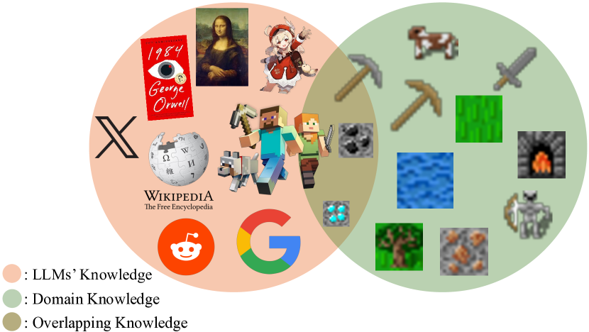
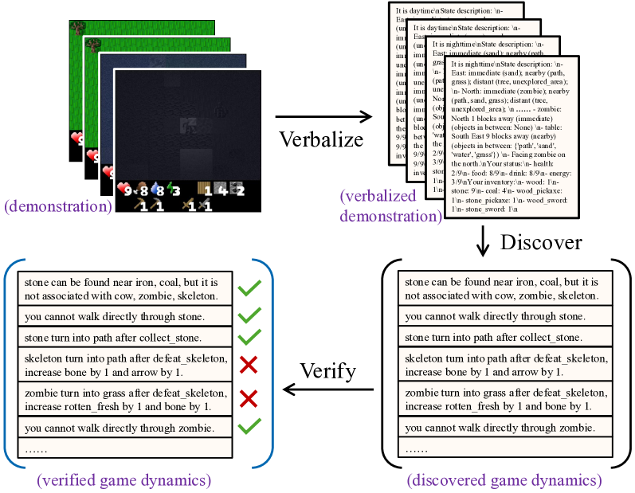
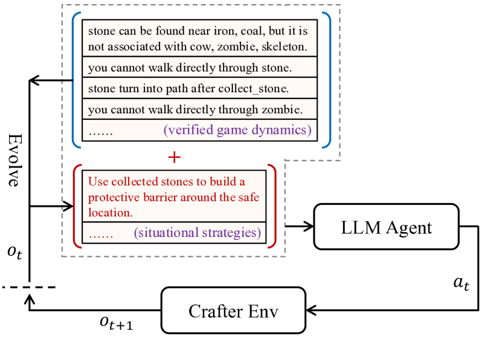
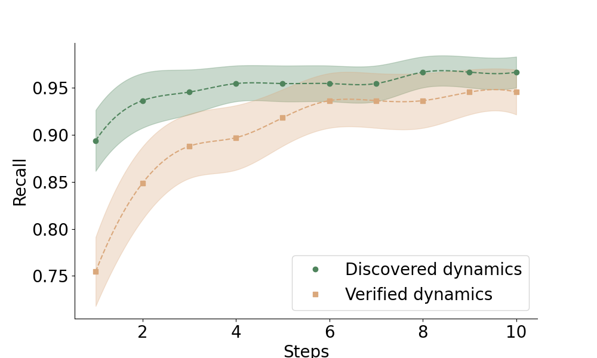
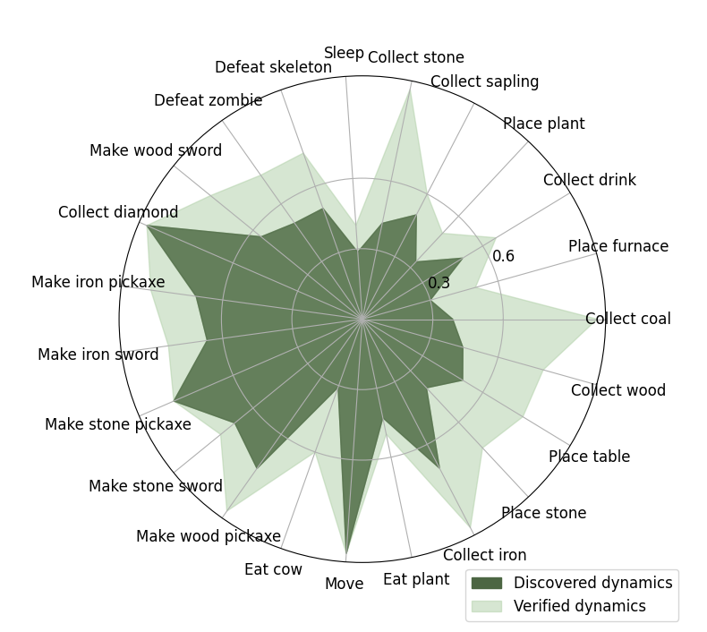
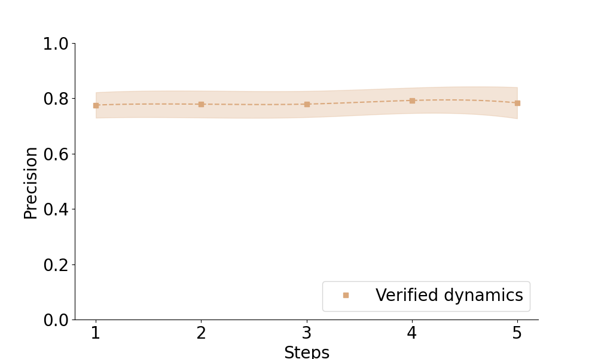
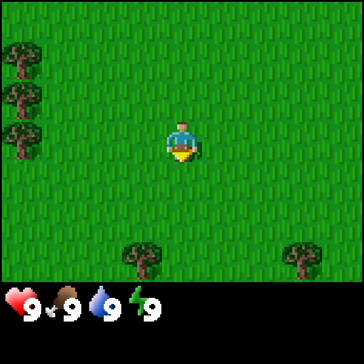
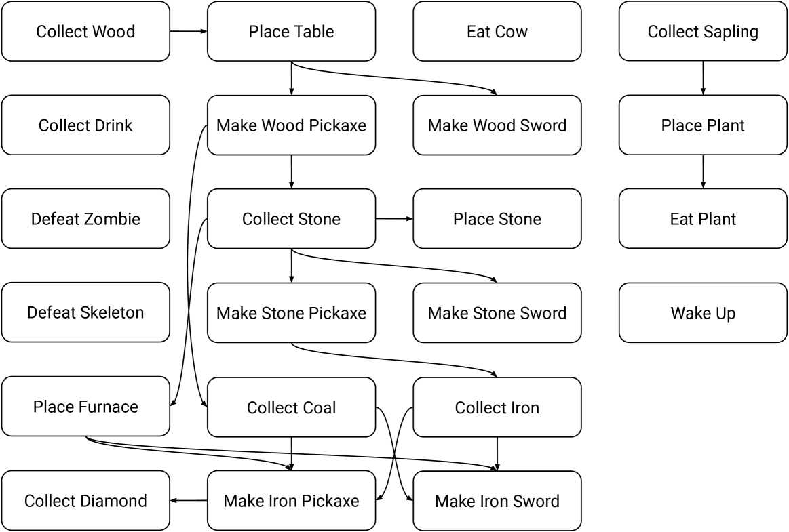

# 借助世界动态建模，提升代理学习效果

发布时间：2024年07月24日

`LLM应用` `人工智能` `游戏开发`

> Enhancing Agent Learning through World Dynamics Modeling

# 摘要

> 大型语言模型 (LLM) 在语言理解和交互决策中的出色表现，得益于其内置的全面深入的领域知识。然而，这些知识的深度在不同领域间存在差异。现有方法往往忽视了 LLM 对真实世界动态理解的潜在不足。为此，我们提出了 Discover, Verify, 和 Evolve (DiVE) 框架，通过少量演示发现、验证并演化适应当前情境的新动态。经过详尽评估，我们探讨了各组件对性能的影响，并比较了 DiVE 自动生成与人工标注的世界动态。结果显示，在 Crafter 环境中，DiVE 引导的 LLM 决策能力显著提升，奖励水平可媲美人类玩家。

> While large language models (LLMs) have been increasingly deployed across tasks in language understanding and interactive decision-making, their impressive performance is largely due to the comprehensive and in-depth domain knowledge embedded within them. However, the extent of this knowledge can vary across different domains. Existing methods often assume that LLMs already possess such comprehensive and in-depth knowledge of their environment, overlooking potential gaps in their understanding of actual world dynamics. To address this gap, we introduce Discover, Verify, and Evolve (DiVE), a framework that discovers world dynamics from a small number of demonstrations, verifies the correctness of these dynamics, and evolves new, advanced dynamics tailored to the current situation. Through extensive evaluations, we analyze the impact of each component on performance and compare the automatically generated dynamics from DiVE with human-annotated world dynamics. Our results demonstrate that LLMs guided by DiVE can make better decisions, achieving rewards comparable to human players in the Crafter environment.

[Arxiv](https://arxiv.org/abs/2407.17695)