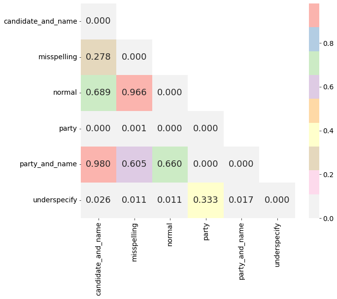

# 探究政治偏见如何影响大型语言模型在立场分类任务中的表现

发布时间：2024年07月24日

`LLM应用` `人工智能`

> Examining the Influence of Political Bias on Large Language Model Performance in Stance Classification

# 摘要

> 大型语言模型（LLM）在处理自然语言任务时表现出色，但它们在特定数据集上的训练使其内含种族、国家和性别偏见。这些偏见是否影响模型性能尚无定论。本研究聚焦于LLM在立场分类任务中的政治偏见，探究模型是否更擅长处理政治敏感内容。通过三个数据集、七种模型和四种提示策略，我们分析了模型在政治相关声明上的表现。结果显示，LLM在不同政治立场分类任务中性能差异显著，且这种差异主要体现在数据集层面。此外，当声明目标模糊时，模型的分类准确性下降。

> Large Language Models (LLMs) have demonstrated remarkable capabilities in executing tasks based on natural language queries. However, these models, trained on curated datasets, inherently embody biases ranging from racial to national and gender biases. It remains uncertain whether these biases impact the performance of LLMs for certain tasks. In this study, we investigate the political biases of LLMs within the stance classification task, specifically examining whether these models exhibit a tendency to more accurately classify politically-charged stances. Utilizing three datasets, seven LLMs, and four distinct prompting schemes, we analyze the performance of LLMs on politically oriented statements and targets. Our findings reveal a statistically significant difference in the performance of LLMs across various politically oriented stance classification tasks. Furthermore, we observe that this difference primarily manifests at the dataset level, with models and prompting schemes showing statistically similar performances across different stance classification datasets. Lastly, we observe that when there is greater ambiguity in the target the statement is directed towards, LLMs have poorer stance classification accuracy.

[Arxiv](https://arxiv.org/abs/2407.17688)