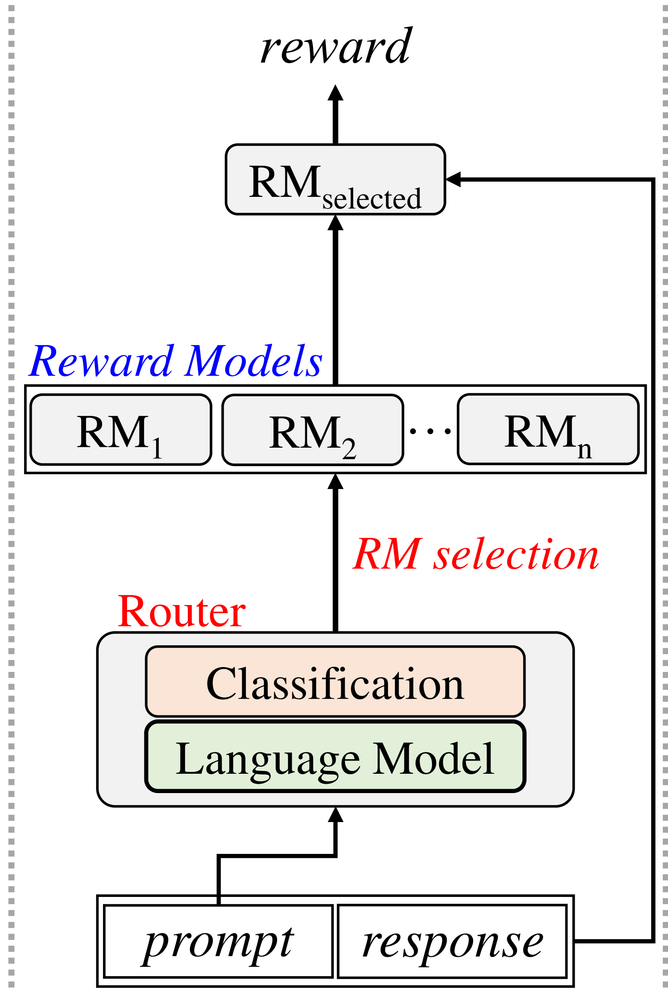

# 探究基于路由机制的领域强健轻量奖励模型

发布时间：2024年07月24日

`LLM应用` `人工智能` `软件工程`

> Exploring Domain Robust Lightweight Reward Models based on Router Mechanism

# 摘要

> 大型语言模型的最新进展主要依赖于基于人类反馈的强化学习中的大奖励模型进行微调。然而，单一奖励模型在多领域应用中并非总是最佳选择，新领域数据出现时往往需要重新训练。为此，我们研究了利用基于路由器机制的小型语言模型，针对特定领域进行优化。我们提出了三种方法：1) 通过模块化内部路由器和专家，利用专家混合构建单一奖励模型；2) 采用外部路由器，从多个特定领域模型中挑选合适的奖励模型；3) 通过加载奖励模型和路由器适配器到单个小语言模型，减少参数规模。实验结果显示，我们的方法不仅性能与传统方法相当，还显著降低了参数总量。

> Recent advancements in large language models have heavily relied on the large reward model from reinforcement learning from human feedback for fine-tuning. However, the use of a single reward model across various domains may not always be optimal, often requiring retraining from scratch when new domain data is introduced. To address these challenges, we explore the utilization of small language models operating in a domain-specific manner based on router mechanisms. Our three approaches are: 1) utilize mixture of experts to form a single reward model by modularizing an internal router and experts, 2) employing external router to select the appropriate reward model from multiple domain-specific models, and 3) the framework reduces parameter size by loading reward models and router adapters onto a single small language model using adapters. Experimental validation underscores the effectiveness of our approach, demonstrating performance comparable to baseline methods while also reducing the total parameter size.

[Arxiv](https://arxiv.org/abs/2407.17546)