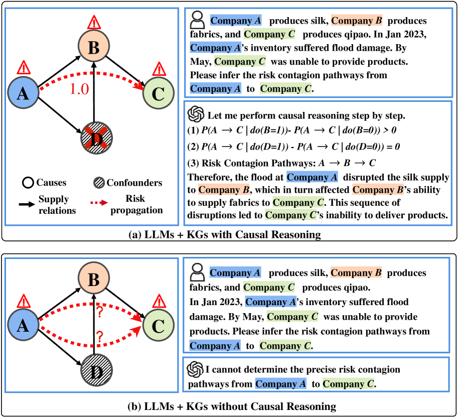
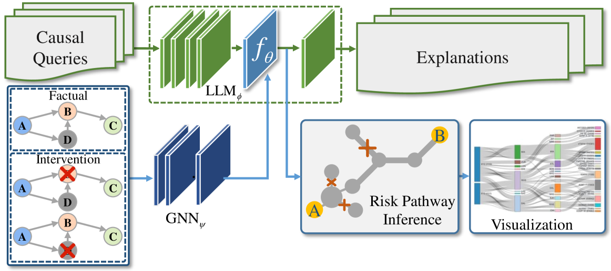
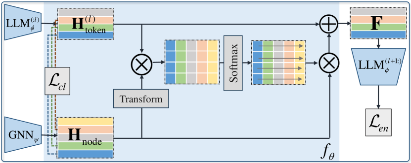
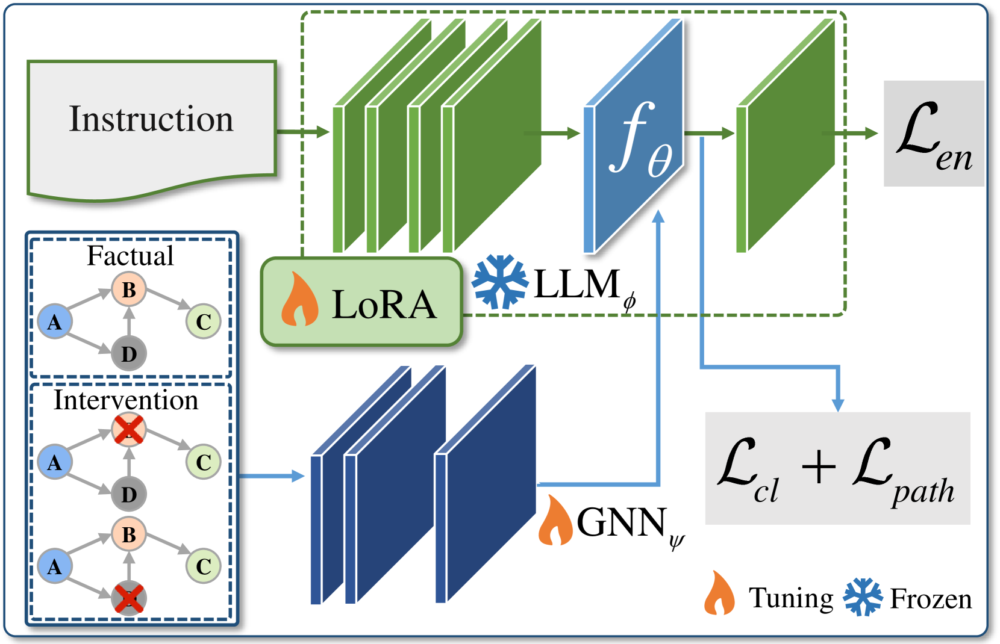
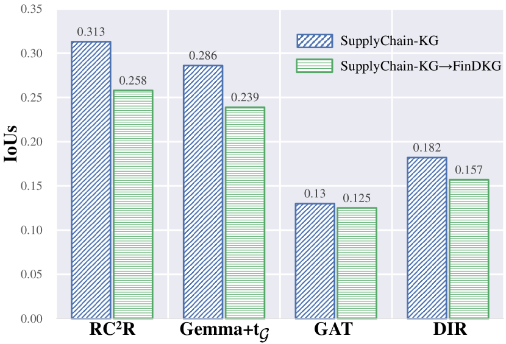
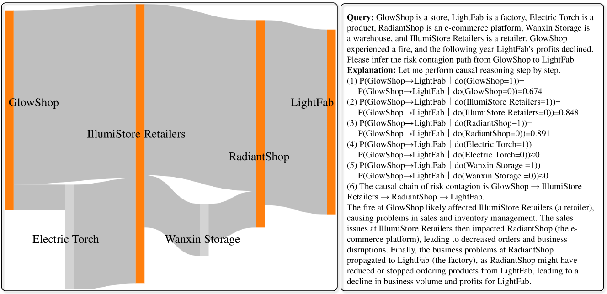
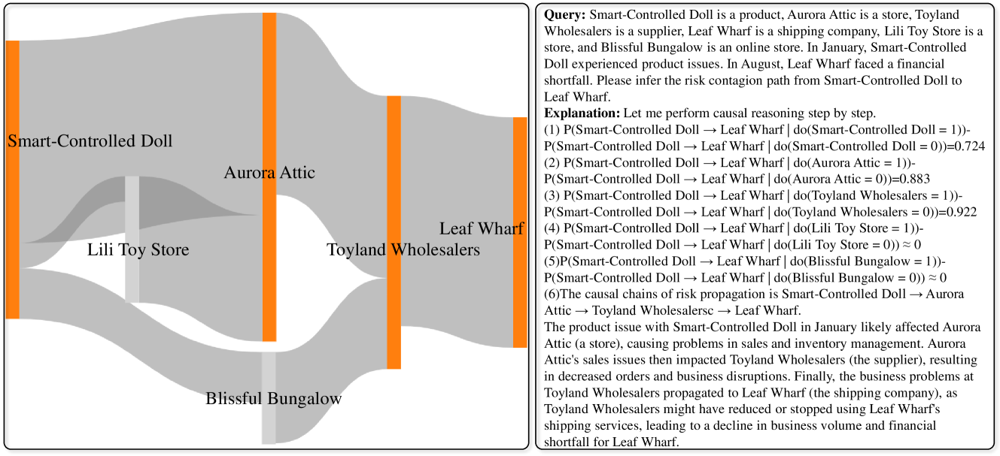
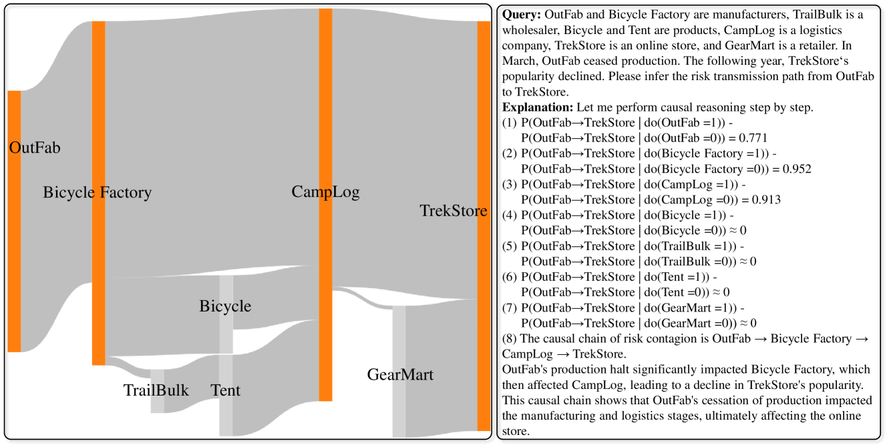
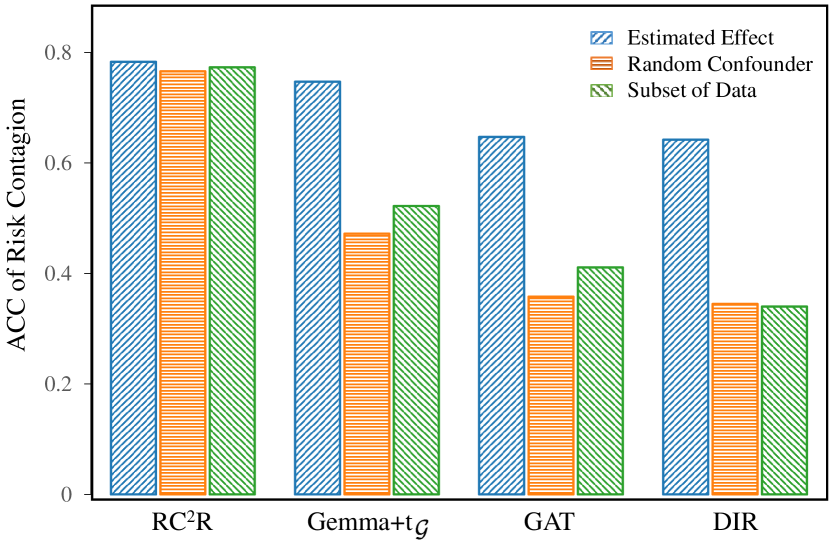

# 结合 LLM 与 KG，深入探究金融风险传播的因果逻辑

发布时间：2024年07月24日

`LLM应用` `风险管理`

> Fusing LLMs and KGs for Formal Causal Reasoning behind Financial Risk Contagion

# 摘要

> 金融风险易从一实体蔓延至另一实体，最终引发系统性风险。防范之关键在于洞察风险传播的因果链。然而，现有方法多聚焦于风险识别，却忽略了深层的因果分析。为此，我们创新性地提出了RC2R模型，借助大型语言模型的逻辑推理能力，结合金融知识图谱中的事实与专家知识，深入剖析风险传染的内在机制。在数据层面，我们通过金融知识图谱构建因果指令，使语言模型能够进行严谨的因果推理，并克服其“因果鹦鹉”的局限。模型架构上，我们通过多尺度对比学习实现不同粒度令牌与节点的精准对齐，再借助软提示与交叉多头注意力机制，融合文本与图结构数据。此外，我们设计了风险路径推理模块，量化各节点的风险值。最终，我们以桑基图形式直观展示风险传播路径及其强度，提供详尽的因果解读。实验证明，我们的模型在预测准确性与泛化能力上均超越了现有顶尖模型。我们计划公开数据集与代码，以推动该领域的深入探索与创新发展。

> Financial risks trend to spread from one entity to another, ultimately leading to systemic risks. The key to preventing such risks lies in understanding the causal chains behind risk contagion. Despite this, prevailing approaches primarily emphasize identifying risks, overlooking the underlying causal analysis of risk. To address such an issue, we propose a Risk Contagion Causal Reasoning model called RC2R, which uses the logical reasoning capabilities of large language models (LLMs) to dissect the causal mechanisms of risk contagion grounded in the factual and expert knowledge embedded within financial knowledge graphs (KGs). At the data level, we utilize financial KGs to construct causal instructions, empowering LLMs to perform formal causal reasoning on risk propagation and tackle the "causal parrot" problem of LLMs. In terms of model architecture, we integrate a fusion module that aligns tokens and nodes across various granularities via multi-scale contrastive learning, followed by the amalgamation of textual and graph-structured data through soft prompt with cross multi-head attention mechanisms. To quantify risk contagion, we introduce a risk pathway inference module for calculating risk scores for each node in the graph. Finally, we visualize the risk contagion pathways and their intensities using Sankey diagrams, providing detailed causal explanations. Comprehensive experiments on financial KGs and supply chain datasets demonstrate that our model outperforms several state-of-the-art models in prediction performance and out-of-distribution (OOD) generalization capabilities. We will make our dataset and code publicly accessible to encourage further research and development in this field.

[Arxiv](https://arxiv.org/abs/2407.17190)