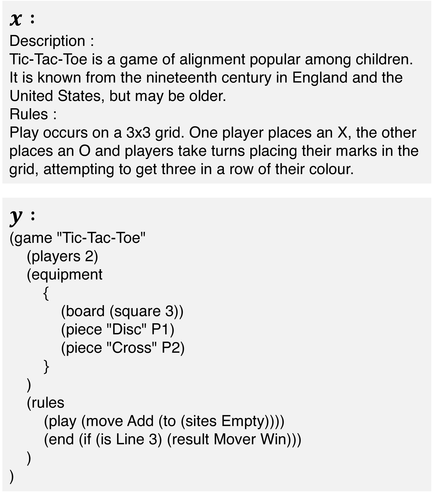
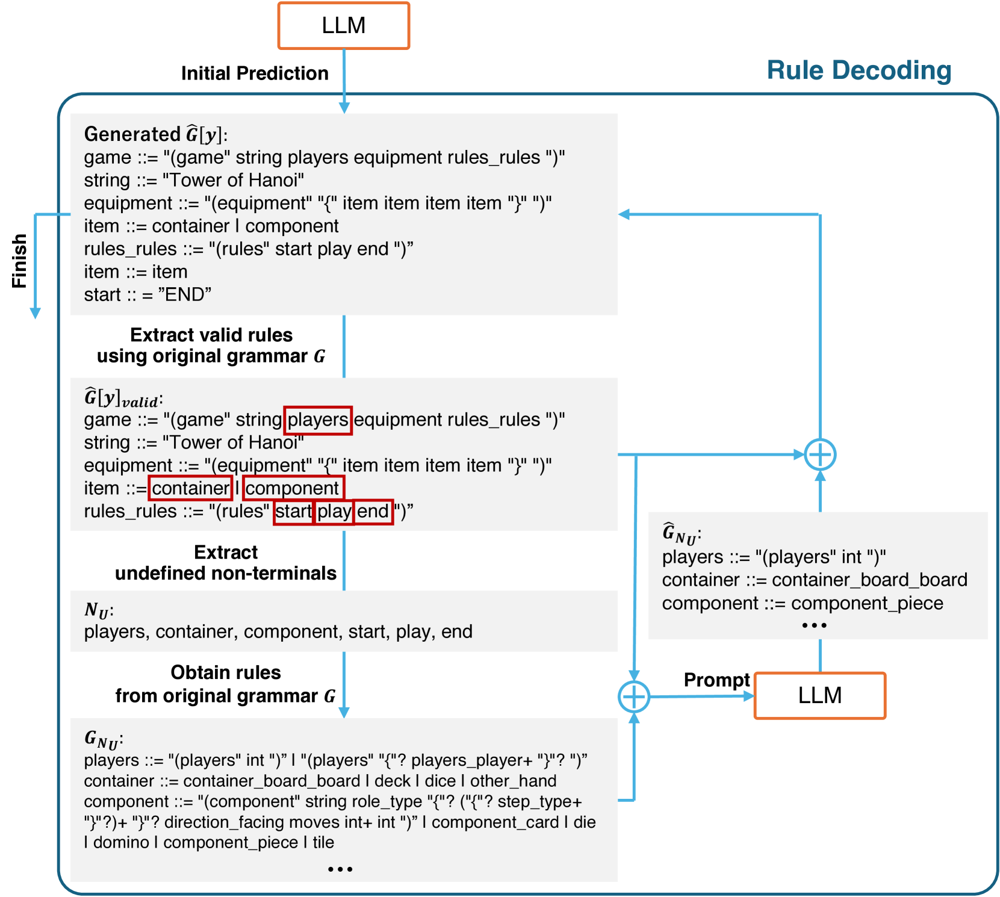

# 利用大型语言模型进行基于语法的游戏描述生成

发布时间：2024年07月24日

`LLM应用` `游戏设计` `人工智能`

> Grammar-based Game Description Generation using Large Language Models

# 摘要

> 为了简化游戏设计流程，自动游戏设计应运而生，它借助计算手段创造游戏。基于机器学习的进化算法等技术在此领域已见成效。随着深度学习的飞速发展，计算机视觉和自然语言处理在关卡生成领域也取得了显著进步。然而，游戏设计数据的稀缺限制了深度学习在游戏描述生成等任务中的应用。为此，我们探索了大型语言模型（LLM）的上下文学习能力，以应对数据有限的挑战。LLM能从少量示例中捕捉任务特征，并运用预训练能力。我们引入了游戏描述的语法结构，有效梳理了游戏设计空间，并将其融入LLM的推理过程。这种语法有助于LLM理解复杂的游戏描述生成任务。同时，我们提出了一种基于语法的迭代解码方法，不断优化生成结果。实验证明，该方法在游戏描述生成方面表现出色。

> To lower the barriers to game design development, automated game design, which generates game designs through computational processes, has been explored. In automated game design, machine learning-based techniques such as evolutionary algorithms have achieved success. Benefiting from the remarkable advancements in deep learning, applications in computer vision and natural language processing have progressed in level generation. However, due to the limited amount of data in game design, the application of deep learning has been insufficient for tasks such as game description generation. To pioneer a new approach for handling limited data in automated game design, we focus on the in-context learning of large language models (LLMs). LLMs can capture the features of a task from a few demonstration examples and apply the capabilities acquired during pre-training. We introduce the grammar of game descriptions, which effectively structures the game design space, into the LLMs' reasoning process. Grammar helps LLMs capture the characteristics of the complex task of game description generation. Furthermore, we propose a decoding method that iteratively improves the generated output by leveraging the grammar. Our experiments demonstrate that this approach performs well in generating game descriptions.

[Arxiv](https://arxiv.org/abs/2407.17404)