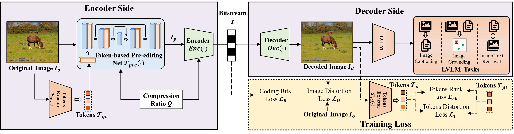

# 大型视觉-语言模型的高效图像压缩技术

发布时间：2024年07月24日

`LLM应用` `多媒体` `计算机视觉`

> High Efficiency Image Compression for Large Visual-Language Models

# 摘要

> 近年来，大型视觉语言模型（LVLMs）在多模态任务中表现卓越，逐渐取代人类成为视觉信息的接收者。本文首创性地提出了一种可变比特率图像压缩框架，包含预编辑模块和端到端编解码器，旨在为不同LVLMs提供优异的速率-准确性表现。我们设计了一种新的优化策略，基于标记级别的失真和排序，而非针对特定任务优化预编辑网络。通过基于大型模型语义标记的损失进行联合训练，该框架为多样数据和任务提供了增强的泛化能力。实验证明，该框架在速率-准确性方面超越了最先进的Versatile Video Coding标准，同时在多模态任务中展现了出色的鲁棒性和泛化能力。

> In recent years, large visual language models (LVLMs) have shown impressive performance and promising generalization capability in multi-modal tasks, thus replacing humans as receivers of visual information in various application scenarios. In this paper, we pioneer to propose a variable bitrate image compression framework consisting of a pre-editing module and an end-to-end codec to achieve promising rate-accuracy performance for different LVLMs. In particular, instead of optimizing an adaptive pre-editing network towards a particular task or several representative tasks, we propose a new optimization strategy tailored for LVLMs, which is designed based on the representation and discrimination capability with token-level distortion and rank. The pre-editing module and the variable bitrate end-to-end image codec are jointly trained by the losses based on semantic tokens of the large model, which introduce enhanced generalization capability for various data and tasks. {Experimental results demonstrate that the proposed framework could efficiently achieve much better rate-accuracy performance compared to the state-of-the-art coding standard, Versatile Video Coding.} Meanwhile, experiments with multi-modal tasks have revealed the robustness and generalization capability of the proposed framework.

[Arxiv](https://arxiv.org/abs/2407.17060)