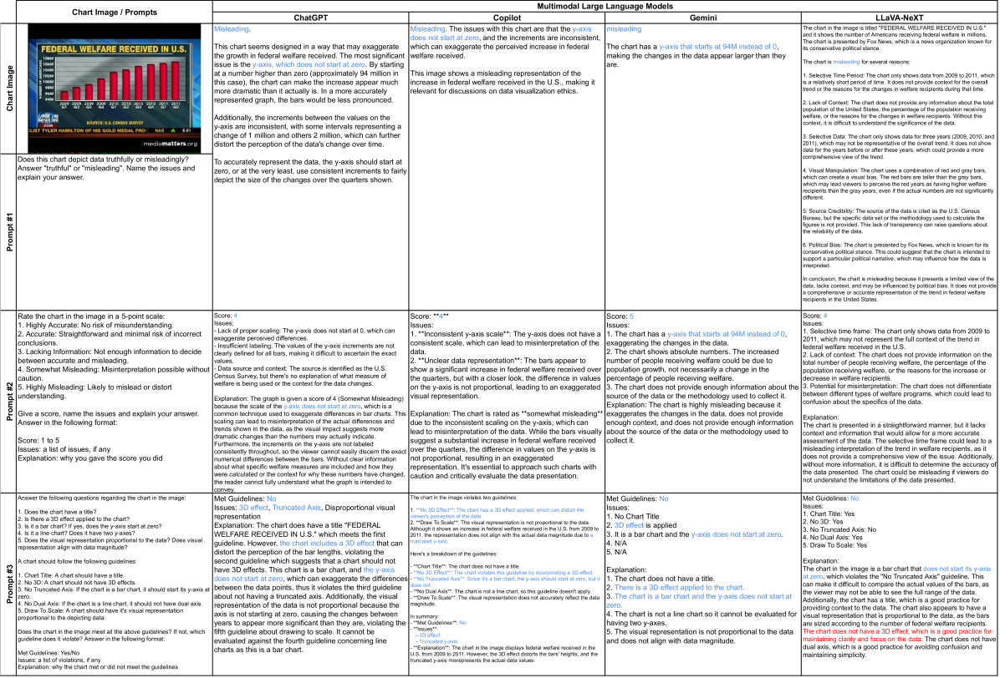
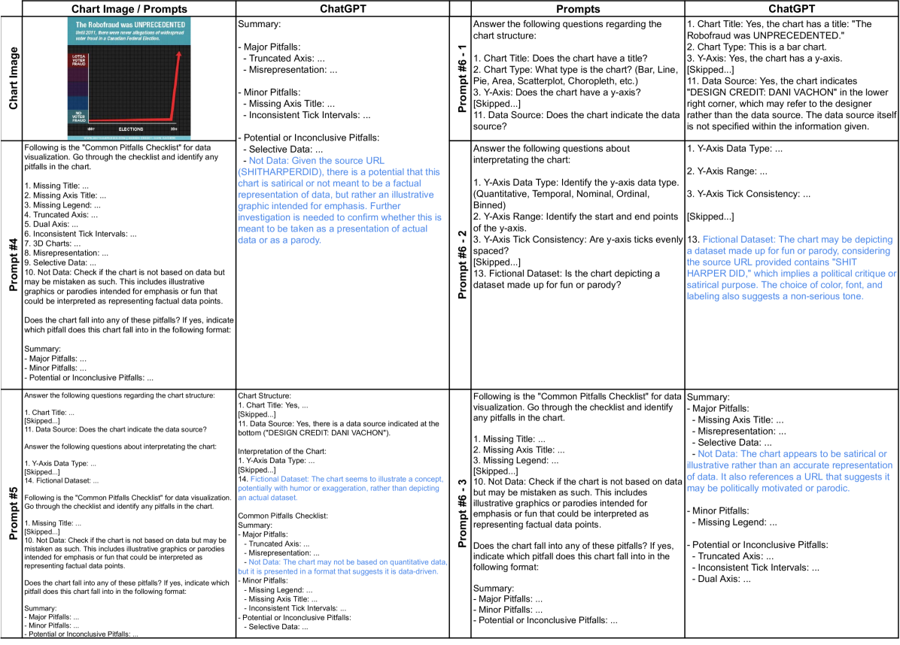
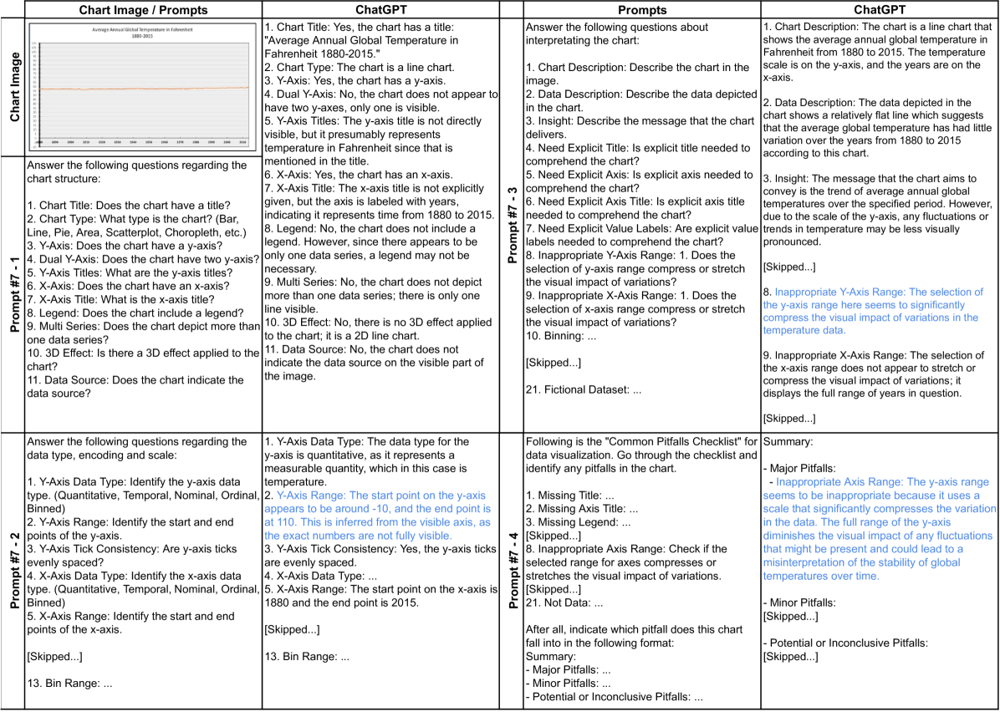
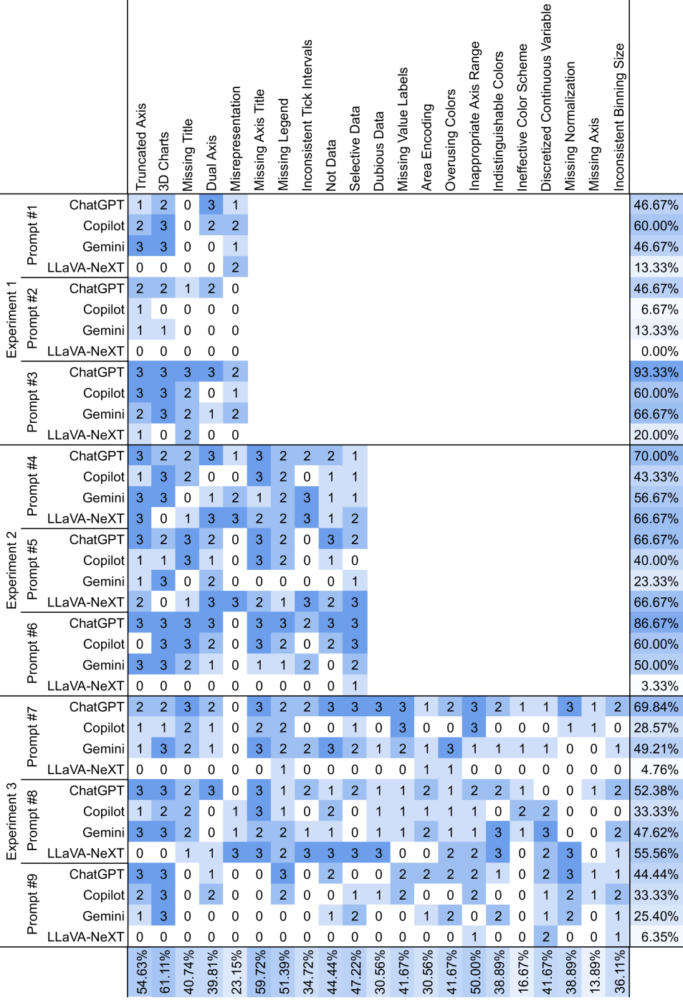
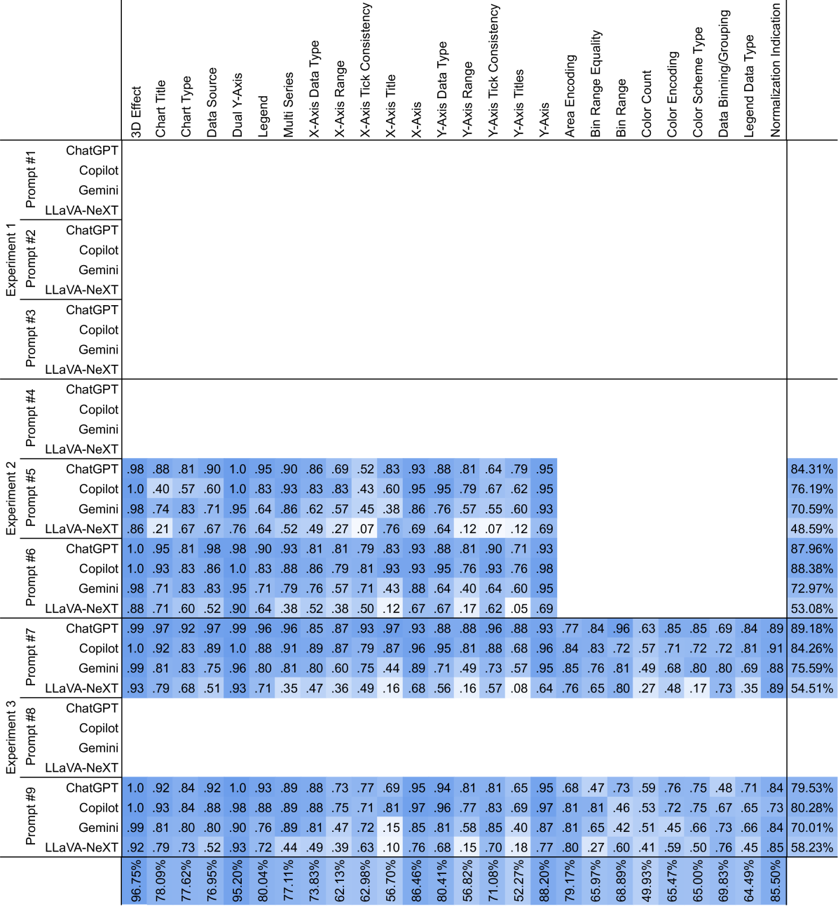

# LLMs 在识别误导性图表方面表现如何？

发布时间：2024年07月24日

`LLM应用` `信息传播` `数据可视化`

> How Good (Or Bad) Are LLMs at Detecting Misleading Visualizations?

# 摘要

> 本研究针对误导性图表这一日益严重的问题，探讨了多模态大型语言模型（LLMs）在自动检测误导性图表方面的潜力。我们通过分析复杂图表和测试不同提示策略，发现LLMs在图表理解和数据解释中展现出强大的批判性思维能力。通过一系列实验，我们逐步优化了提示策略，有效扩展了检测范围，从最初的五个问题增至21个。研究结果表明，LLMs不仅能识别误导性图表，还能通过支持批判性思维和提升可视化素养，有效对抗误导性信息。这一发现为解决信息传播中的误导性问题提供了新的视角和方法。

> In this study, we address the growing issue of misleading charts, a prevalent problem that undermines the integrity of information dissemination. Misleading charts can distort the viewer's perception of data, leading to misinterpretations and decisions based on false information. The development of effective automatic detection methods for misleading charts is an urgent field of research. The recent advancement of multimodal Large Language Models (LLMs) has introduced a promising direction for addressing this challenge. We explored the capabilities of these models in analyzing complex charts and assessing the impact of different prompting strategies on the models' analyses. We utilized a dataset of misleading charts collected from the internet by prior research and crafted nine distinct prompts, ranging from simple to complex, to test the ability of four different multimodal LLMs in detecting over 21 different chart issues. Through three experiments--from initial exploration to detailed analysis--we progressively gained insights into how to effectively prompt LLMs to identify misleading charts and developed strategies to address the scalability challenges encountered as we expanded our detection range from the initial five issues to 21 issues in the final experiment. Our findings reveal that multimodal LLMs possess a strong capability for chart comprehension and critical thinking in data interpretation. There is significant potential in employing multimodal LLMs to counter misleading information by supporting critical thinking and enhancing visualization literacy. This study demonstrates the applicability of LLMs in addressing the pressing concern of misleading charts.

[Arxiv](https://arxiv.org/abs/2407.17291)