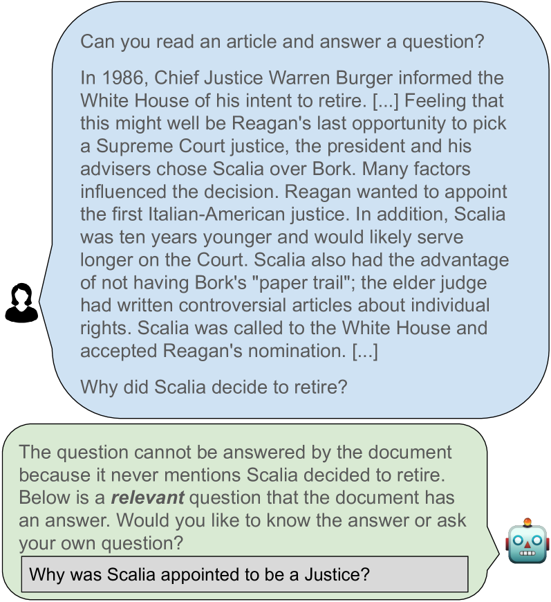

# 我本可以那样问：重塑无解之问

发布时间：2024年07月24日

`LLM应用` `问答系统` `人工智能`

> I Could've Asked That: Reformulating Unanswerable Questions

# 摘要

> 当用户从陌生文档中寻找信息时，常会遇到文档无法解答的问题。现有的 LLM 虽能识别这类问题，却未能协助用户重构提问，降低了其实用性。为此，我们推出了 CouldAsk 评估基准，专门用于研究基于文档的问答中如何重构无法回答的问题。我们对顶尖的开源和专有 LLM 进行了测试，结果显示它们在重构问题上的能力有限。例如，GPT-4 和 Llama2-7B 仅在少数情况下成功重构问题。错误分析揭示，多数失败源于模型仅对问题进行了表面上的改述，甚至重复了原问题。我们已公开发布该基准及复现实验的代码。

> When seeking information from unfamiliar documents, users frequently pose questions that cannot be answered by the documents. While existing large language models (LLMs) identify these unanswerable questions, they do not assist users in reformulating their questions, thereby reducing their overall utility. We curate CouldAsk, an evaluation benchmark composed of existing and new datasets for document-grounded question answering, specifically designed to study reformulating unanswerable questions. We evaluate state-of-the-art open-source and proprietary LLMs on CouldAsk. The results demonstrate the limited capabilities of these models in reformulating questions. Specifically, GPT-4 and Llama2-7B successfully reformulate questions only 26% and 12% of the time, respectively. Error analysis shows that 62% of the unsuccessful reformulations stem from the models merely rephrasing the questions or even generating identical questions. We publicly release the benchmark and the code to reproduce the experiments.

[Arxiv](https://arxiv.org/abs/2407.17469)