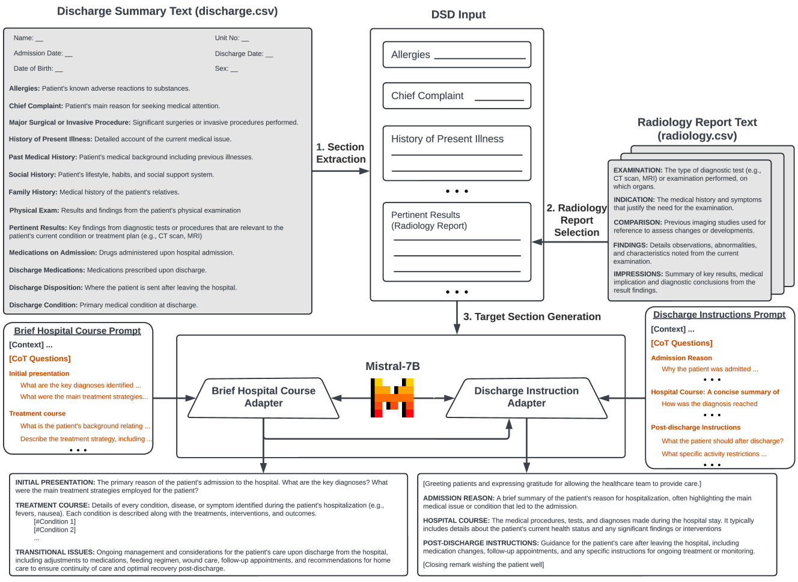
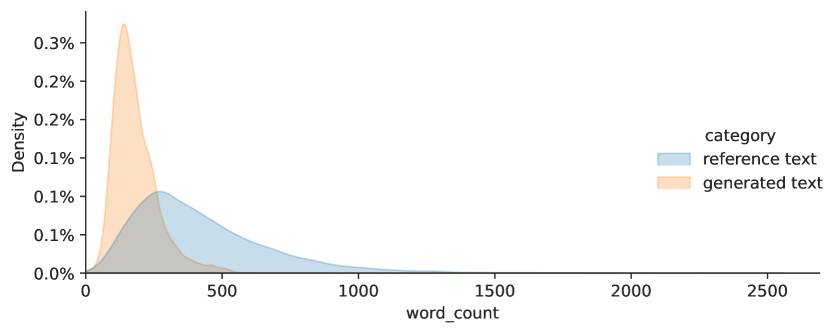
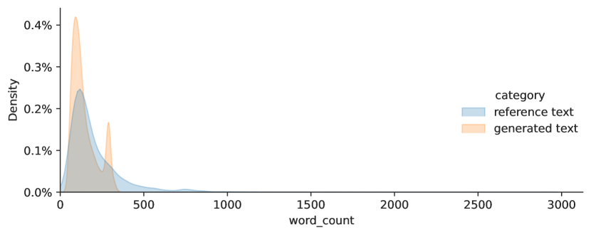

# “Discharge Me!”团队的IgnitionInnovators正在通过链式思维指令微调大型语言模型，以优化出院总结的生成。

发布时间：2024年07月24日

`LLM应用` `生物信息学`

> IgnitionInnovators at "Discharge Me!": Chain-of-Thought Instruction Finetuning Large Language Models for Discharge Summaries

# 摘要

> 本文针对“Discharge Me!”共享任务，提出了一种基于LLM的解决方案，该任务与第23届BioNLP研讨会同期举行。我们构建了一个框架，旨在生成出院总结中的“简要住院过程”和“出院指导”两大部分。通过优化LLM的指令微调流程，我们尝试了多种提示策略，以提升LLM在DSD任务中的表现。实验表明，结合清晰的输出结构和一系列详尽的CoT问题，能显著增强模型的推理能力，进而提高生成文本的结构准确性和临床信息的忠实度。源代码已公开，详见：https://github.com/antangrocket1312/Discharge_LLM。

> This paper presents our proposed approach to the Discharge Me! shared task, collocated with the 23th Workshop on Biomedical Natural Language Processing (BioNLP). In this work, we develop an LLM-based framework for solving the Discharge Summary Documentation (DSD) task, i.e., generating the two critical target sections `Brief Hospital Course' and `Discharge Instructions' in the discharge summary. By streamlining the recent instruction-finetuning process on LLMs, we explore several prompting strategies for optimally adapting LLMs to specific generation task of DSD. Experimental results show that providing a clear output structure, complimented by a set of comprehensive Chain-of-Thoughts (CoT) questions, effectively improves the model's reasoning capability, and thereby, enhancing the structural correctness and faithfulness of clinical information in the generated text. Source code is available at: https://github.com/antangrocket1312/Discharge_LLM

[Arxiv](https://arxiv.org/abs/2407.17636)