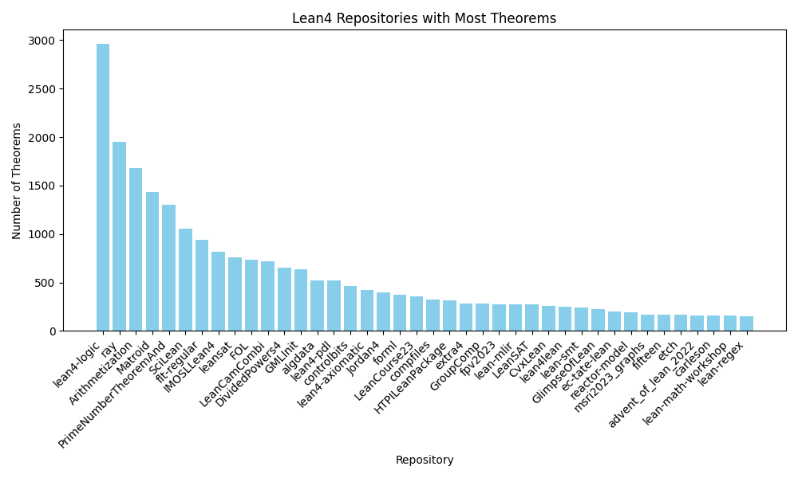

# LEAN-GitHub：打造多功能 LEAN 证明器，编译 GitHub 上的 LEAN 仓库资源。

发布时间：2024年07月24日

`LLM应用` `计算机科学`

> LEAN-GitHub: Compiling GitHub LEAN repositories for a versatile LEAN prover

# 摘要

> 近期，大型语言模型在辅助形式化数学推理方面展现出潜力，但受限于形式化定理证明数据的稀缺，这些数据需从原始形式语言语料库中额外提取。为此，我们创建了LEAN-GitHub数据集，汇集了GitHub上几乎所有Lean 4仓库的大规模形式数据。经过对InternLM-math-plus的微调，该模型在Lean 4 miniF2F测试中单次通过准确率达48.8%，64次通过达54.5%，超越了现有最佳方法。此外，在针对不同数学领域/水平的ProofNet和Putnam基准测试中也表现卓越。这些成果显示，我们的数据集对广泛数学主题的形式化推理大有裨益。模型和数据已分别在GitHub和Hugging Face平台开源。

> Recently, large language models have presented promising results in aiding formal mathematical reasoning. However, their performance is restricted due to the scarcity of formal theorem-proving data, which requires additional effort to be extracted from raw formal language corpora. Meanwhile, a significant amount of human-written formal language corpora remains underutilized. To address this issue, we propose LEAN-GitHub, a dataset consisting of large-scale formal data extracted from almost all Lean 4 repositories on GitHub. After fine-tuning InternLM-math-plus on this dataset, our model achieved accuracies of 48.8% with a single pass and 54.5% with 64 passes on the Lean 4 miniF2F test, surpassing state-of-the-art method at 52%. And it also achieves state-of-the-art on two other Lean 4 benchmarks (ProofNet and Putnam) targeting different fields/levels of math. These results demonstrate that our proposed dataset is beneficial for formal reasoning on a wide range of math topics. We open-source our model at https://GitHub. com/InternLM/InternLM-Math and our data at https://huggingface.co/ datasets/InternLM/Lean-GitHub

[Arxiv](https://arxiv.org/abs/2407.17227)