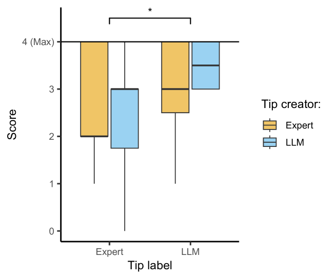
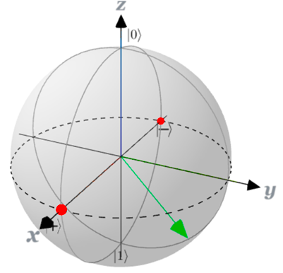

# LLM生成的提示与专家制作的提示在协助学生解答量子计算问题上表现相当。

发布时间：2024年07月24日

`LLM应用` `量子计算`

> LLM-Generated Tips Rival Expert-Created Tips in Helping Students Answer Quantum-Computing Questions

# 摘要

> 一对一教学虽为传授知识的黄金法则，但因师生比例悬殊，常难以为继。量子计算，因备受瞩目，亦陷此困境。为缓解教师重负，确保教育质量，借助GPT-4等大型语言模型自动生成教学内容，实为良策。我们开展了两项研究，旨在验证GPT-4生成学生学习提示的可行性。首项研究中，46名学生借助专家或GPT-4生成的提示解答量子计算选择题，为平衡对GPT-4的偏见，部分学生虽获GPT-4提示却误以为来自专家，反之亦然。第二项研究（23名参与者）则直接对比两种提示，评估其效用与准确性，参与者包括资深教育者和学生。结果显示，GPT-4提示在引导思考与相关概念关联上更胜一筹，虽有时直接揭示答案。首项研究中，标记为GPT-4的提示，即便实为专家手笔，仍助学生答题更佳，此或为心理暗示之效。综上，GPT-4提示在量子计算基础教学中，已可媲美甚至超越专家之作。

> Individual teaching is among the most successful ways to impart knowledge. Yet, this method is not always feasible due to large numbers of students per educator. Quantum computing serves as a prime example facing this issue, due to the hype surrounding it. Alleviating high workloads for teachers, often accompanied with individual teaching, is crucial for continuous high quality education. Therefore, leveraging Large Language Models (LLMs) such as GPT-4 to generate educational content can be valuable. We conducted two complementary studies exploring the feasibility of using GPT-4 to automatically generate tips for students. In the first one students (N=46) solved four multiple-choice quantum computing questions with either the help of expert-created or LLM-generated tips. To correct for possible biases towards LLMs, we introduced two additional conditions, making some participants believe that they were given expert-created tips, when they were given LLM-generated tips and vice versa. Our second study (N=23) aimed to directly compare the LLM-generated and expert-created tips, evaluating their quality, correctness and helpfulness, with both experienced educators and students participating. Participants in our second study found that the LLM-generated tips were significantly more helpful and pointed better towards relevant concepts than the expert-created tips, while being more prone to be giving away the answer. While participants in the first study performed significantly better in answering the quantum computing questions when given tips labeled as LLM-generated, even if they were created by an expert. This phenomenon could be a placebo effect induced by the participants' biases for LLM-generated content. Ultimately, we find that LLM-generated tips are good enough to be used instead of expert tips in the context of quantum computing basics.

[Arxiv](https://arxiv.org/abs/2407.17024)