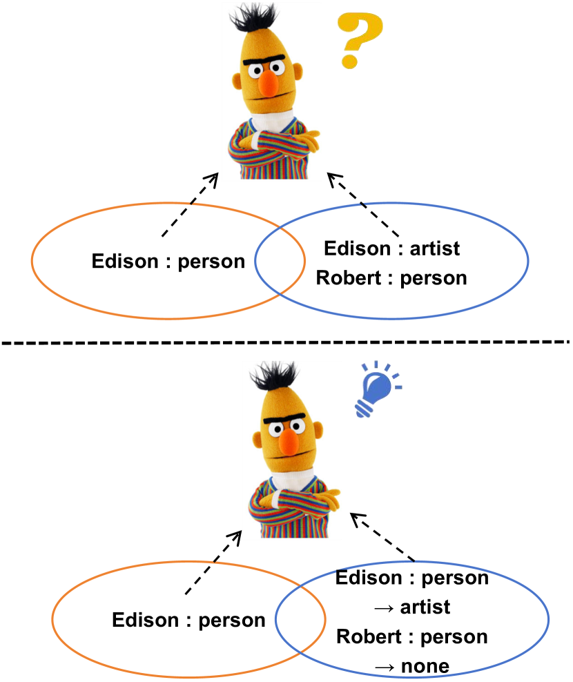
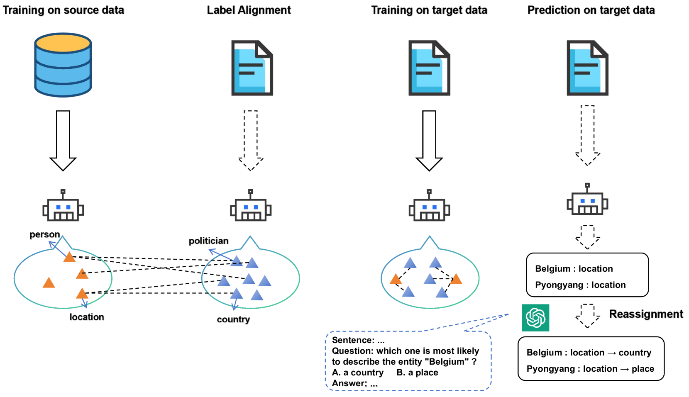
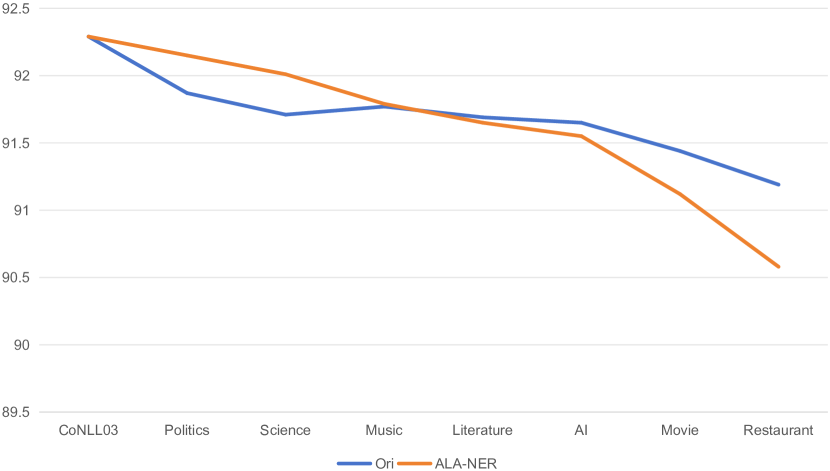
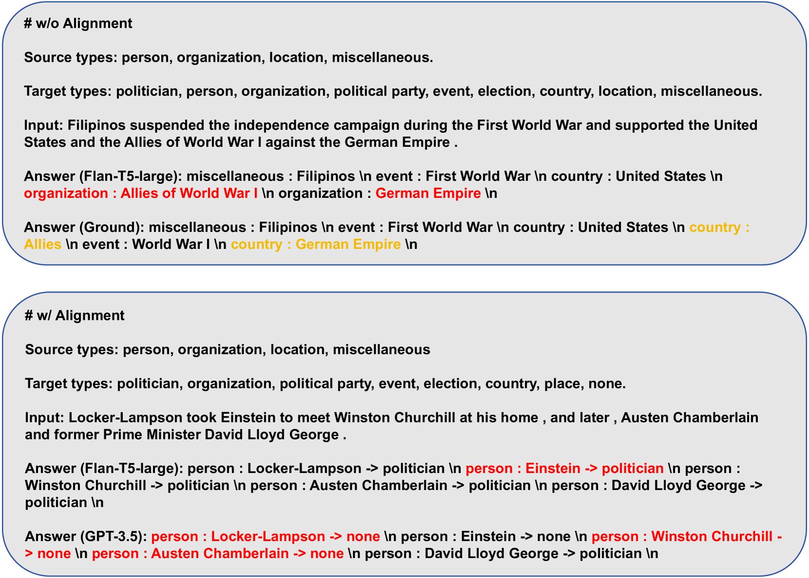

# 利用通才大型语言模型进行标签对齐与重新分配，以提升跨领域命名实体识别的性能。

发布时间：2024年07月24日

`LLM应用` `命名实体识别`

> Label Alignment and Reassignment with Generalist Large Language Model for Enhanced Cross-Domain Named Entity Recognition

# 摘要

> NLP领域内，命名实体识别在监督和少样本环境下已取得显著进展。然而，跨域NER在实际应用中更为常见，对多数方法仍具挑战。过往研究多聚焦于知识迁移，如标签信息从源域到目标域的传递，却鲜少关注标签冲突。本研究提出LAR方法，通过源域与目标域的标签对齐及类型推断的标签重分配，有效解决跨域NER难题。结合ChatGPT等先进大型语言模型，LAR的标签重分配过程得以强化。实验涵盖监督与零-shot场景，结果显示，我们的方法在域外环境下表现卓越，超越了现有最佳方法，验证了其高效性。

> Named entity recognition on the in-domain supervised and few-shot settings have been extensively discussed in the NLP community and made significant progress. However, cross-domain NER, a more common task in practical scenarios, still poses a challenge for most NER methods. Previous research efforts in that area primarily focus on knowledge transfer such as correlate label information from source to target domains but few works pay attention to the problem of label conflict. In this study, we introduce a label alignment and reassignment approach, namely LAR, to address this issue for enhanced cross-domain named entity recognition, which includes two core procedures: label alignment between source and target domains and label reassignment for type inference. The process of label reassignment can significantly be enhanced by integrating with an advanced large-scale language model such as ChatGPT. We conduct an extensive range of experiments on NER datasets involving both supervised and zero-shot scenarios. Empirical experimental results demonstrate the validation of our method with remarkable performance under the supervised and zero-shot out-of-domain settings compared to SOTA methods.

[Arxiv](https://arxiv.org/abs/2407.17344)