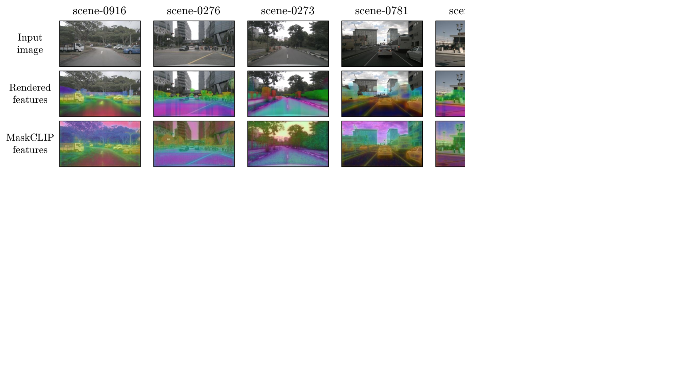
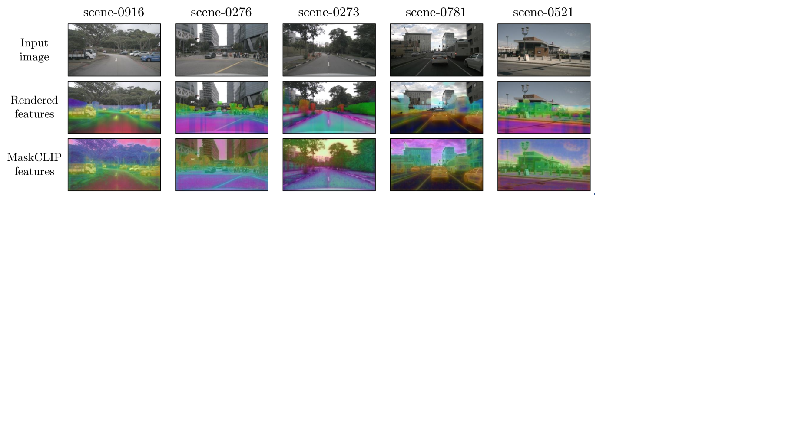

# LangOcc：借助体积渲染技术，实现自监督的开放词汇占用估计

发布时间：2024年07月24日

`LLM应用` `自动驾驶` `计算机视觉`

> LangOcc: Self-Supervised Open Vocabulary Occupancy Estimation via Volume Rendering

# 摘要

> 语义占据作为一种前沿的3D场景表示方法，近期备受瞩目。然而，现有基于相机的方法多依赖于昂贵且细节丰富的3D体素标签或LiDAR扫描数据集，这不仅限制了其实用性，也阻碍了其扩展性，从而呼唤自监督方法的诞生。此外，多数方法仅能识别预设类别，缺乏灵活性。为此，我们创新性地提出了LangOcc，一种仅通过相机图像训练、能通过视觉-语言对齐识别任意语义的开放词汇占据估计方法。我们巧妙地将CLIP这一强大的视觉-语言对齐编码器的知识，通过可微分体积渲染技术，融入3D占据模型。该模型仅凭图像便能在3D体素网格中精准估计视觉-语言对齐特征，并通过将估计结果渲染回2D空间进行自监督训练，实现了无需显式几何监督的直接且高效的训练方式。LangOcc在开放词汇占据领域大幅领先于依赖LiDAR监督的对手，且在Occ3D-nuScenes数据集上刷新了自监督语义占据估计的纪录，充分证明了我们视觉-语言训练方法的卓越效能。

> Semantic occupancy has recently gained significant traction as a prominent method for 3D scene representation. However, most existing camera-based methods rely on costly datasets with fine-grained 3D voxel labels or LiDAR scans for training, which limits their practicality and scalability, raising the need for self-supervised approaches in this domain. Moreover, most methods are tied to a predefined set of classes which they can detect. In this work we present a novel approach for open vocabulary occupancy estimation called \textit{LangOcc}, that is trained only via camera images, and can detect arbitrary semantics via vision-language alignment. In particular, we distill the knowledge of the strong vision-language aligned encoder CLIP into a 3D occupancy model via differentiable volume rendering. Our model estimates vision-language aligned features in a 3D voxel grid using only images. It is trained in a self-supervised manner by rendering our estimations back to 2D space, where ground-truth features can be computed. This training mechanism automatically supervises the scene geometry, allowing for a straight-forward and powerful training method without any explicit geometry supervision. LangOcc outperforms LiDAR-supervised competitors in open vocabulary occupancy by a large margin, solely relying on vision-based training. We also achieve state-of-the-art results in self-supervised semantic occupancy estimation on the Occ3D-nuScenes dataset, despite not being limited to a specific set of categories, thus demonstrating the effectiveness of our proposed vision-language training.

[Arxiv](https://arxiv.org/abs/2407.17310)