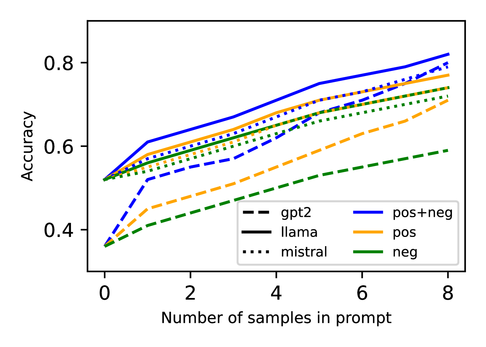

# 大型语言模型在计算工作流异常检测中的应用：从监督微调到情境学习的转变

发布时间：2024年07月24日

`LLM应用` `软件工程` `网络安全`

> Large Language Models for Anomaly Detection in Computational Workflows: from Supervised Fine-Tuning to In-Context Learning

# 摘要

> 确保系统可靠性和安全性的关键在于计算工作流程中的异常检测。然而，传统基于规则的方法在检测新颖异常方面力不从心。本文借助大型语言模型（LLM），利用其学习复杂数据模式的能力，探索了两种异常检测方法：监督微调（SFT）和上下文学习（ICL）。SFT通过在标记数据上微调预训练模型进行句子分类来识别异常，而ICL则通过包含任务描述和示例的提示，在无需微调的情况下实现少量样本异常检测。实验结果显示，LLM在复杂工作流程中进行有效异常检测展现出巨大潜力。

> Anomaly detection in computational workflows is critical for ensuring system reliability and security. However, traditional rule-based methods struggle to detect novel anomalies. This paper leverages large language models (LLMs) for workflow anomaly detection by exploiting their ability to learn complex data patterns. Two approaches are investigated: 1) supervised fine-tuning (SFT), where pre-trained LLMs are fine-tuned on labeled data for sentence classification to identify anomalies, and 2) in-context learning (ICL) where prompts containing task descriptions and examples guide LLMs in few-shot anomaly detection without fine-tuning. The paper evaluates the performance, efficiency, generalization of SFT models, and explores zero-shot and few-shot ICL prompts and interpretability enhancement via chain-of-thought prompting. Experiments across multiple workflow datasets demonstrate the promising potential of LLMs for effective anomaly detection in complex executions.

[Arxiv](https://arxiv.org/abs/2407.17545)