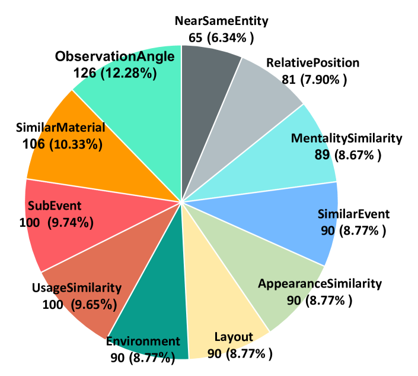
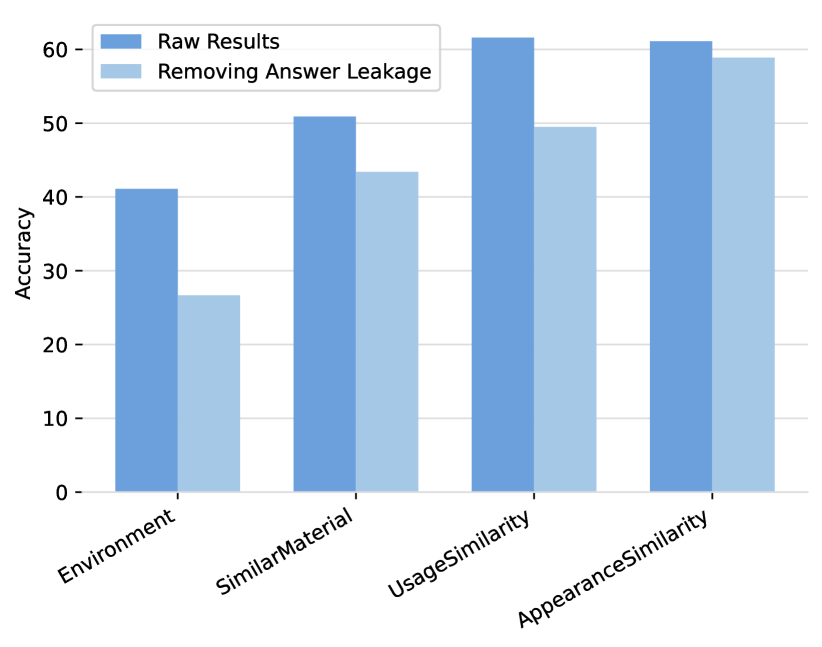
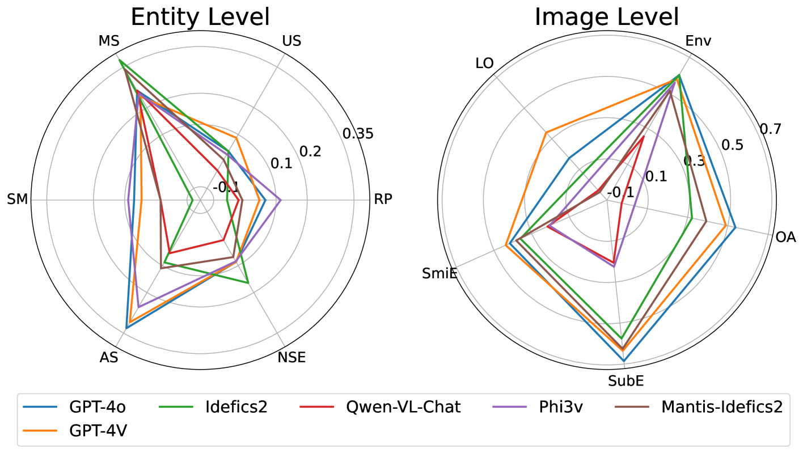

# MMRA：多粒度多图像关系关联的标杆

发布时间：2024年07月24日

`LLM应用` `计算机视觉` `人工智能`

> MMRA: A Benchmark for Multi-granularity Multi-image Relational Association

# 摘要

> 大型视觉语言模型（LVLMs）在图像感知领域的成就斐然，因此，让LVLMs像人类一样感知世界的研究日益受到重视。然而，现有的多模态基准主要关注图像内的客观事实或特定主题知识，却忽视了图像间的关联关系。为此，我们提出了多图像关系关联任务，并精心打造了MMRA基准，涵盖1026个样本，旨在评估LVLMs在多粒度多图像关系关联方面的能力。我们构建了一个包含11个子任务的关联关系系统，分为图像和实体两个粒度级别，以全面评估LVLMs。实验显示，主流LVLMs在不同子任务上表现各异，尤其在实体级别的任务上表现普遍不佳，凸显了细粒度多图像感知的挑战性。此外，LVLMs在空间感知任务上表现较弱，但其图像细节感知能力较强，提升多图像关联能力的关键在于强化语言模型组件的推理能力。相关代码和数据已公开在https://github.com/Wusiwei0410/MMRA。

> Given the remarkable success that large visual language models (LVLMs) have achieved in image perception tasks, the endeavor to make LVMLs perceive the world like humans is drawing increasing attention. Current multi-modal benchmarks mainly focus on the objective fact or certain topic related potential knowledge within a image, but overlook the associative relations between multiple images. Therefore, we define a multi-image relation association task, and meticulously curate \textbf{MMRA} benchmark, a \textbf{M}ulti-granularity \textbf{M}ulti-image \textbf{R}elational \textbf{A}ssociation benchmark, consisted of \textbf{1026} samples. In order to systematically and comprehensively evaluate mainstream LVLMs, we establish an associational relation system among images that contain \textbf{11 subtasks} (e.g, UsageSimilarity, SubEvent, etc.) at two granularity levels (i.e., "\textbf{image}" and "\textbf{entity}") according to the relations in ConceptNet. Our experiments demonstrate that, on our MMRA benchmark, current mainstream LVLMs all have their own advantages and disadvantages across different subtasks. It is worth noting that, at the entity level, the performance of all models is worse than that of them at the image level, indicating that the fine-grained multi-image perception task is still challenging for LVLMs. The tasks related to spatial perception are relatively difficult for LVLMs to handle. Furthermore, we find that LVMLs exhibit a good ability to perceive image details, and the key to enhancing their multi-image association capability is to strengthen the reasoning ability of their language model component. All our codes and data are released at htt\url{https://github.com/Wusiwei0410/MMRA}.

[Arxiv](https://arxiv.org/abs/2407.17379)