# 多标签聚类辨别技术在视觉表示学习中发挥作用。

发布时间：2024年07月24日

`LLM应用

解释：这篇论文主要讨论了Contrastive Language Image Pre-training (CLIP)的改进方法MLCD，这是一种应用于图像和文本处理的技术。尽管它涉及到语言模型（LM）的应用，但主要关注点在于图像和文本的对比学习特征表示，以及如何通过改进方法提高多任务性能。因此，它更符合LLM应用的分类，而不是LLM理论或其他分类。` `计算机视觉` `机器学习`

> Multi-label Cluster Discrimination for Visual Representation Learning

# 摘要

> Contrastive Language Image Pre-training (CLIP) 因其卓越的图像-文本对比学习特征表示，在多任务中表现出色。但CLIP的实例鉴别法难以捕捉训练数据的语义结构。为此，我们提出MLCD方法，通过迭代聚类和分类，不仅为每张图像分配多个伪标签，还设计了新颖的多标签分类损失，有效区分正负类，减少决策边界模糊。实验证明，MLCD在多种下游任务中，如线性探针、零-shot分类和图像-文本检索，均达到顶尖水平。

> Contrastive Language Image Pre-training (CLIP) has recently demonstrated success across various tasks due to superior feature representation empowered by image-text contrastive learning. However, the instance discrimination method used by CLIP can hardly encode the semantic structure of training data. To handle this limitation, cluster discrimination has been proposed through iterative cluster assignment and classification. Nevertheless, most cluster discrimination approaches only define a single pseudo-label for each image, neglecting multi-label signals in the image. In this paper, we propose a novel Multi-Label Cluster Discrimination method named MLCD to enhance representation learning. In the clustering step, we first cluster the large-scale LAION-400M dataset into one million centers based on off-the-shelf embedding features. Considering that natural images frequently contain multiple visual objects or attributes, we select the multiple closest centers as auxiliary class labels. In the discrimination step, we design a novel multi-label classification loss, which elegantly separates losses from positive classes and negative classes, and alleviates ambiguity on decision boundary. We validate the proposed multi-label cluster discrimination method with experiments on different scales of models and pre-training datasets. Experimental results show that our method achieves state-of-the-art performance on multiple downstream tasks including linear probe, zero-shot classification, and image-text retrieval.

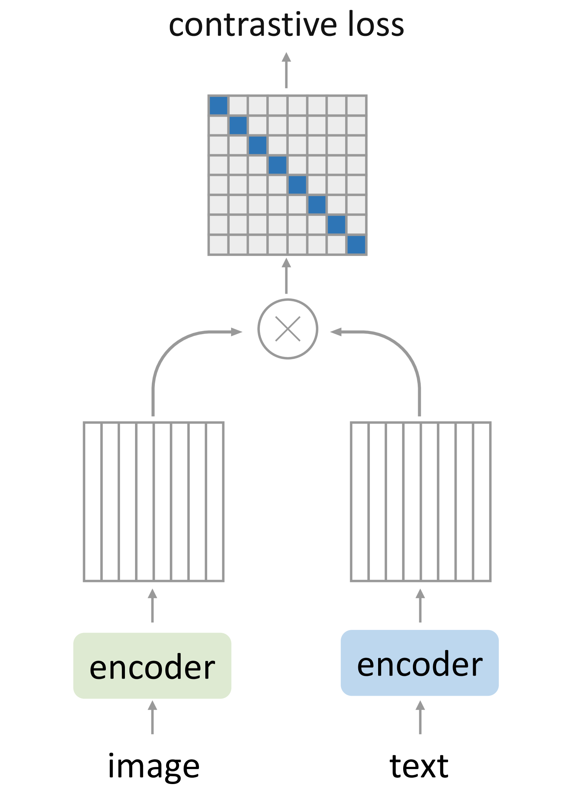

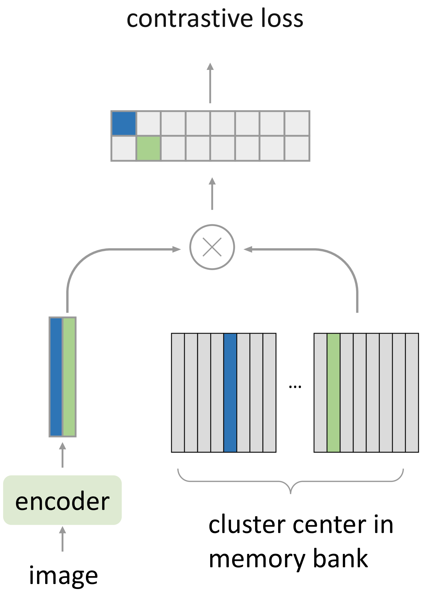

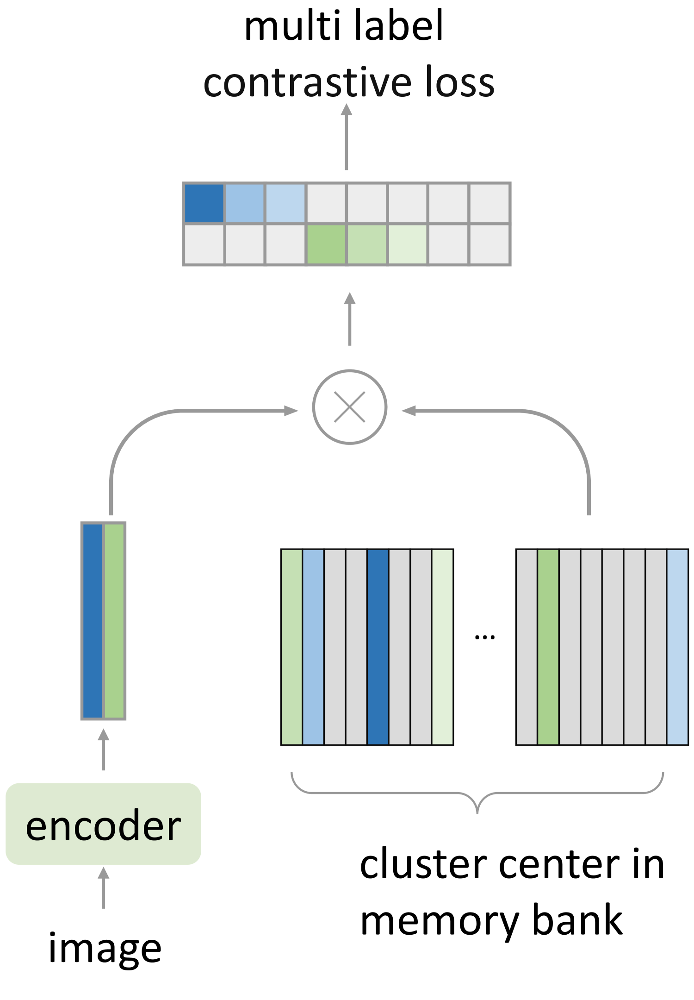

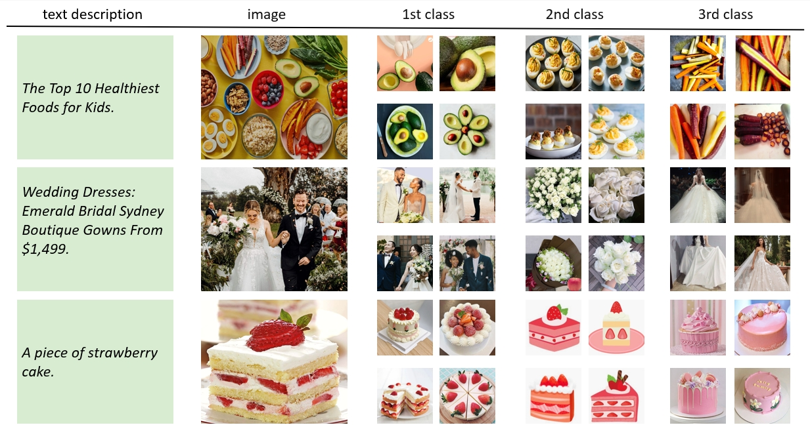

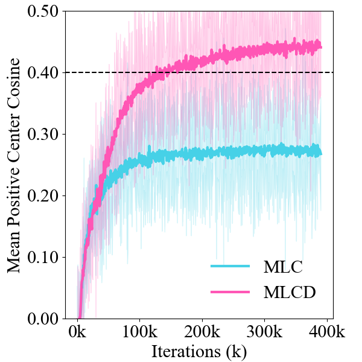

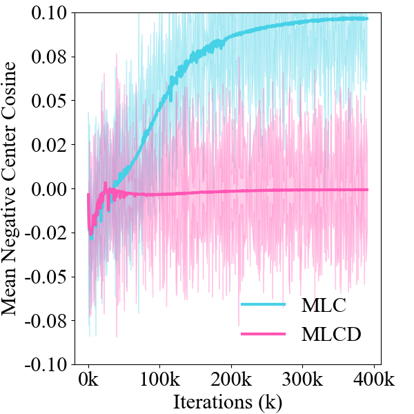

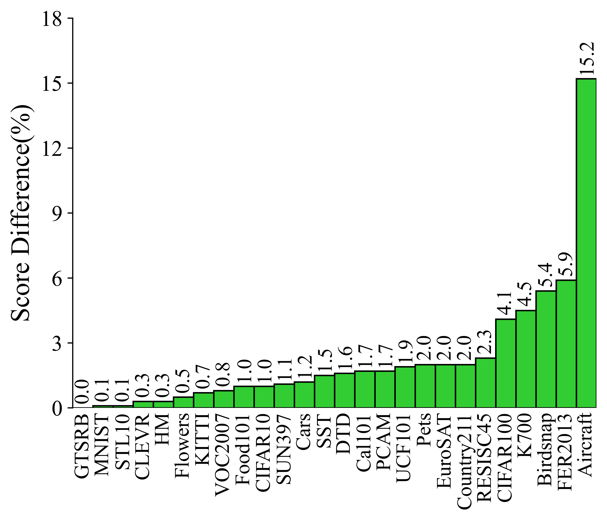

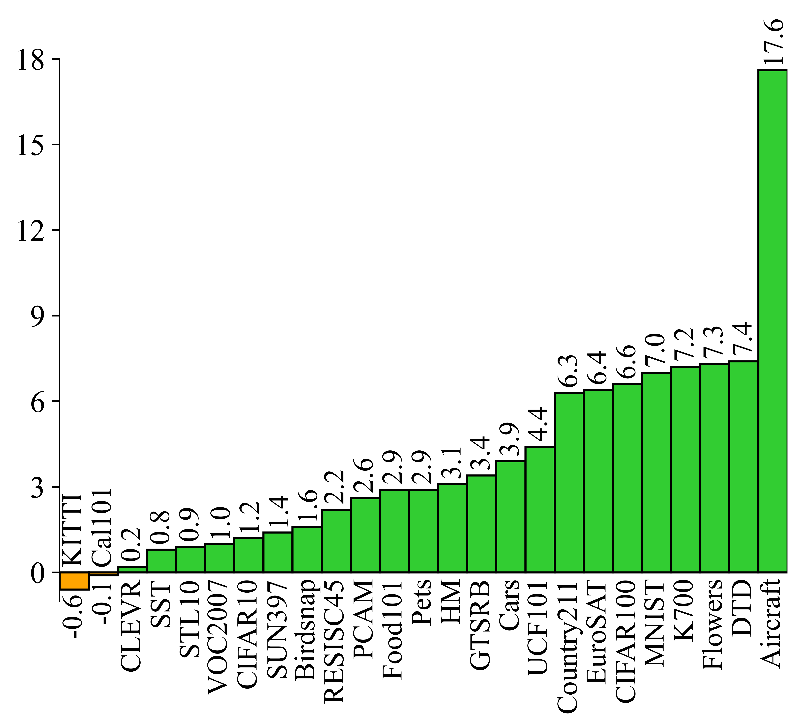

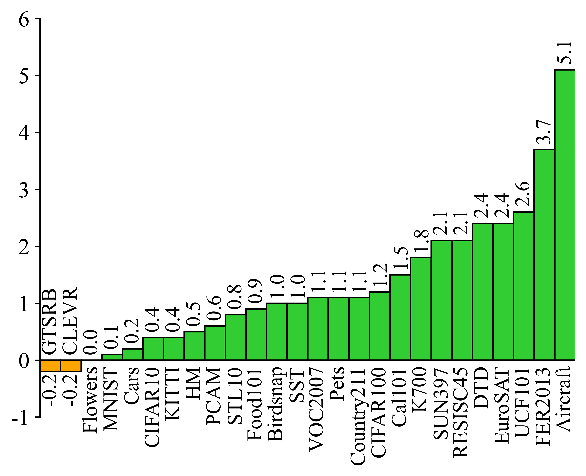

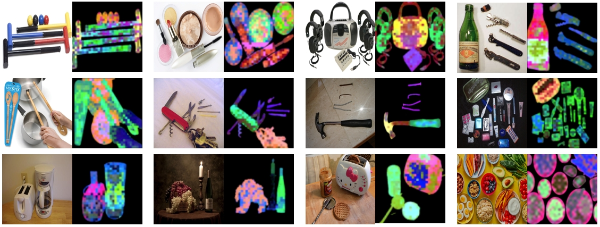

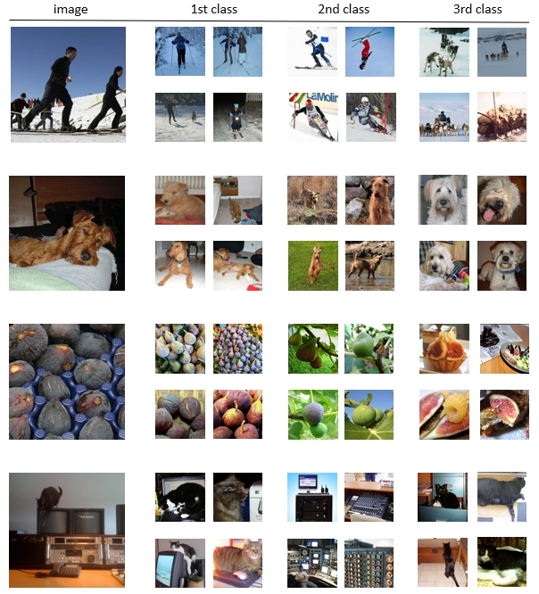

[Arxiv](https://arxiv.org/abs/2407.17331)