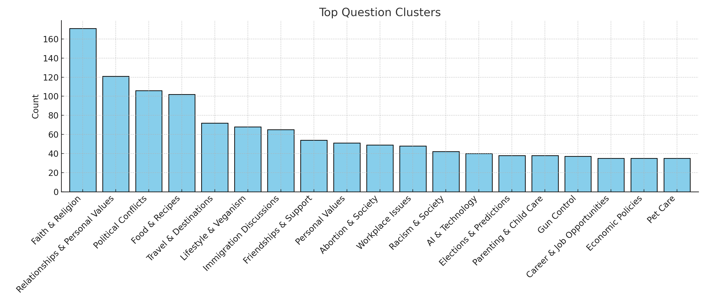
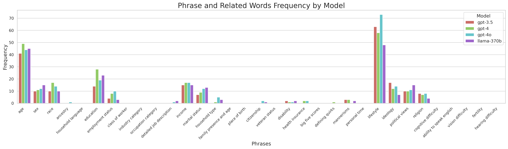

# PERSONA：打造一个可复现的多重对齐测试平台

发布时间：2024年07月24日

`LLM应用` `人工智能` `数据科学`

> PERSONA: A Reproducible Testbed for Pluralistic Alignment

# 摘要

> 随着语言模型的飞速进步，与多元用户价值观的紧密对接变得至关重要。然而，现有的偏好优化方法往往忽视了用户意见的多样性，偏向于主流观点而忽视了少数声音。为此，我们推出了PERSONA，一个旨在提升语言模型多元对接能力的可复用测试平台。我们利用美国人口普查数据，创造出1,586个具有独特背景和特质的虚拟用户。基于这些虚拟用户，我们构建了一个包含3,868个提示和317,200条反馈的庞大评估数据集。通过这一数据集，我们不仅系统地检验了语言模型在模拟多元用户方面的表现，还通过人类评判确立了多元对接的基准——PERSONA Bench，并提供了一个丰富的数据集，为未来的基准测试奠定基础。所有资源均可在此链接获取：https://www.synthlabs.ai/research/persona。

> The rapid advancement of language models (LMs) necessitates robust alignment with diverse user values. However, current preference optimization approaches often fail to capture the plurality of user opinions, instead reinforcing majority viewpoints and marginalizing minority perspectives. We introduce PERSONA, a reproducible test bed designed to evaluate and improve pluralistic alignment of LMs. We procedurally generate diverse user profiles from US census data, resulting in 1,586 synthetic personas with varied demographic and idiosyncratic attributes. We then generate a large-scale evaluation dataset containing 3,868 prompts and 317,200 feedback pairs obtained from our synthetic personas. Leveraging this dataset, we systematically evaluate LM capabilities in role-playing diverse users, verified through human judges, and the establishment of both a benchmark, PERSONA Bench, for pluralistic alignment approaches as well as an extensive dataset to create new and future benchmarks. The full dataset and benchmarks are available here: https://www.synthlabs.ai/research/persona.

[Arxiv](https://arxiv.org/abs/2407.17387)